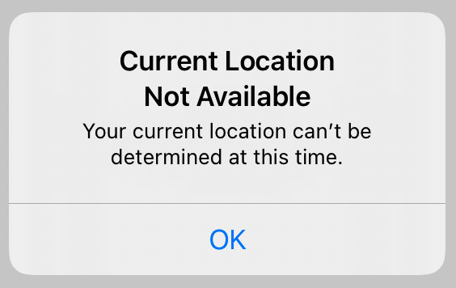
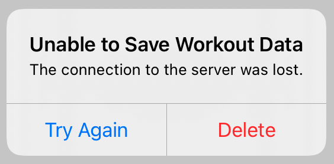

> Navigation: [Technologies](../technologies.md) · [SwiftUI](../swiftui.md)

# Alert

<sub>Structure</sub>

A representation of an alert presentation.

> [!warning] Deprecated
> Use a [View](view.md) modifier like [alert(_:isPresented:presenting:actions:message:)](<view/alert(__ispresented_presenting_actions_message_)-8584l.md>) instead.

<sub>iOS, iPadOS, Mac Catalyst, macOS, tvOS, visionOS, watchOS</sub>

```swift
struct Alert
```

## Overview

Use an alert when you want the user to act in response to the state of the app or system. If you want the user to make a choice in response to their action, use an [ActionSheet](actionsheet.md) instead.

You show an alert by using the [alert(isPresented:content:)](<view/alert(ispresented_content_).md>) view modifier to create an alert, which then appears whenever the bound `isPresented` value is `true`. The `content` closure you provide to this modifer produces a customized instance of the `Alert` type.

In the following example, a button presents a simple alert when tapped, by updating a local `showAlert` property that binds to the alert.

```swift
@State private var showAlert = false
var body: some View {
    Button("Tap to show alert") {
        showAlert = true
    }
    .alert(isPresented: $showAlert) {
        Alert(
            title: Text("Current Location Not Available"),
            message: Text("Your current location can’t be " +
                            "determined at this time.")
        )
    }
}
```



<sub>A default alert dialog with the title Current Location Not Available in bold text, the message your current location can’t be determined at this time in smaller text, and a default OK button.</sub>

To customize the alert, add instances of the [Button](alert/button.md) type, which provides standardized buttons for common tasks like canceling and performing destructive actions. The following example uses two buttons: a default button labeled “Try Again” that calls a `saveWorkoutData` method, and a “Delete” button that calls a destructive `deleteWorkoutData` method.

```swift
@State private var showAlert = false
var body: some View {
    Button("Tap to show alert") {
        showAlert = true
    }
    .alert(isPresented: $showAlert) {
        Alert(
            title: Text("Unable to Save Workout Data"),
            message: Text("The connection to the server was lost."),
            primaryButton: .default(
                Text("Try Again"),
                action: saveWorkoutData
            ),
            secondaryButton: .destructive(
                Text("Delete"),
                action: deleteWorkoutData
            )
        )
    }
}
```



The alert handles its own dismissal when the user taps one of the buttons in the alert, by setting the bound `isPresented` value back to `false`.

## Topics

### Creating an alert

- [init(title:message:dismissButton:)](<alert/init(title_message_dismissbutton_).md>) — Creates an alert with one button. _(deprecated)_
- [init(title:message:primaryButton:secondaryButton:)](<alert/init(title_message_primarybutton_secondarybutton_).md>) — Creates an alert with two buttons. _(deprecated)_
- [sideBySideButtons(title:message:primaryButton:secondaryButton:)](<alert/sidebysidebuttons(title_message_primarybutton_secondarybutton_).md>) — Creates a side by side button alert. _(deprecated)_

### Specifying the button type

- [Button](alert/button.md) — A button that represents an operation of an alert presentation. _(deprecated)_

## See Also

### Deprecated modal presentations

- [ActionSheet](actionsheet.md) — A representation of an action sheet presentation. _(deprecated)_
