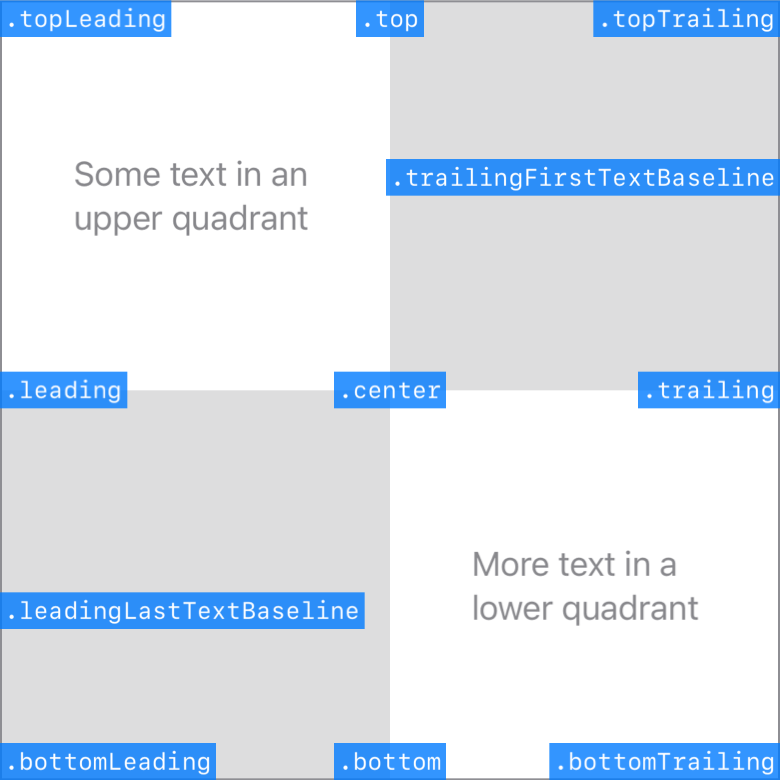

> Navigation: [Technologies](../technologies.md) · [SwiftUI](../swiftui.md)

# Alignment

<sub>Structure</sub>

An alignment in both axes.

<sub>iOS, iPadOS, Mac Catalyst, macOS, tvOS, visionOS, watchOS</sub>

```swift
@frozen struct Alignment
```

## Overview

An `Alignment` contains a [HorizontalAlignment](horizontalalignment.md) guide and a [VerticalAlignment](verticalalignment.md) guide. Specify an alignment to direct the behavior of certain layout containers and modifiers, like when you place views in a [ZStack](zstack.md), or layer a view in front of or behind another view using [overlay(alignment:content:)](<view/overlay(alignment_content_).md>) or [background(alignment:content:)](<view/background(alignment_content_).md>), respectively. During layout, SwiftUI brings the specified guides of the affected views together, aligning the views.

SwiftUI provides a set of built-in alignments that represent common combinations of the built-in horizontal and vertical alignment guides. The blue boxes in the following diagram demonstrate the alignment named by each box’s label, relative to the background view:



The following code generates the diagram above, where each blue box appears in an overlay that’s configured with a different alignment:

```swift
struct AlignmentGallery: View {
    var body: some View {
        BackgroundView()
            .overlay(alignment: .topLeading) { box(".topLeading") }
            .overlay(alignment: .top) { box(".top") }
            .overlay(alignment: .topTrailing) { box(".topTrailing") }
            .overlay(alignment: .leading) { box(".leading") }
            .overlay(alignment: .center) { box(".center") }
            .overlay(alignment: .trailing) { box(".trailing") }
            .overlay(alignment: .bottomLeading) { box(".bottomLeading") }
            .overlay(alignment: .bottom) { box(".bottom") }
            .overlay(alignment: .bottomTrailing) { box(".bottomTrailing") }
            .overlay(alignment: .leadingLastTextBaseline) { box(".leadingLastTextBaseline") }
            .overlay(alignment: .trailingFirstTextBaseline) { box(".trailingFirstTextBaseline") }
    }

    private func box(_ name: String) -> some View {
        Text(name)
            .font(.system(.caption, design: .monospaced))
            .padding(2)
            .foregroundColor(.white)
            .background(.blue.opacity(0.8), in: Rectangle())
    }
}

private struct BackgroundView: View {
    var body: some View {
        Grid(horizontalSpacing: 0, verticalSpacing: 0) {
            GridRow {
                Text("Some text in an upper quadrant")
                Color.gray.opacity(0.3)
            }
            GridRow {
                Color.gray.opacity(0.3)
                Text("More text in a lower quadrant")
            }
        }
        .aspectRatio(1, contentMode: .fit)
        .foregroundColor(.secondary)
        .border(.gray)
    }
}
```

To avoid crowding, the alignment diagram shows only two of the available text baseline alignments. The others align as their names imply. Notice that the first text baseline alignment aligns with the top-most line of text in the background view, while the last text baseline aligns with the bottom-most line. For more information about text baseline alignment, see [VerticalAlignment](verticalalignment.md).

In a left-to-right language like English, the leading and trailing alignments appear on the left and right edges, respectively. SwiftUI reverses these in right-to-left language environments. For more information, see [HorizontalAlignment](horizontalalignment.md).

### Custom alignment

You can create custom alignments — which you typically do to make use of custom horizontal or vertical guides — by using the [init(horizontal:vertical:)](<alignment/init(horizontal_vertical_).md>) initializer. For example, you can combine a custom vertical guide called `firstThird` with the built-in horizontal [center](horizontalalignment/center.md) guide, and use it to configure a [ZStack](zstack.md):

```swift
ZStack(alignment: Alignment(horizontal: .center, vertical: .firstThird)) {
    // ...
}
```

For more information about creating custom guides, including the code that creates the custom `firstThird` alignment in the example above, see [AlignmentID](alignmentid.md).

## Relationships

- **Conforms To**: [BitwiseCopyable](../swift/bitwisecopyable.md), [Copyable](../swift/copyable.md), [Equatable](../swift/equatable.md), [Sendable](../swift/sendable.md), [SendableMetatype](../swift/sendablemetatype.md)

## Topics

### Getting top guides

- [topLeading](alignment/topleading.md) — A guide that marks the top and leading edges of the view.
- [top](alignment/top.md) — A guide that marks the top edge of the view.
- [topTrailing](alignment/toptrailing.md) — A guide that marks the top and trailing edges of the view.

### Getting middle guides

- [leading](alignment/leading.md) — A guide that marks the leading edge of the view.
- [center](alignment/center.md) — A guide that marks the center of the view.
- [trailing](alignment/trailing.md) — A guide that marks the trailing edge of the view.

### Getting bottom guides

- [bottomLeading](alignment/bottomleading.md) — A guide that marks the bottom and leading edges of the view.
- [bottom](alignment/bottom.md) — A guide that marks the bottom edge of the view.
- [bottomTrailing](alignment/bottomtrailing.md) — A guide that marks the bottom and trailing edges of the view.

### Getting text baseline guides

- [leadingFirstTextBaseline](alignment/leadingfirsttextbaseline.md) — A guide that marks the leading edge and top-most text baseline in a view.
- [centerFirstTextBaseline](alignment/centerfirsttextbaseline.md) — A guide that marks the top-most text baseline in a view.
- [trailingFirstTextBaseline](alignment/trailingfirsttextbaseline.md) — A guide that marks the trailing edge and top-most text baseline in a view.
- [leadingLastTextBaseline](alignment/leadinglasttextbaseline.md) — A guide that marks the leading edge and bottom-most text baseline in a view.
- [centerLastTextBaseline](alignment/centerlasttextbaseline.md) — A guide that marks the bottom-most text baseline in a view.
- [trailingLastTextBaseline](alignment/trailinglasttextbaseline.md) — A guide that marks the trailing edge and bottom-most text baseline in a view.

### Creating a custom alignment

- [init(horizontal:vertical:)](<alignment/init(horizontal_vertical_).md>) — Creates a custom alignment value with the specified horizontal and vertical alignment guides.
- [horizontal](alignment/horizontal.md) — The alignment on the horizontal axis.
- [vertical](alignment/vertical.md) — The alignment on the vertical axis.

## See Also

### Aligning views

- [Aligning views within a stack](aligning-views-within-a-stack.md) — Position views inside a stack using alignment guides.
- [Aligning views across stacks](aligning-views-across-stacks.md) — Create a custom alignment and use it to align views across multiple stacks.
- [alignmentGuide(_:computeValue:)](<view/alignmentguide(__computevalue_).md>) — Sets the view’s horizontal alignment.
- [HorizontalAlignment](horizontalalignment.md) — An alignment position along the horizontal axis.
- [VerticalAlignment](verticalalignment.md) — An alignment position along the vertical axis.
- [DepthAlignment](depthalignment.md) — An alignment position along the depth axis.
- [AlignmentID](alignmentid.md) — A type that you use to create custom alignment guides.
- [ViewDimensions](viewdimensions.md) — A view’s size and alignment guides in its own coordinate space.
- [ViewDimensions3D](viewdimensions3d.md) — A view’s 3D size and alignment guides in its own coordinate space.
- [SpatialContainer](spatialcontainer.md) — A layout container that aligns overlapping content in 3D space.
