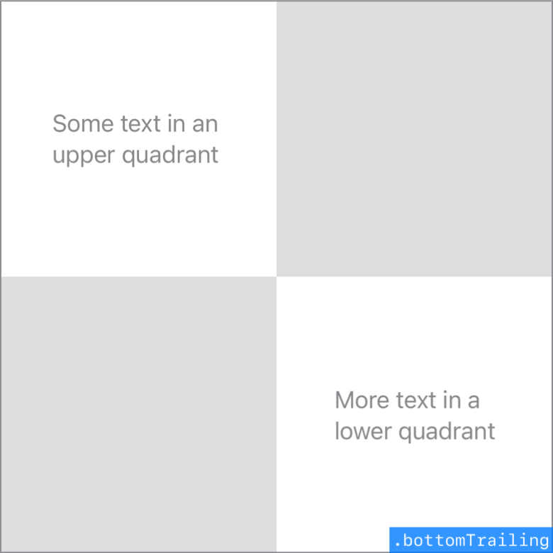

> Navigation: [Technologies](../../technologies.md) · [SwiftUI](../../swiftui.md) · [Alignment](../alignment.md)

# bottomTrailing

<sub>Type Property</sub>

A guide that marks the bottom and trailing edges of the view.

<sub>iOS, iPadOS, Mac Catalyst, macOS, tvOS, visionOS, watchOS</sub>

```swift
static let bottomTrailing: Alignment
```

## Discussion

This alignment combines the [trailing](../horizontalalignment/trailing.md) horizontal guide and the [bottom](../verticalalignment/bottom.md) vertical guide:



## See Also

### Getting bottom guides

- [bottomLeading](bottomleading.md) — A guide that marks the bottom and leading edges of the view.
- [bottom](bottom.md) — A guide that marks the bottom edge of the view.
