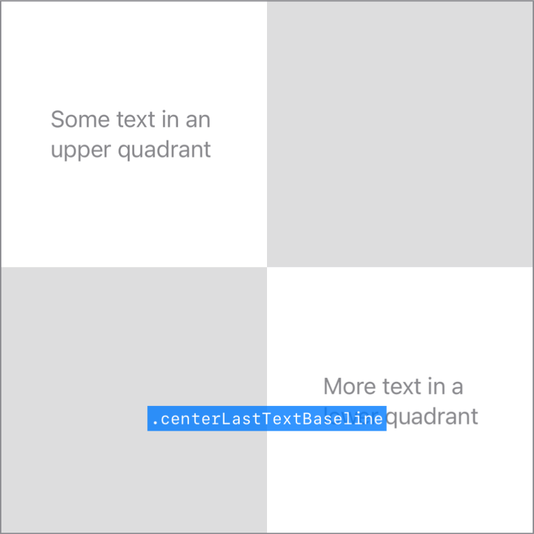

> Navigation: [Technologies](../../technologies.md) · [SwiftUI](../../swiftui.md) · [Alignment](../alignment.md)

# centerLastTextBaseline

<sub>Type Property</sub>

A guide that marks the bottom-most text baseline in a view.

<sub>iOS, iPadOS, Mac Catalyst, macOS, tvOS, visionOS, watchOS</sub>

```swift
@export(implementation) static var centerLastTextBaseline: Alignment { get }
```

## Discussion

This alignment combines the [center](../horizontalalignment/center.md) horizontal guide and the [lastTextBaseline](../verticalalignment/lasttextbaseline.md) vertical guide:



## See Also

### Getting text baseline guides

- [leadingFirstTextBaseline](leadingfirsttextbaseline.md) — A guide that marks the leading edge and top-most text baseline in a view.
- [centerFirstTextBaseline](centerfirsttextbaseline.md) — A guide that marks the top-most text baseline in a view.
- [trailingFirstTextBaseline](trailingfirsttextbaseline.md) — A guide that marks the trailing edge and top-most text baseline in a view.
- [leadingLastTextBaseline](leadinglasttextbaseline.md) — A guide that marks the leading edge and bottom-most text baseline in a view.
- [trailingLastTextBaseline](trailinglasttextbaseline.md) — A guide that marks the trailing edge and bottom-most text baseline in a view.
