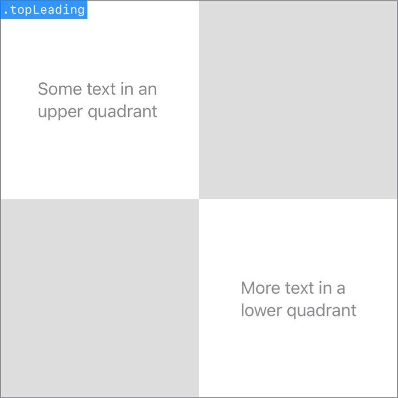

> Navigation: [Technologies](../../technologies.md) · [SwiftUI](../../swiftui.md) · [Alignment](../alignment.md)

# topLeading

<sub>Type Property</sub>

A guide that marks the top and leading edges of the view.

<sub>iOS, iPadOS, Mac Catalyst, macOS, tvOS, visionOS, watchOS</sub>

```swift
static let topLeading: Alignment
```

## Discussion

This alignment combines the [leading](../horizontalalignment/leading.md) horizontal guide and the [top](../verticalalignment/top.md) vertical guide:



## See Also

### Getting top guides

- [top](top.md) — A guide that marks the top edge of the view.
- [topTrailing](toptrailing.md) — A guide that marks the top and trailing edges of the view.
