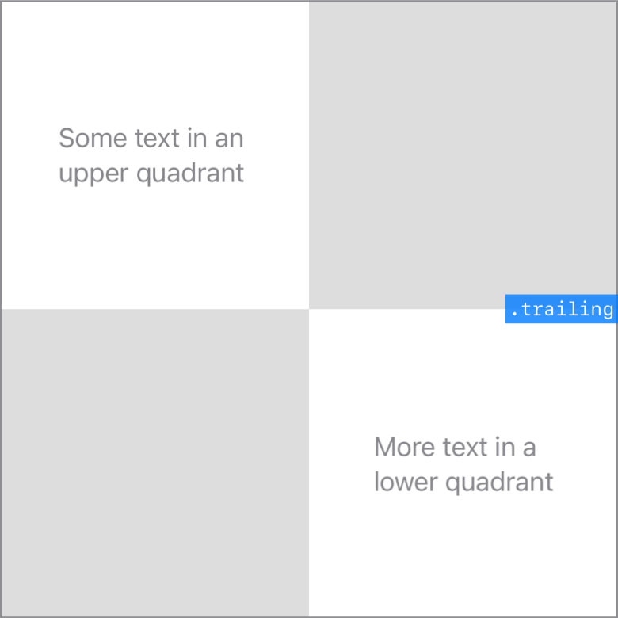

> Navigation: [Technologies](../../technologies.md) · [SwiftUI](../../swiftui.md) · [Alignment](../alignment.md)

# trailing

<sub>Type Property</sub>

A guide that marks the trailing edge of the view.

<sub>iOS, iPadOS, Mac Catalyst, macOS, tvOS, visionOS, watchOS</sub>

```swift
static let trailing: Alignment
```

## Discussion

This alignment combines the [trailing](../horizontalalignment/trailing.md) horizontal guide and the [center](../verticalalignment/center.md) vertical guide:



## See Also

### Getting middle guides

- [leading](leading.md) — A guide that marks the leading edge of the view.
- [center](center.md) — A guide that marks the center of the view.
