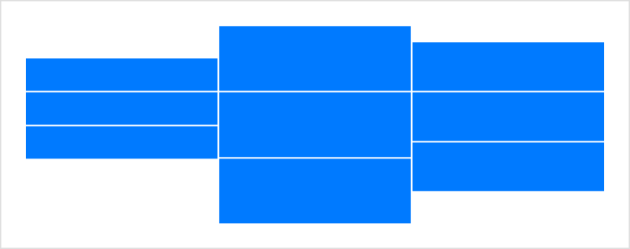
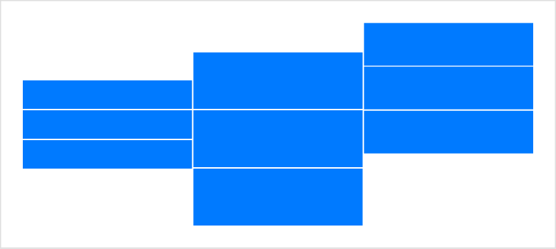

> Navigation: [Technologies](../technologies.md) · [SwiftUI](../swiftui.md)

# AlignmentID

<sub>Protocol</sub>

A type that you use to create custom alignment guides.

<sub>iOS, iPadOS, Mac Catalyst, macOS, tvOS, visionOS, watchOS</sub>

```swift
protocol AlignmentID
```

## Overview

Every built-in alignment guide that [VerticalAlignment](verticalalignment.md) or [HorizontalAlignment](horizontalalignment.md) defines as a static property, like [top](verticalalignment/top.md) or [leading](horizontalalignment/leading.md), has a unique alignment identifier type that produces the default offset for that guide. To create a custom alignment guide, define your own alignment identifier as a type that conforms to the `AlignmentID` protocol, and implement the required [defaultValue(in:)](<alignmentid/defaultvalue(in_).md>) method:

```swift
private struct FirstThirdAlignment: AlignmentID {
    static func defaultValue(in context: ViewDimensions) -> CGFloat {
        context.height / 3
    }
}
```

When implementing the method, calculate the guide’s default offset from the view’s origin. If it’s helpful, you can use information from the [ViewDimensions](viewdimensions.md) input in the calculation. This parameter provides context about the specific view that’s using the guide. The above example creates an identifier called `FirstThirdAlignment` and calculates a default value that’s one-third of the height of the aligned view.

Use the identifier’s type to create a static property in an extension of one of the alignment guide types, like [VerticalAlignment](verticalalignment.md):

```swift
extension VerticalAlignment {
    static let firstThird = VerticalAlignment(FirstThirdAlignment.self)
}
```

You can apply your custom guide like any of the built-in guides. For example, you can use an [HStack](hstack.md) to align its views at one-third of their height using the guide defined above:

```swift
struct StripesGroup: View {
    var body: some View {
        HStack(alignment: .firstThird, spacing: 1) {
            HorizontalStripes().frame(height: 60)
            HorizontalStripes().frame(height: 120)
            HorizontalStripes().frame(height: 90)
        }
    }
}

struct HorizontalStripes: View {
    var body: some View {
        VStack(spacing: 1) {
            ForEach(0..<3) { _ in Color.blue }
        }
    }
}
```

Because each set of stripes has three equal, vertically stacked rectangles, they align at the bottom edge of the top rectangle. This corresponds in each case to a third of the overall height, as measured from the origin at the top of each set of stripes:



You can also use the [alignmentGuide(_:computeValue:)](<view/alignmentguide(__computevalue_).md>) view modifier to alter the behavior of your custom guide for a view, as you might alter a built-in guide. For example, you can change one of the stacks of stripes from the previous example to align its `firstThird` guide at two thirds of the height instead:

```swift
struct StripesGroupModified: View {
    var body: some View {
        HStack(alignment: .firstThird, spacing: 1) {
            HorizontalStripes().frame(height: 60)
            HorizontalStripes().frame(height: 120)
            HorizontalStripes().frame(height: 90)
                .alignmentGuide(.firstThird) { context in
                    2 * context.height / 3
                }
        }
    }
}
```

The modified guide calculation causes the affected view to place the bottom edge of its middle rectangle on the `firstThird` guide, which aligns with the bottom edge of the top rectangle in the other two groups:



## Topics

### Getting the default value

- [defaultValue(in:)](<alignmentid/defaultvalue(in_).md>) — Calculates a default value for the corresponding guide in the specified context.

## See Also

### Aligning views

- [Aligning views within a stack](aligning-views-within-a-stack.md) — Position views inside a stack using alignment guides.
- [Aligning views across stacks](aligning-views-across-stacks.md) — Create a custom alignment and use it to align views across multiple stacks.
- [alignmentGuide(_:computeValue:)](<view/alignmentguide(__computevalue_).md>) — Sets the view’s horizontal alignment.
- [Alignment](alignment.md) — An alignment in both axes.
- [HorizontalAlignment](horizontalalignment.md) — An alignment position along the horizontal axis.
- [VerticalAlignment](verticalalignment.md) — An alignment position along the vertical axis.
- [DepthAlignment](depthalignment.md) — An alignment position along the depth axis.
- [ViewDimensions](viewdimensions.md) — A view’s size and alignment guides in its own coordinate space.
- [ViewDimensions3D](viewdimensions3d.md) — A view’s 3D size and alignment guides in its own coordinate space.
- [SpatialContainer](spatialcontainer.md) — A layout container that aligns overlapping content in 3D space.
