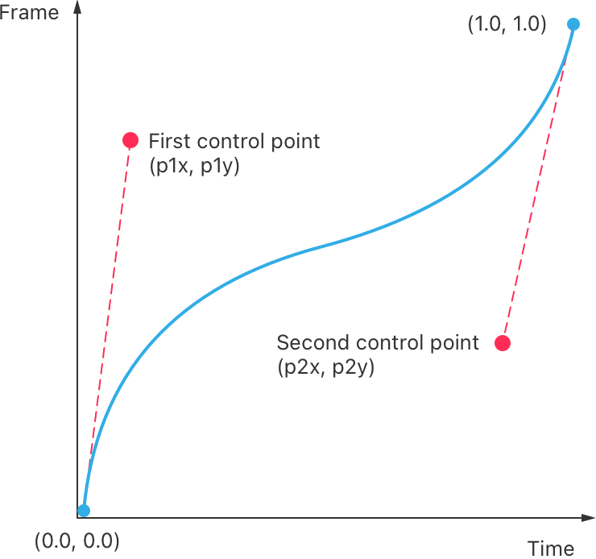

> Navigation: [Technologies](../../technologies.md) · [SwiftUI](../../swiftui.md) · [Animation](../animation.md)

# timingCurve(_:_:_:_:duration:)

<sub>Type Method</sub>

An animation created from a cubic Bézier timing curve.

<sub>iOS, iPadOS, Mac Catalyst, macOS, tvOS, visionOS, watchOS</sub>

```swift
static func timingCurve(_ p1x: Double, _ p1y: Double, _ p2x: Double, _ p2y: Double, duration: TimeInterval = 0.35) -> Animation
```

## Parameters

- `p1x` — The x-coordinate of the first control point of the cubic Bézier curve.

- `p1y` — The y-coordinate of the first control point of the cubic Bézier curve.

- `p2x` — The x-coordinate of the second control point of the cubic Bézier curve.

- `p2y` — The y-coordinate of the second control point of the cubic Bézier curve.

- `duration` — The length of time, expressed in seconds, the animation takes to complete.

## Return Value

A cubic Bézier timing curve animation.

## Discussion

Use this method to create a timing curve based on the control points of a cubic Bézier curve. A cubic Bézier timing curve consists of a line whose starting point is `(0, 0)` and whose end point is `(1, 1)`. Two additional control points, `(p1x, p1y)` and `(p2x, p2y)`, define the shape of the curve.

The slope of the line defines the speed of the animation at that point in time. A steep slopes causes the animation to appear to run faster, while a shallower slope appears to run slower. The following illustration shows a timing curve where the animation starts and finishes fast, but appears slower through the middle section of the animation.



<sub>An illustration of an XY graph that shows the path of a Bézier timing curve that an animation frame follows over time. The horizontal x-axis has a label with the text Time, and a label with the text Frame appears along the vertical y-axis. The path begins at the graph’s origin, labeled as (0.0, 0.0). The path moves upwards, forming a concave down shape. At the point of inflection, the path continues upwards, forming a concave up shape. A label with the text First control point (p1x, p1y) appears above the path. Extending from the label is a dotted line pointing to the position (0.1, 0.75) on the graph. Another label with the text Second control point (p2x, p2y) appears below the path. A dotted line extends from the label to the (0.85, 0.35) position on the graph.</sub>

The following code uses the timing curve from the previous illustration to animate a [Circle](../circle.md) as its size changes.

```swift
struct ContentView: View {
    @State private var scale = 1.0

    var body: some View {
        VStack {
            Circle()
                .scaleEffect(scale)
                .animation(
                    .timingCurve(0.1, 0.75, 0.85, 0.35, duration: 2.0),
                    value: scale)

            Button("Animate") {
                if scale == 1.0 {
                    scale = 0.25
                } else {
                    scale = 1.0
                }
            }
        }
    }
}
```

[A video that shows a circle shrinking then growing to its original size using a timing curve animation. The first control point of the time curve is (0.1, 0.75) and the second is (0.85, 0.35).](https://docs-assets.developer.apple.com/published/dd8a1a97b1d2656e2a9e37566aef2d9c/animation-14-timing-curve.mp4)

## See Also

### Creating custom animations

- [init(_:)](<init(__).md>) — Create an `Animation` that contains the specified custom animation.
- [timingCurve(_:duration:)](<timingcurve(__duration_).md>) — Creates a new animation with speed controlled by the given curve.
