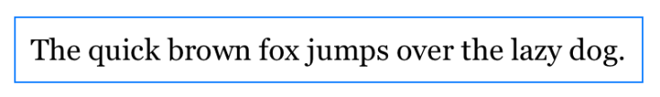

> Navigation: [Technologies](../technologies.md) · [SwiftUI](../swiftui.md) · [Text input and output](text-input-and-output.md)

# Applying custom fonts to text

<sub>Article</sub>

Add and use a font in your app that scales with Dynamic Type.

## Overview

SwiftUI supports styling text views using the built-in fonts, and uses a system font by default. Rather than using a system-provided font, you can use custom fonts by including the font files in your Xcode project. To use a custom font, add the font file that contains your licensed font to your app, and then apply the font to a text view or set it as a default font within a container view. SwiftUI’s adaptive text display scales the font automatically using Dynamic Type.

Dynamic Type allows users to choose the size of textual content displayed onscreen. It helps users who need larger text for better readability and accommodates those who can read smaller text, allowing more information to appear onscreen.

### Add the font files to the project

To add the font files to your Xcode project:

1. In Xcode, select the Project navigator.
2. Drag your fonts from a Finder window into your project. This copies the fonts to your project.
3. Select the font or folder with the fonts, and verify that the files show their target membership checked for your app’s targets.


<sub>A screenshot of Xcode showing the Info plist file with the fonts added to the selected app. The screenshot shows the target membership check boxes selected for macOS and iOS targets in the file inspector</sub>

### Identify the font files to include in the app bundle

For iOS, watchOS, tvOS, or Mac Catalyst targets, add the [UIAppFonts](../bundleresources/information-property-list/uiappfonts.md) key to your app’s `Info.plist` file. For the key’s value, provide an array of strings containing the relative paths to any added font files. For a macOS app target, use the [ATSApplicationFontsPath](../bundleresources/information-property-list/atsapplicationfontspath.md) key in your target’s `Info.plist` file, and provide the name of the folder that holds the fonts as the value for that key.

In the following example, the font file is inside the `project_fonts` directory, so you use `project_fonts/MyFont.ttf` as the string value in the `Info.plist` file.


<sub>A screenshot of Xcode showing the Info plist file with the key Fonts provided by the app as an array that contains a single entry of project_fonts/MyFont.ttf</sub>

### Apply a font supporting dynamic sizing

Use the [custom(_:size:)](<font/custom(__size_).md>) method to retrieve an instance of your font and apply it to a text view with the [font(_:)](<text/font(__).md>) modifier. When retrieving the font with [custom(_:size:)](<font/custom(__size_).md>), match the name of the font with the font’s PostScript name. You can find the postscript name of a font by opening it with the Font Book app and selecting the Font Info tab. If SwiftUI can’t retrieve and apply your font, it renders the text view with the default system font instead.

The following example applies the font `MyFont` to a text view:

```swift
Text("Hello, world!")
    .font(Font.custom("MyFont", size: 18))
```

The font scales adaptively from the size provided to align with the default text style of [body](font/body.md). Use the `relativeTo` parameter to specify a text style to scale with other than the default of `body`. For example, to set the font size to `32` points and adaptively scale relative to the text style of [title](font/title.md):

```swift
Text("Hello, world!")
    .font(Font.custom("MyFont", size: 32, relativeTo: .title))
```

SwiftUI doesn’t synthesize bold or italic styling for fonts. If the font supports weighted or italic variants, you can customize the typography of the text view by styling the font using the [weight(_:)](<font/weight(__).md>) or [italic()](<font/italic().md>) modifiers.

For design guidance on choosing fonts to enhance your app on your target platform, see [Typography](../design/human-interface-guidelines/typography.md) in the Human Interface Guidelines.

### Scale padding using scaled metric

The [ScaledMetric](scaledmetric.md) property wrapper on a view property provides a scaled value that changes automatically with accessibility settings. When working with adaptively sized fonts, you can scale the spacing between or around the text to improve the visual design with this property wrapper.

The following example uses `@ScaledMetric` to scale the padding value surrounding a text view relative to the `body` text style, with a blue border added to identify the spacing that padding adds:

```swift
struct ContentView: View {
    @ScaledMetric(relativeTo: .body) var scaledPadding: CGFloat = 10

    var body: some View {
        Text("The quick brown fox jumps over the lazy dog.")
            .font(Font.custom("MyFont", size: 18))
            .padding(scaledPadding)
            .border(Color.blue)
    }
}

struct ContentView_Previews: PreviewProvider {
    static var previews: some View {
        ContentView()
    }
}
```

The preview shows the following image without any accessibility settings turned on:



Use the [environment(_:_:)](<view/environment(____).md>) modifier to set the accessibility size category on the preview to [ContentSizeCategory.accessibilityLarge](contentsizecategory/accessibilitylarge.md):

```swift
struct ContentView_Previews: PreviewProvider {
    static var previews: some View {
        ContentView()
            .environment(\.sizeCategory, .accessibilityLarge)
    }
}
```

The preview then shows the following image that reflects the increased accessibility size and the scaled padding:


<sub>The text the quick brown fox jumps over the lazy dog in three lines with a blue border around it with larger whitespace between the blue border and text content.</sub>

## See Also

### Setting a font

- [font(_:)](<view/font(__).md>) — Sets the default font for text in this view.
- [fontDesign(_:)](<view/fontdesign(__).md>) — Sets the font design of the text in this view.
- [fontWeight(_:)](<view/fontweight(__).md>) — Sets the font weight of the text in this view.
- [fontWidth(_:)](<view/fontwidth(__).md>) — Sets the font width of the text in this view.
- [font](environmentvalues/font.md) — The default font of this environment.
- [Font](font.md) — An environment-dependent font.
