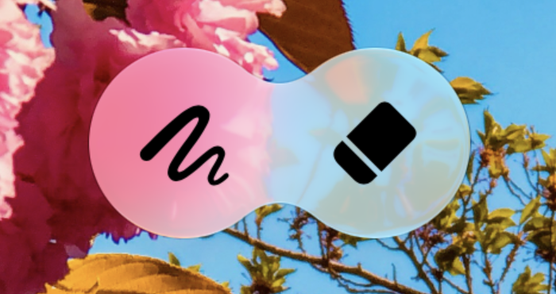

> Navigation: [Technologies](../technologies.md) · [SwiftUI](../swiftui.md) · [View styles](view-styles.md)

# Applying Liquid Glass to custom views

<sub>Article</sub>

Configure, combine, and morph views using Liquid Glass effects.

## Overview

Interfaces across Apple platforms feature a new dynamic material called Liquid Glass, which combines the optical properties of glass with a sense of fluidity. Liquid Glass is a material that blurs content behind it, reflects color and light of surrounding content, and reacts to touch and pointer interactions in real time. Standard components in SwiftUI use Liquid Glass. Adopt Liquid Glass on custom components to move, combine, and morph them into one another with unique animations and transitions.


To learn about Liquid Glass and more, see [Landmarks: Building an app with Liquid Glass](landmarks-building-an-app-with-liquid-glass.md).

## Apply and configure Liquid Glass effects

Use the [glassEffect(_:in:)](<view/glasseffect(__in_).md>) modifier to add Liquid Glass effects to a view. By default, the modifier uses the [regular](glass/regular.md) variant of [Glass](glass.md) and applies the given effect within a [Capsule](capsule.md) shape behind the view’s content.

Configure the effect to customize your components in a variety of ways:

- Use different shapes to have a consistent look and feel across custom components in your app. For example, use a rounded rectangle if you’re applying the effect to larger components that would look odd as a `Capsule` or [Circle](circle.md).
- Assign a tint color to suggest prominence.
- Add [interactive(_:)](<glass/interactive(__).md>) to custom components to make them react to touch and pointer interactions. This applies the same responsive and fluid reactions that [glass](primitivebuttonstyle/glass.md) provides to standard buttons.

In the examples below, observe how to apply Liquid Glass effects to a view, use an alternate shape with a specific corner radius, and create a tinted view that responds to interactivity:

[A video showing examples including a Text view with Liquid Glass effects applied, a Text view with a custom shape, corner radius effect, and Liquid Glass effects applied, and a Text view with an orange tint color effect that responds to interactivity, with Liquid Glass effects applied.](https://docs-assets.developer.apple.com/published/fd1df61adf23123bd504c5ddf4d83b00/liquid-glass-view-examples.mp4)

```swift
Text("Hello, World!")
    .font(.title)
    .padding()
    .glassEffect()

Text("Hello, World!")
    .font(.title)
    .padding()
    .glassEffect(in: .rect(cornerRadius: 16.0))

Text("Hello, World!")
    .font(.title)
    .padding()
    .glassEffect(.regular.tint(.orange).interactive())
```

## Combine multiple views with Liquid Glass containers

Use [GlassEffectContainer](glasseffectcontainer.md) when applying Liquid Glass effects on multiple views to achieve the best rendering performance. A container also allows views with Liquid Glass effects to blend their shapes together and to morph in and out of each other during transitions. Inside a container, each view with the [glassEffect(_:in:)](<view/glasseffect(__in_).md>) modifier renders with the effects behind it.

Customize the spacing on the container to control how the Liquid Glass effects behind views interact with one another. The larger the spacing value on the container, the sooner the Liquid Glass effects behind views blend together and merge the shapes during a transition. A spacing value on the container that’s larger than the spacing of an interior [HStack](hstack.md), [VStack](vstack.md), or other layout container causes Liquid Glass effects to blend together at rest because the views are too close to each other. Animating views in or out causes the shapes to morph apart or together as the space in the container changes.

The `glassEffect(_:in:)` modifier captures the content to send to the container to render. Apply the `glassEffect(_:in:)` modifier after other modifiers that affect the appearance of the view.

In the example below, two images are placed close to each other and the Liquid Glass effects begin to blend their shapes together. This creates a fluid animation as components move around each other within a container:



<sub>Two Image views representing a scribble symbol on the left, and an eraser symbol on the right. The views are close to each other, which causes the Liquid Glass effects to merge the views.</sub>

```swift
GlassEffectContainer(spacing: 40.0) {
    HStack(spacing: 40.0) {
        Image(systemName: "scribble.variable")
            .frame(width: 80.0, height: 80.0)
            .font(.system(size: 36))
            .glassEffect()

        Image(systemName: "eraser.fill")
            .frame(width: 80.0, height: 80.0)
            .font(.system(size: 36))
            .glassEffect()

            // An `offset` shows how Liquid Glass effects react to each other in a container.
            // Use animations and components appearing and disappearing to obtain effects that look purposeful.
            .offset(x: -40.0, y: 0.0)
    }
}
```

In some cases, you want the geometries of multiple views to contribute to a single Liquid Glass effect capsule, even when your content is at rest. Use the [glassEffectUnion(id:namespace:)](<view/glasseffectunion(id_namespace_).md>) modifier to specify that a view contributes to a unified effect with a particular ID. This combines all effects with a similar shape, Liquid Glass effect, and ID into a single shape with the applied Liquid Glass material. This is especially useful when creating views dynamically, or with views that live outside of a layout container, like an `HStack` or `VStack`.


<sub>Four Image views that have Liquid Glass effects applied. A rain cloud with lightning symbol and a sun with rain symbol have a unified Liquid Glass effect encapsulating both of them, followed by a unified Liquid Glass effect of a moon with stars symbol and a moon symbol.</sub>

```swift
let symbolSet: [String] = ["cloud.bolt.rain.fill", "sun.rain.fill", "moon.stars.fill", "moon.fill"]

GlassEffectContainer(spacing: 20.0) {
    HStack(spacing: 20.0) {
        ForEach(symbolSet.indices, id: \.self) { item in
            Image(systemName: symbolSet[item])
                .frame(width: 80.0, height: 80.0)
                .font(.system(size: 36))
                .glassEffect()
                .glassEffectUnion(id: item < 2 ? "1" : "2", namespace: namespace)
        }
    }
}
```

## Morph Liquid Glass effects during transitions

Morphing effects occur during transitions or animations between views with Liquid Glass effects. Coordinate transitions between views with effects in a container by using the [glassEffectID(_:in:)](<view/glasseffectid(__in_).md>) modifier. [GlassEffectTransition](glasseffecttransition.md) allows you to specify the type of transition to use when you want to add or remove effects within a container. For effects you want to add or remove that are positioned within the container’s assigned spacing, the default transition type is [matchedGeometry](glasseffecttransition/matchedgeometry.md).

If you prefer to have a simpler transition or to create a custom transition, use the [materialize](glasseffecttransition/materialize.md) transition and [withAnimation(_:_:)](<withanimation(____).md>). Use the `materialize` transition for effects you want to add or remove that are farther from each other than the container’s assigned spacing. To provide people with a consistent experience, use `matchedGeometry` and `materialize` transitions across your apps. The system applies more than opacity changes with the available transition types.

Associate each Liquid Glass effect with a unique identifier within a namespace that the [Namespace](namespace.md) property wrapper provides. These IDs ensure SwiftUI animates the same shapes correctly when a shape appears or disappears due to view hierarchy changes. SwiftUI uses the spacing provided to the effect container along with the geometry of the shapes themselves to determine when and which appropriate shapes to morph into and out of.

The `glassEffectID(_:in:)` and `glassEffectTransition(_:)` modifiers only affect their content during view hierarchy transitions or animations.

In the example below, the eraser image transitions into and out of the pencil image when the `isExpanded` variable changes. The `GlassEffectContainer` has a spacing value of `40.0`, and the `HStack` within it has a spacing of `40.0`. This morphs the eraser image into the pencil image when the eraser’s nearest edge is less than or equal to the container’s spacing.

[A video which shows two views, a scribble symbol on the left and a eraser symbol on the right, with Liquid Glass effects morphing in and out of each other as a button below them is pressed.](https://docs-assets.developer.apple.com/published/d26d316e435a6e3ae01751e4b9fd5e85/liquid-glass-morph-views.mp4)

```swift
@State private var isExpanded: Bool = false
@Namespace private var namespace

var body: some View {
    GlassEffectContainer(spacing: 40.0) {
        HStack(spacing: 40.0) {
            Image(systemName: "scribble.variable")
                .frame(width: 80.0, height: 80.0)
                .font(.system(size: 36))
                .glassEffect()
                .glassEffectID("pencil", in: namespace)

            if isExpanded {
                Image(systemName: "eraser.fill")
                    .frame(width: 80.0, height: 80.0)
                    .font(.system(size: 36))
                    .glassEffect()
                    .glassEffectID("eraser", in: namespace)
            }
        }
    }

    Button("Toggle") {
        withAnimation {
            isExpanded.toggle()
        }
    }
    .buttonStyle(.glass)
}
```

## Optimize performance when using Liquid Glass effects

Creating too many Liquid Glass effect containers and applying too many effects to views outside of containers can degrade performance. Limit the use of Liquid Glass effects onscreen at the same time. Additionally, optimize how your app spends rendering time as people use it. To learn how to improve the performance of your UI, see [Explore UI animation hitches and the render loop](https://developer.apple.com/videos/play/tech-talks/10855/) and [Optimize SwiftUI performance with Instruments](https://developer.apple.com/videos/play/wwdc2025/306/).

## See Also

### Styling views with Liquid Glass

- [Landmarks: Building an app with Liquid Glass](landmarks-building-an-app-with-liquid-glass.md) — Enhance your app experience with system-provided and custom Liquid Glass.
- [glassEffect(_:in:)](<view/glasseffect(__in_).md>) — Applies the Liquid Glass effect to a view.
- [glassEffectID(_:in:)](<view/glasseffectid(__in_).md>) — Associates an identity value to Liquid Glass effects defined within this view.
- [glassEffectTransition(_:)](<view/glasseffecttransition(__).md>) — Associates a glass effect transition with any glass effects defined within this view.
- [glassEffectUnion(id:namespace:)](<view/glasseffectunion(id_namespace_).md>) — Associates any Liquid Glass effects defined within this view to a union with the provided identifier.
- [interactive(_:)](<glass/interactive(__).md>) — Returns a copy of the structure configured to be interactive.
- [GlassEffectContainer](glasseffectcontainer.md) — A view that combines multiple Liquid Glass shapes into a single shape that can morph individual shapes into one another.
- [GlassEffectTransition](glasseffecttransition.md) — A structure that describes changes to apply when a glass effect is added or removed from the view hierarchy.
- [GlassButtonStyle](glassbuttonstyle.md) — A button style that applies glass border artwork based on the button’s context.
- [GlassProminentButtonStyle](glassprominentbuttonstyle.md) — A button style that applies prominent glass border artwork based on the button’s context.
- [DefaultGlassEffectShape](defaultglasseffectshape.md) — The default shape applied by glass effects, a capsule.
