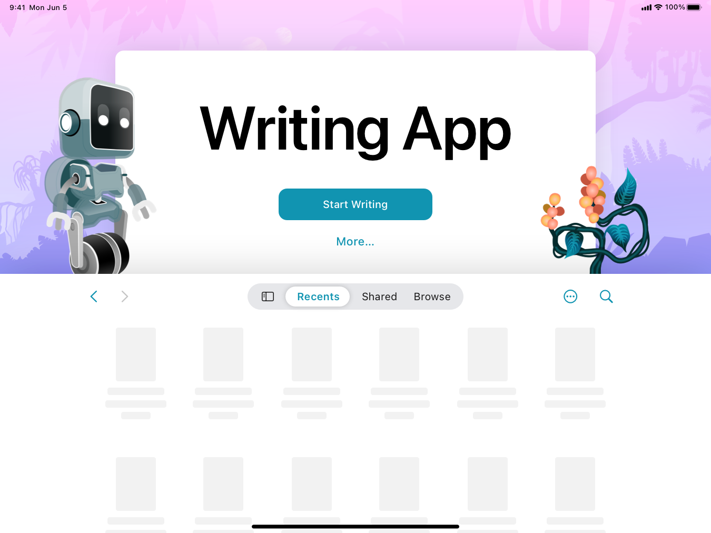

> Navigation: [Technologies](../technologies.md) · [SwiftUI](../swiftui.md) · [Documents](documents.md)

# Building a document-based app with SwiftUI

<sub>Sample Code</sub>

Create, save, and open documents in a multiplatform app.

## Overview

The Writing App sample builds a document-based app for iOS, iPadOS, and macOS. In the app definition, it has a [DocumentGroup](documentgroup.md) scene, and its document type conforms to the [FileDocument](filedocument.md) protocol. People can create a writing app document, modify the title and contents of the document, and read the story in focus mode.



<sub>A screenshot displaying the document launch experience on iPad with a robot and plant accessory to the left and right of the title view, respectively.</sub>

## Configure the sample code project

To build and run this sample on your device, select your development team for the project’s target using these steps:

1. Open the sample with the latest version of Xcode.
2. Select the top-level project.
3. For the project’s target, choose your team from the Team pop-up menu in the Signing & Capabilities pane to let Xcode automatically manage your provisioning profile.

## Define the app’s scene

A document-based SwiftUI app returns a `DocumentGroup` scene from its `body` property. The `newDocument` parameter that an app supplies to the document group’s [init(newDocument:editor:)](<documentgroup/init(newdocument_editor_)-4toe2.md>) initializer conforms to either [FileDocument](filedocument.md) or [ReferenceFileDocument](referencefiledocument.md). In this sample, the document type conforms to `FileDocument`. The trailing closure of the initializer returns a view that renders the document’s contents:

```swift
@main
struct WritingApp: App {
    var body: some Scene {
        DocumentGroup(newDocument: WritingAppDocument()) { file in
            StoryView(document: file.$document)
        }
    }
}
```

## Customize the iOS and iPadOS launch experience

You can update the default launch experience on iOS and iPadOS with a custom title, action buttons, and screen background. To add an action button with a custom label, use [NewDocumentButton](newdocumentbutton.md) to replace the default label. You can customize the background in many ways such as adding a view or a `backgroundStyle` with an initializer, for example [init(_:backgroundStyle:_:backgroundAccessoryView:overlayAccessoryView:)](<documentgrouplaunchscene/init(__backgroundstyle___backgroundaccessoryview_overlayaccessoryview_)-2d13c.md>). This sample customizes the background of the title view, using the [init(_:_:background:)](<documentgrouplaunchscene/init(____background_)-2iefz.md>) initializer:

```swift
DocumentGroupLaunchScene("Writing App") {
    NewDocumentButton("Start Writing")
} background: {
    Image(.pinkJungle)
    .resizable()
    .scaledToFill()
    .ignoresSafeArea()
} 
```

You can also add accessories to the scene using initializers such as [init(_:_:background:backgroundAccessoryView:)](<documentgrouplaunchscene/init(____background_backgroundaccessoryview_)-1valf.md>) and [init(_:_:background:overlayAccessoryView:)](<documentgrouplaunchscene/init(____background_overlayaccessoryview_)-1143c.md>) depending on the positioning.

```swift
overlayAccessoryView: { _ in
    AccessoryView()
}
```

This sample contains two accessories in the overlay position that it defines in `AccessoryView`. It customizes the accessories by applying modifiers, including [offset(x:y:)](<view/offset(x_y_).md>) and [frame(width:height:alignment:)](<view/frame(width_height_alignment_).md>).

```swift
ZStack {
    Image(.robot)
        .resizable()
        .offset(x: size.width / 2 - 450, y: size.height / 2 - 300)
        .scaledToFit()
        .frame(width: 200)
        .opacity(horizontal == .compact ? 0 : 1)
    Image(.plant)
        .resizable()
        .offset(x: size.width / 2 + 250, y: size.height / 2 - 225)
        .scaledToFit()
        .frame(width: 200)
        .opacity(horizontal == .compact ? 0 : 1)
}
```

To add both background and overlay accessories, use an initializer, such as [init(_:_:background:backgroundAccessoryView:overlayAccessoryView:)](<documentgrouplaunchscene/init(____background_backgroundaccessoryview_overlayaccessoryview_)-1re6d.md>). If you don’t provide any accessories, the system displays two faded sheets below the title view by default. In macOS, this sample displays the default system document browser on launch. You may wish to add an additional experience on launch.

## Create the data model

This sample has a data model that defines a story as a `String`, it initializes `story` with an empty string:

```swift
var story: String

init(text: String = "") {
    self.story = text
}
```

## Adopt the file document protocol

The `WritingAppDocument` structure adopts the `FileDocument` protocol to serialize documents to and from files. The [readableContentTypes](filedocument/readablecontenttypes.md) property defines the types that the sample can read and write, specifically, the `.writingAppDocument` type:

```swift
static var readableContentTypes: [UTType] { [.writingAppDocument] }
```

The [init(configuration:)](<filedocument/init(configuration_).md>) initializer loads documents from a file. After reading the file’s data using the [file](filedocumentreadconfiguration/file.md) property of the `configuration` input, it deserializes the data and stores it in the document’s data model:

```swift
init(configuration: ReadConfiguration) throws {
    guard let data = configuration.file.regularFileContents,
          let string = String(data: data, encoding: .utf8)
    else {
        throw CocoaError(.fileReadCorruptFile)
    }
    story = string
}
```

When a person writes a document, SwiftUI calls the [fileWrapper(configuration:)](<filedocument/filewrapper(configuration_).md>) function to serialize the data model into a `FileWrapper` value that represents the data in the file system:

```swift
func fileWrapper(configuration: WriteConfiguration) throws -> FileWrapper {
    let data = Data(story.utf8)
    return .init(regularFileWithContents: data)
}
```

Because the document type conforms to `FileDocument`, this sample handles undo actions automatically.

## Export a custom document type

The app defines and exports a custom content type for the documents it creates. It declares this custom type in the project’s [Information Property List](../bundleresources/information-property-list.md) file under the [UTExportedTypeDeclarations](../bundleresources/information-property-list/utexportedtypedeclarations.md) key. This sample uses `com.example.writingAppDocument` as the identifier in the `Info.plist` file:

```swift
<key>CFBundleDocumentTypes</key>
<array>
    <dict>
        <key>CFBundleTypeRole</key>
        <string>Editor</string>
        <key>LSHandlerRank</key>
        <string>Default</string>
        <key>LSItemContentTypes</key>
        <array>
            <string>com.example.writingAppDocument</string>
        </array>
        <key>NSUbiquitousDocumentUserActivityType</key>
        <string>$(PRODUCT_BUNDLE_IDENTIFIER).exampledocument</string>
    </dict>
</array>
<key>UTExportedTypeDeclarations</key>
<array>
    <dict>
        <key>UTTypeConformsTo</key>
        <array>
            <string>public.utf8-plain-text</string>
        </array>
        <key>UTTypeDescription</key>
        <string>Writing App Document</string>
        <key>UTTypeIconFiles</key>
        <array/>
        <key>UTTypeIdentifier</key>
        <string>com.example.writingAppDocument</string>
        <key>UTTypeTagSpecification</key>
        <dict>
            <key>public.filename-extension</key>
            <array>
                <string>story</string>
            </array>
        </dict>
    </dict>
</array>
```

For convenience, you can also define the content type in code. For example:

```swift
extension UTType {
    static var writingapp: UTType {
        UTType(exportedAs: "com.example.writingAppDocument")
    }
}
```

To make sure that the operating system knows that your application can open files with the format described in the `Info.plist`, it defines the file extension `story` for the content type. For more information about custom file and data types, see [Defining file and data types for your app](../uniformtypeidentifiers/defining-file-and-data-types-for-your-app.md).

## See Also

#### Related samples

- [Building a document-based app using SwiftData](building-a-document-based-app-using-swiftdata.md)

#### Related articles

- [Defining file and data types for your app](../uniformtypeidentifiers/defining-file-and-data-types-for-your-app.md)
- [Customizing a document-based app’s launch experience](../uikit/customizing-a-document-based-app-s-launch-experience.md)

#### Related videos

- [Evolve your document launch experience](../https_/developer.apple.com/videos/play/wwdc2024/10132.md)

## Download

- [BuildingADocumentBasedAppWithSwiftUI.zip](https://docs-assets.developer.apple.com/published/ef10bd7eff0d/BuildingADocumentBasedAppWithSwiftUI.zip)
