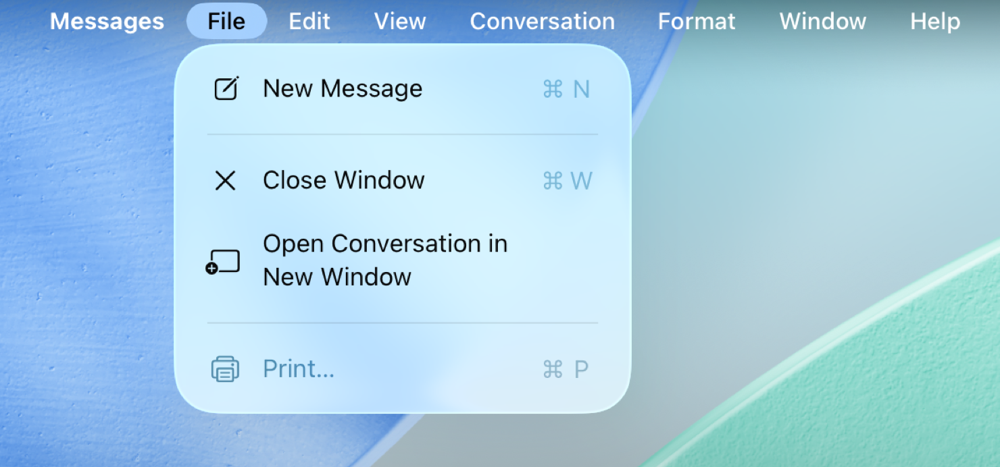
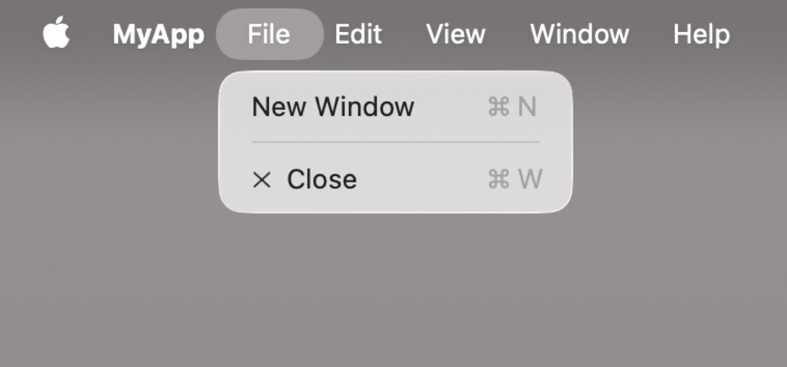
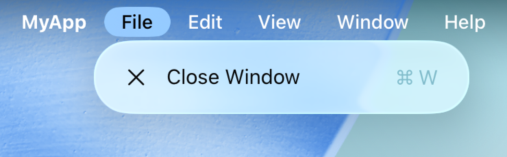
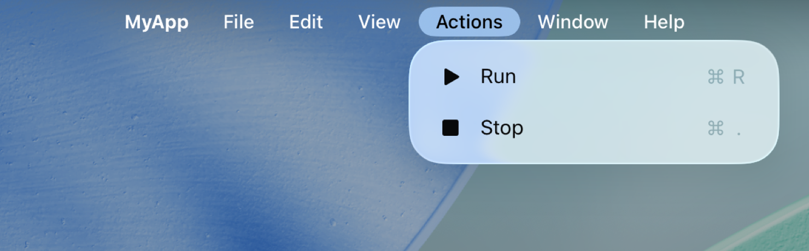
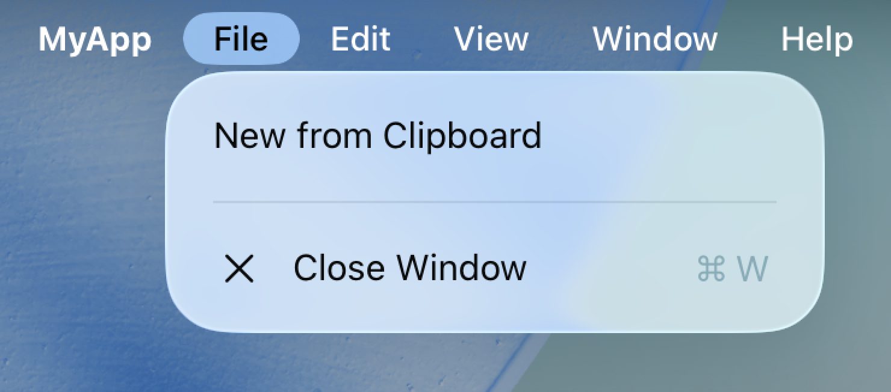

> Navigation: [Technologies](../technologies.md) · [SwiftUI](../swiftui.md) · [Menus and commands](menus-and-commands.md)

# Building and customizing the menu bar with SwiftUI

<sub>Article</sub>

Provide a seamless, cross-platform user experience by building a native menu bar for iPadOS and macOS.

## Overview

On iPadOS and macOS, the menu bar provides access to crucial system-provided actions, such as Cut, Copy, Paste, and window management. The system groups these actions by function into menus and submenus through the menu bar. Apps can add contextual actions, like showing and hiding a sidebar, and can also create custom menus and menu items to allow people to perform app-specific actions from the menu bar. You can also bind menu bar to keyboard shortcuts to make your app quicker and easier to use.

**macOS**


<sub>The menu bar for Messages on macOS. The File menu is open with active menu items for New Message, Close, Open Conversation in New Window, and Print.</sub>

**iPadOS**



<sub>The menu bar for Messages on iPadOS. The File menu is open with active menu items for New Message, Close Window, and Open Conversation in New Window.</sub>

Apps include instances of [Scene](scene.md) which display the main views of the app. Each scene provides different default menu sets and actions in the menu bar. Contextually relevant menus and actions, and even custom menus and actions, are specified with the [commands(content:)](<scene/commands(content_).md>) modifier.

The order of system-provided menus and menu items is consistent across all apps, but some menus and menu items are added depending on context. For example, document-based apps include options in the File menu for creating and opening documents. Similarly, not all apps include text-formatting capabilities, but those that include text editing views get a Format menu with options for choosing fonts and styling text by including [TextFormattingCommands](textformattingcommands.md) in the scene’s commands. The system will then add the appropriate menu groups and items that people expect in this context.

Think about how someone uses your app and which actions make sense to add to the menu bar and where to place them. For design guidance, see Human Interface Guidelines \> [The menu bar](../design/human-interface-guidelines/the-menu-bar.md).

## Populate the menu bar

When your app launches, the menu bar populates with menus and menu items based on the implemented scenes and commands. Menu items for conditional or context-dependent commands are made active or inactive dynamically, using information from the active scene and its view hierarchy in focus.

Each scene includes a set of default menus and menu items, which you can supplement with your own app-specific needs using the [commands(content:)](<scene/commands(content_).md>) modifier.

A scene’s default menus and menu items are dependent on the functionality the scene type supports. For example, [WindowGroup](windowgroup.md) includes commands for quitting and hiding the app, as well as Copy and Paste support and window management.

```swift
@main
struct MyApp: App {
    var body: some Scene {
        WindowGroup {
            ContentView()
        }
    }
}
```

**macOS**



**iPadOS**



On macOS, the [Settings](settings.md) scene includes the same actions as `Window`, but adds an action for presenting the app’s Settings window that people get when they choose App menu \> Settings. On iPadOS, this menu bar item doesn’t require an additional scene and when performed; it switches to the app’s settings in the Settings app.

```swift
@main
struct MyApp: App {
    var body: some Scene {
        WindowGroup {
            ContentView()
        }

        #if os(macOS)
        Settings {
            SettingsView()
        }
        #endif
    }
}
```

**macOS**


<sub>The menu bar for MyApp on macOS. The MyApp menu is open with active menu items for About MyApp, Settings, a Services submenu, Hide MyApp, and Hide Others. The Settings menu item has been added using the Settings scene.</sub>

**iPadOS**


The [DocumentGroup](documentgroup.md) scene includes actions that `WindowGroup` includes, as well as a number of actions that support document management capabilities, like Save and Duplicate.

Using scenes together creates a menu bar that includes menu items for all of the core functionality of an app that creates and edits documents, manages multiple windows, and exposes user-configurable settings.

```swift
@main
struct MyApp: App {
    var body: some Scene {
        DocumentGroup(newDocument: MyAppDocument()) { file in
            // ...
        }

        #if os(macOS)
        Settings {
            // ...
        }
        #endif
    }
}
```

## Add contextual system-provided menu items

Some common menu items are optional, but are helpful if the app contains certain capabilities. For example, not every scene includes a navigation sidebar, but for those that do, people expect to find a menu item that controls the navigation sidebar’s visibility. If your scene includes a navigation sidebar, include this menu item using the [commands(content:)](<scene/commands(content_).md>) modifier and implementing [SidebarCommands](sidebarcommands.md):

```swift
@main
struct MyApp: App {
    var body: some Scene {
        DocumentGroup(newDocument: MyAppDocument()) { file in
            ContentView(document: file.$document)
        }
        .commands {
            SidebarCommands()
        }
    }
}
```

For more information on system-provided command groups, such as text formatting, toolbars, and inspectors, see [Commands](commands.md).

## Create custom menus and menu items

Organize and group your app’s custom menu items in custom menus using [CommandMenu](commandmenu.md). The system inserts custom menus into the menu bar after the View menu.

Custom menu items are created with standard SwiftUI views, for example [Button](button.md) and [Toggle](toggle.md). [Menu](menu.md) creates a submenu. For more information about menu item creation, see [Populating SwiftUI menus with adaptive controls](populating-swiftui-menus-with-adaptive-controls.md).

The menu bar also displays information about keyboard shortcuts next to menu items and which keys someone needs to press on the keyboard to perform an action without using the menu bar. The [keyboardShortcut(_:)](<scene/keyboardshortcut(__).md>) modifier allows you to define which key combination will perform the action. Be aware that the system provides many keyboard shortcuts that your app can’t override. For design guidance, see Human Interface Guidelines \> [Keyboards](../design/human-interface-guidelines/keyboards.md).

```swift
WindowGroup {
    ContentView()
}
.commands {
    CommandMenu("Actions") {
        Button("Run", systemImage: "play.fill") { ... }
            .keyboardShortcut("R")

        Button("Stop", systemImage: "stop.fill") { ... }
            .keyboardShortcut(".")
    }
}
```

**macOS**


<sub>The menu bar for MyApp on macOS. The Actions menu is open with menu items for Run and Stop. The Actions menu and menu items have been added using a CommandMenu that has two buttons inside.</sub>

**iPadOS**



<sub>The menu bar for MyApp on iPadOS. The Actions menu is open with menu items for Run and Stop. The Actions menu and menu items have been added using a CommandMenu that has two buttons inside.</sub>

## Modify standard menus

Modify system-provided menus using [CommandGroup](commandgroup.md). These groups either extend menus with additional menu items or they replace existing menu items in the indicated command group. When you add menu items in this way, you can specify the location of the menu item based on system-provided menu items.

```swift
WindowGroup {
    ContentView()
}
.commands {
    CommandGroup(before: .systemServices) {
        Button("Check for Updates") { ... }
    }
    
    CommandGroup(after: .newItem) {
        Button("New from Clipboard") { ... }
    }
    
    CommandGroup(replacing: .help) {
        Button("User Manual") { ... }
    }
}

```

**macOS**


<sub>The menu bar for MyApp on macOS. The File menu is open with menu items New Window, New from Clipboard, and Close. The New from Clipboard menu item has been added using a CommandGroup.</sub>

**iPadOS**



<sub>The menu bar for MyApp on iPadOS. The File menu is open with menu items New from Clipboard and Close Window. The New from Clipboard menu item has been added using a CommandGroup.</sub>

## Update menus and menu items dynamically

Many menu items update their appearance or action depending on whether the scene is active, if the scene has focus, or what is currently selected. For example, the system grays out the Close Window command in the File menu when the app’s last window closes. Similarly, the Cut and Copy menu items are only available in the active window if the person selects copyable data. This behavior also applies to custom menus and menu items your app provides.

Use [FocusedValue](focusedvalue.md) to create contextual dependencies with your menus and menu items. For example, a menu item’s title can change if the current focus is on a photo or a photo album. A focused value is state data that requires an active scene with its view hierarchy in focus. Use a dynamic property to react to changes in the views of the scene.

In the following, an app with a `WindowGroup` scene has an [Observable()](<../observation/observable().md>) data model for each window that supplies that window’s contents. The active window’s data model is made available as a focused value using the [focusedSceneValue(_:)](<view/focusedscenevalue(__).md>) modifier in the window view hierarchy.

```swift
@Observable
final class DataModel {
    var messages: [Message]
    ...
}

struct ContentView: View {
    @State private var model = DataModel()

    var body: some View {
        VStack {
            ForEach(model.messages) { ... }
        }
        .focusedSceneValue(model)
    }
}
```

Use the [FocusedValue](focusedvalue.md) property wrapper to represent the active scene’s data model in the menu bar. The data model changes whether the “New Message” button is active or inactive:

```swift
struct MessageCommands: Commands {
    @FocusedValue(DataModel.self) private var dataModel: DataModel?

    var body: some Commands {
        CommandGroup(after: .newItem) {
            Button("New Message") {
                dataModel?.messages.append(...)
            }
            .disabled(dataModel == nil)
        }
    }
}

@main struct MessagesApp: App {
    var body: some Scene {
        WindowGroup {
            ContentView()
        }
        .commands {
            MessageCommands()
        }
    }
}
```

Similar to the [Environment](environment.md) dynamic property, `FocusedValue` uses a key you provide to find the current value. When the focused value is an `Observable` object, that key can simply be the object’s type.

To share value-typed values, extend `FocusedValues` with a custom entry using the [Entry()](<entry().md>) macro, and pass the resulting key path when declaring the `FocusedValue` property. Custom entry values must always be optional.

```swift
struct ContentView: View {
    @State private var items: [Item] = ...
    @State private var selection: UUID?
    
    var body: some View {
        List(items, selection: $selection) { item in
            ...
        }
        // When active, views in the same scene or in the menu bar
        // can read the selected item ID.
        .focusedSceneValue(\.selectedItemID, selection)
    }
}

struct ItemCommands: Commands {
    @FocusedValue(\.selectedItemID) var selectedItemID: UUID?
    
    var body: some Commands {
        ...
    }
}

extension FocusedValues {
    @Entry var selectedItemID: UUID?
}
```

Use [focusedValue(_:)](<view/focusedvalue(__).md>) when a menu item depends on the current placement of focus within the active scene’s view hierarchy. This creates a focused value that’s’ only visible to other views when focus is on the modified view or one of its subviews. When focus is elsewhere, the value of corresponding `FocusedValue` property is `nil`.

```swift
struct ContentView: View {
    @State private var items: [Item] = ...
    @State private var selection: UUID?

    var body: some View {
        NavigationSplitView {
            SidebarContent()
        } detail: {
            List(items, selection: $selection) { item in
                ...
            }

            // The selected item ID is visible when focus is on the 
            // navigation detail list. If focus is on the sidebar, the value of 
            // `@FocusedValue(\.selectedItemID)` is `nil`.
            .focusedValue(\.selectedItemID, selection)
        }
    }
}
```
