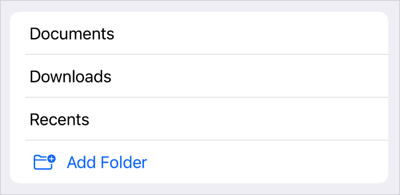
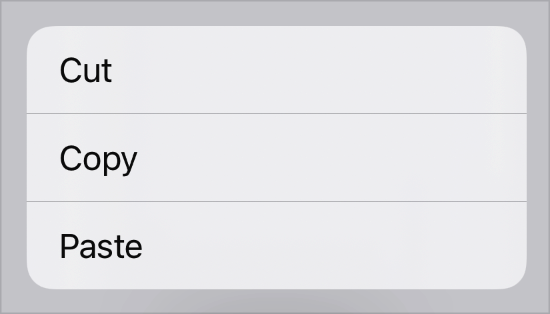
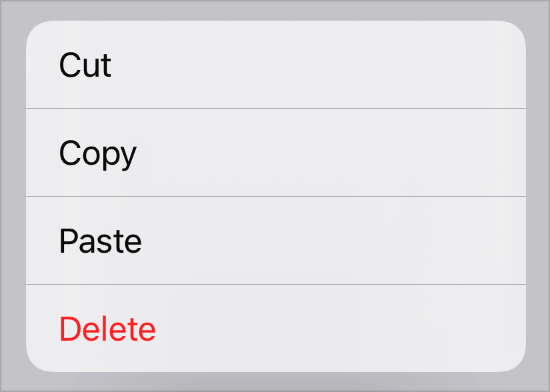
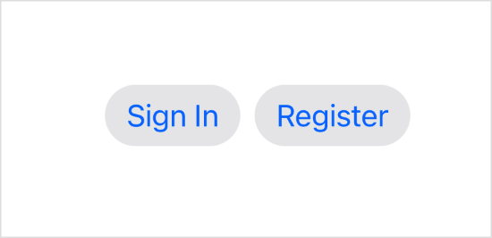

> Navigation: [Technologies](../technologies.md) · [SwiftUI](../swiftui.md)

# Button

<sub>Structure</sub>

A control that initiates an action.

<sub>iOS, iPadOS, Mac Catalyst, macOS, tvOS, visionOS, watchOS</sub>

```swift
nonisolated struct Button<Label> where Label : View
```

## Overview

You create a button by providing an action and a label. The action is either a method or closure property that does something when a user clicks or taps the button. The label is a view that describes the button’s action — for example, by showing text, an icon, or both.

The label of a button can be any kind of view, such as a [Text](text.md) view for text-only labels:

```swift
Button(action: signIn) {
    Text("Sign In")
}
```

Or a [Label](label.md) view, for buttons with both a title and an icon:

```swift
Button(action: signIn) {
    Label("Sign In", systemImage: "arrow.up")
}
```

For those common cases, you can also use the convenience initializers that take a title string or [LocalizedStringKey](localizedstringkey.md) as their first parameter, and optionally a system image name or `ImageResource` as their second parameter, instead of a trailing closure:

```swift
Button("Sign In", systemImage: "arrow.up", action: signIn)
```

Prefer to use these convenience initializers, or a [Label](label.md) view, when providing both a title and an icon. This allows the button to dynamically adapt its appearance to render its title and icon correctly in containers such as toolbars and menus. For example, on iOS, buttons only display their icons by default when placed in toolbars, but show both a leading title and trailing icon in menus. Defining labels this way also helps with accessibility — for example, applying the [labelStyle(_:)](<view/labelstyle(__).md>) modifier with an [iconOnly](labelstyle/icononly.md) style to the button will cause it to only visually display its icon, but still use its title to describe the button in accessibility modes like VoiceOver:

```swift
Button("Sign In", systemImage: "arrow.up", action: signIn)
    .labelStyle(.iconOnly)
```

Avoid labels that only use images or exclusively visual components without an accessibility label.

How the user activates the button varies by platform:

- In iOS and watchOS, the user taps the button.
- In macOS, the user clicks the button.
- In tvOS, the user presses “select” on an external remote, like the Siri Remote, while focusing on the button.

The appearance of the button depends on factors like where you place it, whether you assign it a role, and how you style it.

### Adding buttons to containers

Use buttons for any user interface element that initiates an action. Buttons automatically adapt their visual style to match the expected style within these different containers and contexts. For example, to create a [List](list.md) cell that initiates an action when selected by the user, add a button to the list’s content:

```swift
List {
    // Cells that show all the current folders.
    ForEach(folders) { folder in
        Text(folder.title)
    }

    // A cell that, when selected, adds a new folder.
    Button(action: addItem) {
        Label("Add Folder", systemImage: "folder.badge.plus")
    }
}
```



Similarly, to create a context menu item that initiates an action, add a button to the [contextMenu(_:)](<view/contextmenu(__).md>) modifier’s content closure:

```swift
.contextMenu {
    Button("Cut", action: cut)
    Button("Copy", action: copy)
    Button("Paste", action: paste)
}
```



This pattern extends to most other container views in SwiftUI that have customizable, interactive content, like [Form](form.md) instances.

### Assigning a role

You can optionally initialize a button with a [ButtonRole](buttonrole.md) that characterizes the button’s purpose. For example, you can create a [destructive](buttonrole/destructive.md) button for a deletion action:

```swift
 Button("Delete", role: .destructive, action: delete)
```

The system uses the button’s role to style the button appropriately in every context. For example, a destructive button in a contextual menu appears with a red foreground color:



If you don’t specify a role for a button, the system applies an appropriate default appearance.

### Styling buttons

You can customize a button’s appearance using one of the standard button styles, like [bordered](primitivebuttonstyle/bordered.md), and apply the style with the [buttonStyle(_:)](<view/buttonstyle(__).md>) modifier:

```swift
HStack {
    Button("Sign In", action: signIn)
    Button("Register", action: register)
}
.buttonStyle(.bordered)
```

If you apply the style to a container view, as in the example above, all the buttons in the container use the style:



You can also create custom styles. To add a custom appearance with standard interaction behavior, create a style that conforms to the [ButtonStyle](buttonstyle.md) protocol. To customize both appearance and interaction behavior, create a style that conforms to the [PrimitiveButtonStyle](primitivebuttonstyle.md) protocol. Custom styles can also read the button’s role and use it to adjust the button’s appearance.

## Relationships

- **Conforms To**: [View](view.md)

## Topics

### Creating a button

- [init(action:label:)](<button/init(action_label_).md>) — Creates a button that displays a custom label.
- [init(_:action:)](<button/init(__action_).md>) — Creates a button that generates its label from a localized string resource.
- [init(_:image:action:)](<button/init(__image_action_).md>) — Creates a button that generates its label from a localized string resource and image resource.
- [init(_:systemImage:action:)](<button/init(__systemimage_action_).md>) — Creates a button that generates its label from a localized string key and system image name.

### Creating a button with a role

- [init(role:action:label:)](<button/init(role_action_label_).md>) — Creates a button with a specified role that displays a custom label.
- [init(_:role:action:)](<button/init(__role_action_).md>) — Creates a button with a specified role that generates its label from a localized string resource.
- [init(_:image:role:action:)](<button/init(__image_role_action_).md>) — Creates a button with a specified role that generates its label from a localized string resource and an image resource.
- [init(_:systemImage:role:action:)](<button/init(__systemimage_role_action_).md>) — Creates a button with a specified role that generates its label from a localized string key and a system image.

### Creating a button from a configuration

- [init(_:)](<button/init(__).md>) — Creates a button based on a configuration for a style with a custom appearance and custom interaction behavior.

### Creating a button to perform an App Intent

- [init(_:intent:)](<button/init(__intent_).md>) — Creates a button that performs an `AppIntent` and generates its label from a localized string key.
- [init(intent:label:)](<button/init(intent_label_).md>) — Creates a button that performs an `AppIntent`.
- [init(_:role:intent:)](<button/init(__role_intent_).md>) — Creates a button with a specified role that performs an `AppIntent` and generates its label from a string.
- [init(role:intent:label:)](<button/init(role_intent_label_).md>) — Creates a button with a specified role that performs an `AppIntent`.
- [init(_:image:role:intent:)](<button/init(__image_role_intent_).md>) — Creates a button with a specified role that generates its label from a string and an image resource.
- [init(_:systemImage:role:intent:)](<button/init(__systemimage_role_intent_).md>) — Creates a button with a specified role that generates its label from a string and a system image.

### Initializers

- [init(role:action:)](<button/init(role_action_).md>) — Creates a button that displays a default label.

## See Also

### Creating buttons

- [buttonStyle(_:)](<view/buttonstyle(__).md>) — Sets the style for buttons within this view to a button style with a custom appearance and standard interaction behavior.
- [buttonBorderShape(_:)](<view/buttonbordershape(__).md>) — Sets the border shape for buttons in this view.
- [ButtonBorderShape](buttonbordershape.md) — A shape used to draw a button’s border.
- [buttonRepeatBehavior(_:)](<view/buttonrepeatbehavior(__).md>) — Sets whether buttons in this view should repeatedly trigger their actions on prolonged interactions.
- [ButtonRepeatBehavior](buttonrepeatbehavior.md) — The options for controlling the repeatability of button actions.
- [buttonRepeatBehavior](environmentvalues/buttonrepeatbehavior.md) — Whether buttons with this associated environment should repeatedly trigger their actions on prolonged interactions.
- [buttonSizing(_:)](<view/buttonsizing(__).md>) — The preferred sizing behavior of buttons in the view hierarchy.
- [ButtonSizing](buttonsizing.md) — The sizing behavior of `Button`s and other button-like controls.
- [ButtonRole](buttonrole.md) — A value that describes the purpose of a button.
