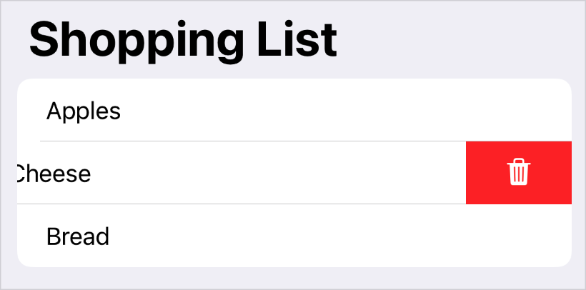

> Navigation: [Technologies](../../technologies.md) · [SwiftUI](../../swiftui.md) · [ButtonRole](../buttonrole.md)

# destructive

<sub>Type Property</sub>

A role that indicates a destructive button.

<sub>iOS, iPadOS, Mac Catalyst, macOS, tvOS, visionOS, watchOS</sub>

```swift
static let destructive: ButtonRole
```

## Discussion

Use this role for a button that deletes user data, or performs an irreversible operation. A destructive button signals by its appearance that the user should carefully consider whether to tap or click the button. For example, SwiftUI presents a destructive button that you add with the [swipeActions(edge:allowsFullSwipe:content:)](<../view/swipeactions(edge_allowsfullswipe_content_).md>) modifier using a red background:

```swift
List {
    ForEach(items) { item in
        Text(item.title)
            .swipeActions {
                Button(role: .destructive) { delete() } label: {
                    Label("Delete", systemImage: "trash")
                }
            }
    }
}
.navigationTitle("Shopping List")
```



## See Also

### Getting button roles

- [cancel](cancel.md) — A role that indicates a button that cancels an operation.
