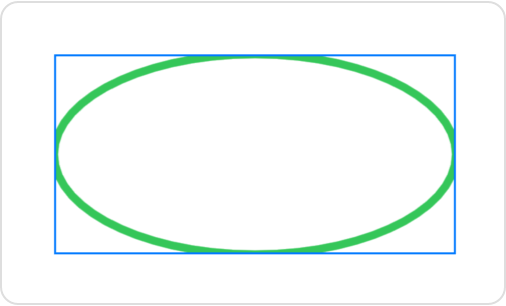

> Navigation: [Technologies](../technologies.md) · [SwiftUI](../swiftui.md)

# Canvas

<sub>Structure</sub>

A view type that supports immediate mode drawing.

<sub>iOS, iPadOS, Mac Catalyst, macOS, tvOS, visionOS, watchOS</sub>

```swift
nonisolated struct Canvas<Symbols> where Symbols : View
```

## Overview

Use a canvas to draw rich and dynamic 2D graphics inside a SwiftUI view. The canvas passes a [GraphicsContext](graphicscontext.md) to the closure that you use to perform immediate mode drawing operations. The canvas also passes a [CGSize](../corefoundation/cgsize.md) value that you can use to customize what you draw. For example, you can use the context’s [stroke(_:with:lineWidth:)](<graphicscontext/stroke(__with_linewidth_).md>) command to draw a [Path](path.md) instance:

```swift
Canvas { context, size in
    context.stroke(
        Path(ellipseIn: CGRect(origin: .zero, size: size)),
        with: .color(.green),
        lineWidth: 4)
}
.frame(width: 300, height: 200)
.border(Color.blue)
```

The example above draws the outline of an ellipse that exactly inscribes a canvas with a blue border:



In addition to outlined and filled paths, you can draw images, text, and complete SwiftUI views. To draw views, use the [init(opaque:colorMode:rendersAsynchronously:renderer:symbols:)](<canvas/init(opaque_colormode_rendersasynchronously_renderer_symbols_).md>) method to supply views that you can reference from inside the renderer. You can also add masks, apply filters, perform transforms, control blending, and more. For information about how to draw, see [GraphicsContext](graphicscontext.md).

A canvas doesn’t offer interactivity or accessibility for individual elements, including for views that you pass in as symbols. However, it might provide better performance for a complex drawing that involves dynamic data. Use a canvas to improve performance for a drawing that doesn’t primarily involve text or require interactive elements.

## Relationships

- **Conforms To**: [Copyable](../swift/copyable.md), [Escapable](../swift/escapable.md), [View](view.md)

## Topics

### Creating a canvas

- [init(opaque:colorMode:rendersAsynchronously:renderer:)](<canvas/init(opaque_colormode_rendersasynchronously_renderer_).md>) — Creates and configures a canvas.
- [init(opaque:colorMode:rendersAsynchronously:renderer:symbols:)](<canvas/init(opaque_colormode_rendersasynchronously_renderer_symbols_).md>) — Creates and configures a canvas that you supply with renderable child views.

### Managing opacity and color

- [isOpaque](canvas/isopaque.md) — A Boolean that indicates whether the canvas is fully opaque.
- [colorMode](canvas/colormode.md) — The working color space and storage format of the canvas.

### Referencing symbols

- [symbols](canvas/symbols.md) — A view that provides child views that you can use in the drawing callback.

### Rendering

- [rendersAsynchronously](canvas/rendersasynchronously.md) — A Boolean that indicates whether the canvas can present its contents to its parent view asynchronously.
- [renderer](canvas/renderer.md) — The drawing callback that you use to draw into the canvas.

## See Also

### Immediate mode drawing

- [Add rich graphics to your SwiftUI app](add-rich-graphics-to-your-swiftui-app.md) — Make your apps stand out by adding background materials, vibrancy, custom graphics, and animations.
- [GraphicsContext](graphicscontext.md) — An immediate mode drawing destination, and its current state.
