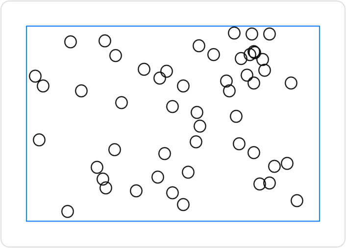

> Navigation: [Technologies](../../technologies.md) · [SwiftUI](../../swiftui.md) · [Canvas](../canvas.md)

# init(opaque:colorMode:rendersAsynchronously:renderer:symbols:)

<sub>Initializer</sub>

Creates and configures a canvas that you supply with renderable child views.

<sub>iOS, iPadOS, Mac Catalyst, macOS, tvOS, visionOS, watchOS</sub>

```swift
nonisolated init(opaque: Bool = false, colorMode: ColorRenderingMode = .nonLinear, rendersAsynchronously: Bool = false, renderer: @escaping (inout GraphicsContext, CGSize) -> Void, @ContentBuilder symbols: () -> Symbols)
```

## Parameters

- `opaque` — A Boolean that indicates whether the canvas is fully opaque. You might be able to improve performance by setting this value to `true`, but then drawing a non-opaque image into the context produces undefined results. The default is `false`.

- `colorMode` — A working color space and storage format of the canvas. The default is [ColorRenderingMode.nonLinear](../colorrenderingmode/nonlinear.md).

- `rendersAsynchronously` — A Boolean that indicates whether the canvas can present its contents to its parent view asynchronously. The default is `false`.

- `renderer` — A closure in which you conduct immediate mode drawing. The closure takes two inputs: a context that you use to issue drawing commands and a size — representing the current size of the canvas — that you can use to customize the content. The canvas calls the renderer any time it needs to redraw the content.

- `symbols` — A [ContentBuilder](../contentbuilder.md) that you use to supply SwiftUI views to the canvas for use during drawing. Uniquely tag each view using the `View/tag(_:)` modifier, so that you can find them from within your renderer using the [resolveSymbol(id:)](<../graphicscontext/resolvesymbol(id_).md>) method.

## Discussion

This initializer behaves like the [init(opaque:colorMode:rendersAsynchronously:renderer:)](<init(opaque_colormode_rendersasynchronously_renderer_).md>) initializer, except that you also provide a collection of SwiftUI views for the renderer to use as drawing elements.

SwiftUI stores a rendered version of each child view that you specify in the `symbols` content builder and makes these available to the canvas. Tag each child view so that you can retrieve it from within the renderer using the [resolveSymbol(id:)](<../graphicscontext/resolvesymbol(id_).md>) method. For example, you can create a scatter plot using a passed-in child view as the mark for each data point:

```swift
struct ScatterPlotView<Mark: View>: View {
    let rects: [CGRect]
    let mark: Mark

    enum SymbolID: Int {
        case mark
    }

    var body: some View {
        Canvas { context, size in
            if let mark = context.resolveSymbol(id: SymbolID.mark) {
                for rect in rects {
                    context.draw(mark, in: rect)
                }
            }
        } symbols: {
            mark.tag(SymbolID.mark)
        }
        .frame(width: 300, height: 200)
        .border(Color.blue)
    }
}
```

You can use any SwiftUI view for the `mark` input:

```swift
ScatterPlotView(rects: rects, mark: Image(systemName: "circle"))
```

If the `rects` input contains 50 randomly arranged [CGRect](../../corefoundation/cgrect.md) instances, SwiftUI draws a plot like this:



The symbol inputs, like all other elements that you draw to the canvas, lack individual accessibility and interactivity, even if the original SwiftUI view has these attributes. However, you can add accessibility and interactivity modifers to the canvas as a whole.

## See Also

### Creating a canvas

- [init(opaque:colorMode:rendersAsynchronously:renderer:)](<init(opaque_colormode_rendersasynchronously_renderer_).md>) — Creates and configures a canvas.
