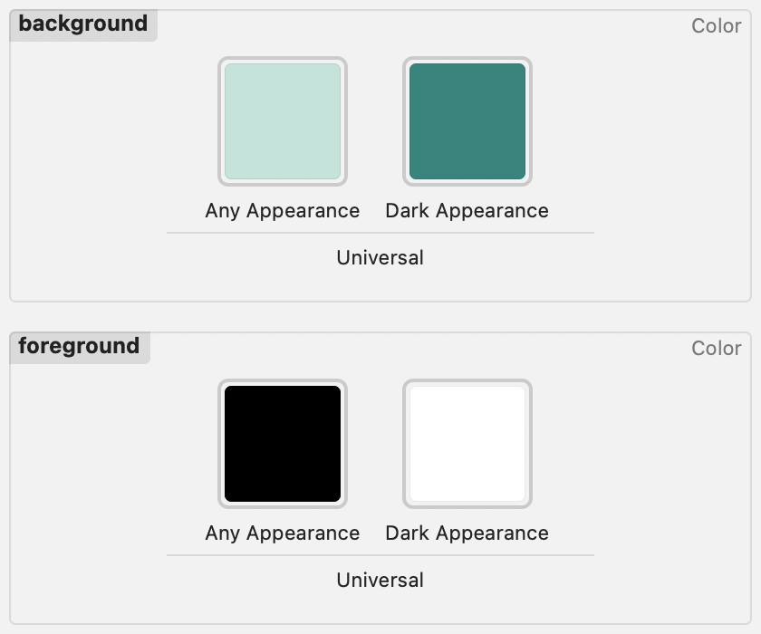
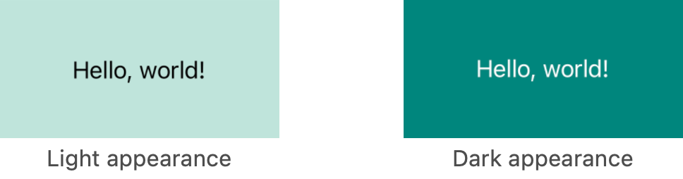

> Navigation: [Technologies](../../technologies.md) · [SwiftUI](../../swiftui.md) · [Color](../color.md)

# init(_:bundle:)

<sub>Initializer</sub>

Creates a color from a color set that you indicate by name.

<sub>iOS, iPadOS, Mac Catalyst, macOS, tvOS, visionOS, watchOS</sub>

```swift
init(_ name: String, bundle: Bundle? = nil)
```

## Parameters

- `name` — The name of the color resource to look up.

- `bundle` — The bundle in which to search for the color resource. If you don’t indicate a bundle, the initializer looks in your app’s main bundle by default.

## Discussion

Use this initializer to load a color from a color set stored in an Asset Catalog. The system determines which color within the set to use based on the environment at render time. For example, you can provide light and dark versions for background and foreground colors:



You can then instantiate colors by referencing the names of the assets:

```swift
struct Hello: View {
    var body: some View {
        ZStack {
            Color("background")
            Text("Hello, world!")
                .foregroundStyle(Color("foreground"))
        }
        .frame(width: 200, height: 100)
    }
}
```

SwiftUI renders the appropriate colors for each appearance:



## See Also

### Creating a color

- [init(_:)](<init(__).md>) — Creates a constant color with the values specified by the resolved color.
- [resolve(in:)](<resolve(in_).md>) — Evaluates this color to a resolved color given the current `context`.
