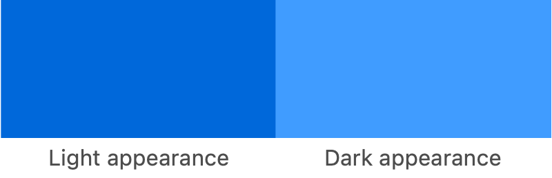

> Navigation: [Technologies](../../technologies.md) · [SwiftUI](../../swiftui.md) · [Color](../color.md)

# init(nsColor:)

<sub>Initializer</sub>

Creates a color from an AppKit color.

<sub>macOS</sub>

```swift
nonisolated init(nsColor: NSColor)
```

## Discussion

Use this method to create a SwiftUI color from an [NSColor](../../appkit/nscolor.md) instance. The new color preserves the adaptability of the original. For example, you can create a rectangle using [linkColor](../../appkit/nscolor/linkcolor.md) to see how the shade adjusts to match the user’s system settings:

```swift
struct Box: View {
    var body: some View {
        Color(nsColor: .linkColor)
            .frame(width: 200, height: 100)
    }
}
```

The `Box` view defined above automatically changes its appearance when the user turns on Dark Mode. With the light and dark appearances placed side by side, you can see the subtle difference in shades:



> [!note] Note
> Use this initializer only if you need to convert an existing [NSColor](../../appkit/nscolor.md) to a SwiftUI color. Otherwise, create a SwiftUI [Color](../color.md) using an initializer like [init(_:red:green:blue:opacity:)](<init(__red_green_blue_opacity_).md>), or use a system color like [blue](../shapestyle/blue.md).

## See Also

### Creating a color from another color

- [init(uiColor:)](<init(uicolor_).md>) — Creates a color from a UIKit color.
- [init(cgColor:)](<init(cgcolor_).md>) — Creates a color from a Core Graphics color.
