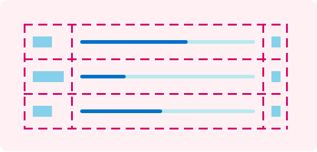
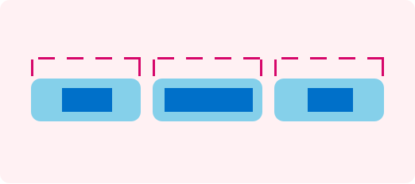

> Navigation: [Technologies](../technologies.md) · [SwiftUI](../swiftui.md) · [Custom layout](custom-layout.md)

# Composing custom layouts with SwiftUI

<sub>Sample Code</sub>

Arrange views in your app’s interface using layout tools that SwiftUI provides.

## Overview

This sample app demonstrates many of the layout tools that SwiftUI provides by building an interface that enables people to vote for their favorite kind of pet. The app offers buttons to vote for a specific pet type, and displays the vote counts and relative rankings of the various contenders on a leaderboard. It also shows avatars for the pets, arranged in a way that reflects the current rankings.


<sub>An iPhone showing the layout of the app, with the three main sections called out. The group of avatars are in a circular arrangement at the top. The leaderboard grid is in the middle. The equal-width voting buttons are at the bottom.</sub>

> [!note] Note
> This sample code project is associated with WWDC22 session [10056: Compose custom layouts with SwiftUI](https://developer.apple.com/wwdc22/10056/).

### Arrange views in two dimensions with a grid

To draw a leaderboard in the middle of the display that shows vote counts and percentages, the sample uses a [Grid](grid.md) view.



<sub>A grid with three rows and three columns. The first column and last column each contain rectangles in every cell. The middle column contains progress indicators with different amounts of progress.</sub>

The grid contains a [GridRow](gridrow.md) inside a [ForEach](foreach.md), where each view in the row creates a column cell. So the first view appears in the first column, the second in the second column, and so on. Because the [Divider](divider.md) appears outside of a grid row instance, it creates a row that spans the width of the grid.

```swift
Grid(alignment: .leading) {
    ForEach(model.pets) { pet in
        GridRow {
            Text(pet.type)
            ProgressView(
                value: Double(pet.votes),
                total: Double(max(1, model.totalVotes))) // Avoid dividing by zero.
            Text("\(pet.votes)")
                .gridColumnAlignment(.trailing)
        }

        Divider()
    }
}
```

The sample initializes the grid with leading-edge alignment, which applies to every cell in the grid. Meanwhile, the [gridColumnAlignment(_:)](<view/gridcolumnalignment(__).md>) view modifier that appears on the vote count cell overrides the alignment of cells in that column to use trailing-edge alignment.

### Create a custom equal-width layout

The app offers buttons for voting at the bottom of the interface.



<sub>Three rectangles arranged in a horizontal line. Each rectangle contains one smaller rectangle. The smaller rectangles have varying widths. Dashed lines above each of the container rectangles show that the larger rectangles all have the same width as each other.</sub>

To ensure the buttons all have the same width, but are no wider than the widest button text, the app creates a custom layout container type that conforms to the [Layout](layout.md) protocol. The equal-width horizontal stack (`MyEqualWidthHStack`) measures the ideal sizes of all its subviews, and offers the widest ideal size to each subview.

The custom stack implements the protocol’s two required methods. First, [sizeThatFits(proposal:subviews:cache:)](<layout/sizethatfits(proposal_subviews_cache_).md>) reports the container’s size, given a set of subviews.

```swift
func sizeThatFits(
    proposal: ProposedViewSize,
    subviews: Subviews,
    cache: inout Void
) -> CGSize {
    guard !subviews.isEmpty else { return .zero }

    let maxSize = maxSize(subviews: subviews)
    let spacing = spacing(subviews: subviews)
    let totalSpacing = spacing.reduce(0) { $0 + $1 }

    return CGSize(
        width: maxSize.width * CGFloat(subviews.count) + totalSpacing,
        height: maxSize.height)
}
```

This method combines the largest size in each dimension with the horizontal spacing between subviews to find the container’s total size. Then, [placeSubviews(in:proposal:subviews:cache:)](<layout/placesubviews(in_proposal_subviews_cache_).md>) tells each of the subviews where to appear within the layout’s bounds.

```swift
func placeSubviews(
    in bounds: CGRect,
    proposal: ProposedViewSize,
    subviews: Subviews,
    cache: inout Void
) {
    guard !subviews.isEmpty else { return }

    let maxSize = maxSize(subviews: subviews)
    let spacing = spacing(subviews: subviews)

    let placementProposal = ProposedViewSize(width: maxSize.width, height: maxSize.height)
    var nextX = bounds.minX + maxSize.width / 2

    for index in subviews.indices {
        subviews[index].place(
            at: CGPoint(x: nextX, y: bounds.midY),
            anchor: .center,
            proposal: placementProposal)
        nextX += maxSize.width + spacing[index]
    }
}
```

The method creates a single size proposal for the subviews, and then uses that, along with a point that changes for each subview, to arrange the buttons in a horizontal line with default spacing.

### Choose the view that fits

The size of the voting buttons depends on the width of the text they contain. For people that speak another language or that use a larger text size, the horizontally arranged buttons might not fit in the display. So the app uses [ViewThatFits](viewthatfits.md) to let SwiftUI choose between a horizontal and a vertical arrangement of the buttons for the one that fits in the available space.

```swift
ViewThatFits { // Choose the first view that fits.
    MyEqualWidthHStack { // Arrange horizontally if it fits...
        Buttons()
    }
    MyEqualWidthVStack { // ...or vertically, otherwise.
        Buttons()
    }
}
```

To ensure that the buttons maintain their equal-width property when arranged vertically, the app uses a custom equal-width vertical stack (`MyEqualWidthVStack`) that’s very similar to the horizontal version.

### Improve layout efficiency with a cache

The methods of the [Layout](layout.md) protocol take a bidirectional `cache` parameter. The cache provides access to optional storage that’s shared among all the methods of a particular layout instance. To demonstrate the use of a cache, the sample app’s equal-width vertical layout creates storage to share size and spacing calculations between its [sizeThatFits(proposal:subviews:cache:)](<layout/sizethatfits(proposal_subviews_cache_).md>) and [placeSubviews(in:proposal:subviews:cache:)](<layout/placesubviews(in_proposal_subviews_cache_).md>) implementations.

First, the layout defines a `CacheData` type for the storage.

```swift
struct CacheData {
    let maxSize: CGSize
    let spacing: [CGFloat]
    let totalSpacing: CGFloat
}
```

It then implements the protocol’s optional [makeCache(subviews:)](<layout/makecache(subviews_).md>) method to do the calculations for a set of subviews, returning a value of the type defined above.

```swift
func makeCache(subviews: Subviews) -> CacheData {
    let maxSize = maxSize(subviews: subviews)
    let spacing = spacing(subviews: subviews)
    let totalSpacing = spacing.reduce(0) { $0 + $1 }

    return CacheData(
        maxSize: maxSize,
        spacing: spacing,
        totalSpacing: totalSpacing)
}
```

If the subviews change, SwiftUI calls the layout’s [updateCache(_:subviews:)](<layout/updatecache(__subviews_).md>) method. The default implementation of that method calls [makeCache(subviews:)](<layout/makecache(subviews_).md>) again, which recalculates the data. Then the `sizeThatFits(proposal:subviews:cache:)` and `placeSubviews(in:proposal:subviews:cache:)` methods make use of their `cache` parameter to retrieve the data. For example, `placeSubviews(in:proposal:subviews:cache:)` reads the size and the spacing array from the cache.

```swift
let maxSize = cache.maxSize
let spacing = cache.spacing
```

Contrast this with the equal-width horizontal stack, which doesn’t use a cache, and instead calculates the size and spacing information every time it needs that information.

> [!note] Note
> Most simple layouts, including the equal-width vertical stack, don’t gain much efficiency from using a cache. Developers can profile their app with Instruments to find out whether a particular layout type actually benefits from a cache.

### Create a custom radial layout with an offset

To display the pet avatars in a circle, the app defines a radial layout (`MyRadialLayout`).


<sub>Three filled circles placed at equal distances along the outline of a larger, empty circle. The outline of the larger circle uses a dashed line.</sub>

Like other custom layouts, this layout needs the two required methods. For [sizeThatFits(proposal:subviews:cache:)](<layout/sizethatfits(proposal_subviews_cache_).md>), the layout fills the available space by returning whatever size its container proposes.

```swift
proposal.replacingUnspecifiedDimensions()
```

The app uses the proposal’s [replacingUnspecifiedDimensions(by:)](<proposedviewsize/replacingunspecifieddimensions(by_).md>) method to convert the proposal into a concrete size. Then, to place subviews, the layout rotates a vector, translates the vector to the middle of the placement region, and uses that as the anchor for the subview.

```swift
for (index, subview) in subviews.enumerated() {
    // Find a vector with an appropriate size and rotation.
    var point = CGPoint(x: 0, y: -radius)
        .applying(CGAffineTransform(
            rotationAngle: angle * Double(index) + offset))

    // Shift the vector to the middle of the region.
    point.x += bounds.midX
    point.y += bounds.midY

    // Place the subview.
    subview.place(at: point, anchor: .center, proposal: .unspecified)
}
```

The offset that the app applies to the rotation accounts for the current rankings, placing higher-ranked pets closer to the top of the interface. The app stores ranks on the subviews using the [LayoutValueKey](layoutvaluekey.md) protocol, and then reads the values to calculate the offset before placing views.

### Animate transitions between layouts

The radial layout can calculate an offset that creates an appropriate arrangement for all but one set of rankings: there’s no way to show a three-way tie with the avatars in a circle. To resolve this, the app detects this condition, and uses it to put the avatars in a line instead, using a the [HStackLayout](hstacklayout.md) type, which is a version of the built-in [HStack](hstack.md) that conforms to the [Layout](layout.md) protocol. To transition between these layout types, the app uses the [AnyLayout](anylayout.md) type.

```swift
let layout = model.isAllWayTie ? AnyLayout(HStackLayout()) : AnyLayout(MyRadialLayout())

Podium()
    .overlay(alignment: .top) {
        layout {
            ForEach(model.pets) { pet in
                Avatar(pet: pet)
                    .rank(model.rank(pet))
            }
        }
        .animation(.default, value: model.pets)
    }
```

Because the structural identity of the views remains the same throughout, the [animation(_:value:)](<view/animation(__value_).md>) view modifier creates animated transitions between layout types. The modifier also animates radial layout changes that result from changes in the rankings because the calculated offsets depend on the same pet data.

### Build documentation for the app

To see more information about the symbols defined by this app, you can build the app’s documentation. Open the project in Xcode and select Product \> Build Documentation.

For information about how to include documentation in your own apps, see [DocC](https://www.swift.org/documentation/docc).

## See Also

### Creating a custom layout container

- [Layout](layout.md) — A type that defines the geometry of a collection of views.
- [LayoutSubview](layoutsubview.md) — A proxy that represents one subview of a layout.
- [LayoutSubviews](layoutsubviews.md) — A collection of proxy values that represent the subviews of a layout view.

## Download

- [ComposingCustomLayoutsWithSwiftUI.zip](https://docs-assets.developer.apple.com/published/13cfc7c1502b/ComposingCustomLayoutsWithSwiftUI.zip)
