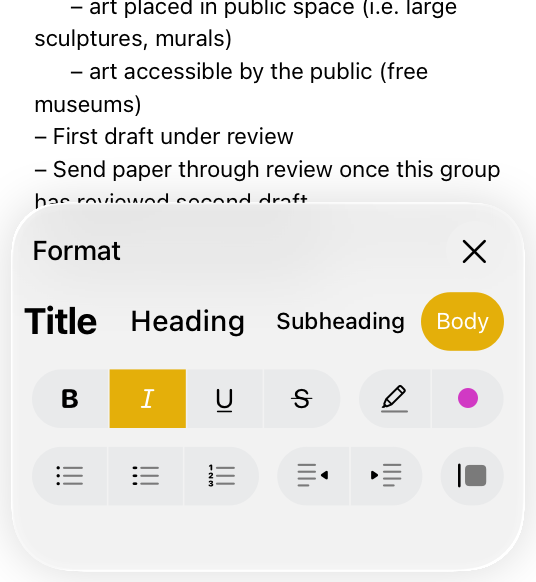
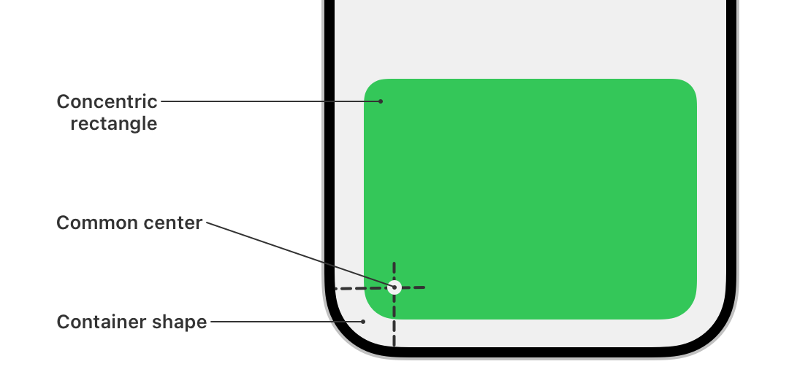
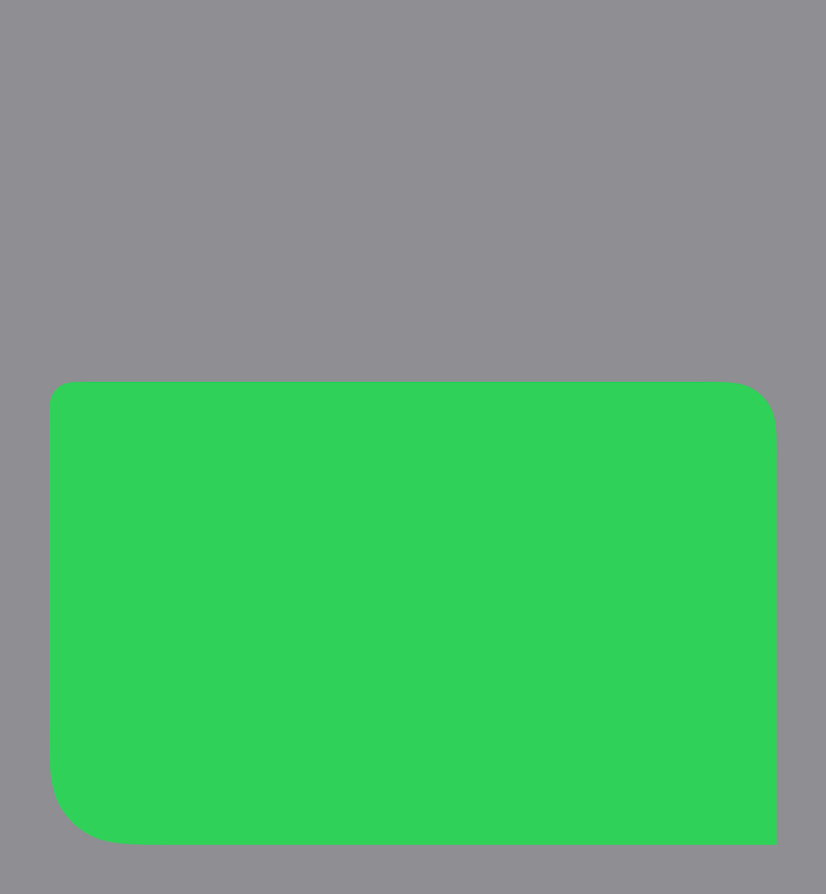
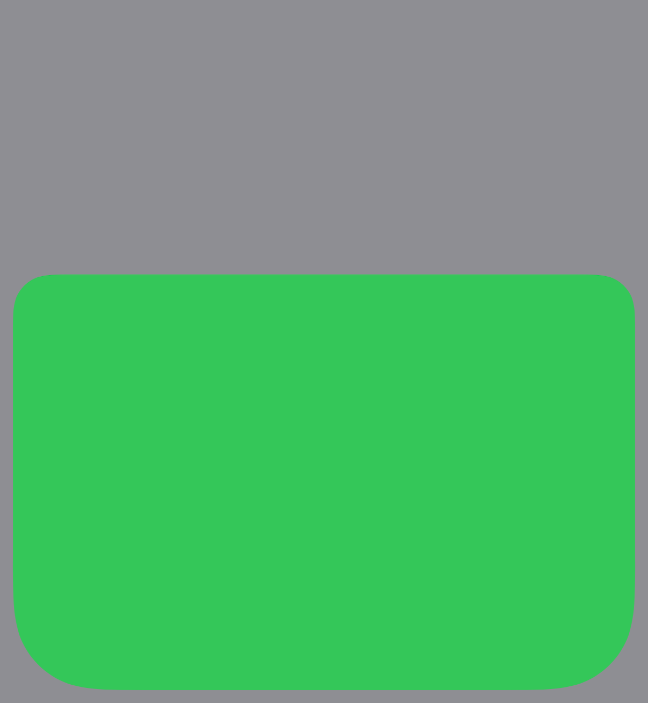

> Navigation: [Technologies](../technologies.md) · [SwiftUI](../swiftui.md)

# ConcentricRectangle

<sub>Structure</sub>

A shape whose corners you configure, individually or uniformly, to be squared, rounded, or concentric relative to a container shape’s corners.

<sub>iOS, iPadOS, Mac Catalyst, macOS, tvOS, visionOS, watchOS</sub>

```swift
struct ConcentricRectangle
```

## Overview

Use `ConcentricRectangle` to create a rectangular shape that fits inside a container’s shape, similar to the way that a sheet’s corners in iOS match the curvature of the screen. System-provided elements like sheets and popovers do this automatically. You can use this effect for your custom views to match a device’s curved edges, or for your custom views near the edges inside another view with concentric corners. For example, the Notes app format sheet has rounded bottom corners that are concentric relative to the device’s corners, and rounded top corners that have a fixed radius.



<sub>A screenshot of the Format sheet over the Notes app. The Format sheet has top corners that have rounded corners with a fixed radius, and rounded bottom corners that are concentric relative to the device's corners.</sub>

A rounded corner of a rectangle is _concentric_ relative to the container shape’s adjacent corner when the corner’s radius shares a common center with the containing shape’s rounded corner radius. A containing shape could be a view that extends to the device’s rounded corners, or any view that sets [containerShape(_:)](<view/containershape(__)-3br47.md>). `ConcentricRectangle` automatically calculates each corner’s radius relative to the container shape, so your view adapts correctly across devices and sizes without hard-coded values.



<sub>A diagram of the bottom half of an iPhone with a gray background view. Over the gray background is a green view with uniformly rounded top corners, and uniformly rounded bottom corners that are concentric with the device's edge. Callouts identify the gray background as the container shape, the green view as a concentric rectangle, and a dot that's the common center of the radii of the bottom leading corner curves.</sub>

### Create a concentric rectangle

Create a `ConcentricRectangle` by specifying corner styles that reflect the types of corners you want, with an initializer or static [Shape](shape.md) convenience method that specifies how to shape each corner. By default, `ConcentricRectangle`’s [init()](<concentricrectangle/init().md>) creates a shape where each corner is individually concentric with the container shape:

**Code**

```swift
ConcentricRectangle()
    .fill(Color.green)
    .padding(8.0)
    .ignoresSafeArea()
    .frame(height: 240.0)
```

**Preview**


<sub>A screenshot of a green view with squared top corners, and rounded bottom corners that are concentric with the device's edge.</sub>

When your `ConcentricRectangle`‘s corners are far away from the containing shape’s corners, such as the top corners in this example, the corner radius the system calculates may be zero. When that happens, the corner is square. It’s also possible that your app is running on a device whose corners are square. To ensure that your view always has rounded corners that are concentric relative to the container shape when they can be, use [concentric(minimum:)](<edge/corner/style/concentric(minimum_).md>) to specify a rounded corner with a minimum radius.

SwiftUI provides container shapes by default in system-provided views. To allow `ConcentricRectangle` to resolve corner radii based on concentricity in your custom view, use [containerShape(_:)](<view/containershape(__)-3br47.md>) to specify a container shape that implements [RoundedRectangularShape](roundedrectangularshape.md), such as [Circle](circle.md), [Rectangle](rectangle.md), [RoundedRectangle](roundedrectangle.md), or [Capsule](capsule.md). When the container shape does not conform to [RoundedRectangularShape](roundedrectangularshape.md), `ConcentricRectangle` provides an inset version of the container shape like [ContainerRelativeShape](containerrelativeshape.md).

### Customize corners

Select corner styles from the [Style](edge/corner/style.md) enumeration to form the following types of corners:

- A rounded corner with a radius that’s concentric relative to the containing view
- A rounded corner with a radius that’s concentric relative to the containing view, constrained with a minimum radius
- A rounded corner with a fixed radius
- A squared corner

The following example shows one concentric rectangle with each type of corner:

**Code**

```swift
ConcentricRectangle(
    topLeadingCorner: .concentric(minimum: 12.0),
    topTrailingCorner: .fixed(24.0),
    bottomLeadingCorner: .concentric,
    bottomTrailingCorner: .fixed(0.0)
)
.fill(Color.green)
.padding(24.0)
.ignoresSafeArea()
.frame(height: 240.0)
```

**Preview**



<sub>A screenshot of a green view with a concentric top leading corner with a minimum radius, a fixed radius top trailing corner, a concentric bottom leading corner, and a square bottom trailing corner.</sub>

### Create uniform corners

To create a shape similar to the Notes app format sheet, create a `ConcentricRectangle` that specifies uniform top corners with a fixed radius and concentric uniform bottom corners. The functions with uniform corner styles calculate each uniform corner’s radius first, then use the largest radius for each uniform corner:

**Code**

```swift
ConcentricRectangle(
    uniformTopCorners: .fixed(24.0),
    uniformBottomCorners: .concentric
)
.fill(Color.green)
.padding(8.0)
.ignoresSafeArea()
.frame(height: 240.0)
```

**Preview**



<sub>A screenshot of a green view with uniformly rounded top corners, and uniformly rounded bottom corners that are concentric with the device's edge.</sub>

Use initializers with uniform parameters to fit your concentric rectangle inside the containing view, depending on which corners need concentricity:

- All corners
- Leading corners only
- Trailing corners only
- Leading and trailing corners separately
- Top corners only
- Bottom corners only
- Top and bottom corners separately

## Relationships

- **Conforms To**: [Animatable](animatable.md), [Sendable](../swift/sendable.md), [SendableMetatype](../swift/sendablemetatype.md), [Shape](shape.md), [View](view.md)

## Topics

### Creating a default concentric rectangle

- [init()](<concentricrectangle/init().md>) — Creates a rectangle using the concentric corner style on each corner individually.

### Creating a rectangle with the same corner style

- [init(corners:isUniform:)](<concentricrectangle/init(corners_isuniform_).md>) — Creates a rectangle with the same corner style set on four corners.
- [rect(corners:isUniform:)](<shape/rect(corners_isuniform_).md>) — Creates a rectangle with the same corner style set on four corners.

### Creating a rectangle with individual corner styles

- [init(topLeadingCorner:topTrailingCorner:bottomLeadingCorner:bottomTrailingCorner:)](<concentricrectangle/init(topleadingcorner_toptrailingcorner_bottomleadingcorner_bottomtrailingcorner_).md>) — Creates a rectangle with individual corner styles on all four corners.
- [rect(topLeadingCorner:topTrailingCorner:bottomLeadingCorner:bottomTrailingCorner:)](<shape/rect(topleadingcorner_toptrailingcorner_bottomleadingcorner_bottomtrailingcorner_).md>) — Creates a rectangle with individual styles for each corner.

### Creating a rectangle with uniform bottom corners

- [init(uniformBottomCorners:topLeadingCorner:topTrailingCorner:)](<concentricrectangle/init(uniformbottomcorners_topleadingcorner_toptrailingcorner_).md>) — Creates a rectangle with a corner style set on the bottom two corners uniformly, and two other styles for the top two corners respectively.
- [rect(uniformBottomCorners:topLeadingCorner:topTrailingCorner:)](<shape/rect(uniformbottomcorners_topleadingcorner_toptrailingcorner_).md>) — Creates a rectangle with a corner style set on the two bottom corners uniformly, and two other styles for the two top corners respectively.

### Creating a rectangle with uniform leading corners

- [init(uniformLeadingCorners:topTrailingCorner:bottomTrailingCorner:)](<concentricrectangle/init(uniformleadingcorners_toptrailingcorner_bottomtrailingcorner_).md>) — Creates a rectangle with a corner style set on the leading two corners uniformly, and two other styles for the trailing two corners respectively.
- [rect(uniformLeadingCorners:topTrailingCorner:bottomTrailingCorner:)](<shape/rect(uniformleadingcorners_toptrailingcorner_bottomtrailingcorner_).md>) — Creates a rectangle with a corner style uniformly set on the two leading corners, and two other styles for the two trailing corners respectively.

### Creating a rectangle with uniform leading and trailing corners

- [init(uniformLeadingCorners:uniformTrailingCorners:)](<concentricrectangle/init(uniformleadingcorners_uniformtrailingcorners_).md>) — Creates a rectangle with a corner style set on the leading two corners uniformly, and another style set on the trailing two corners uniformly.
- [rect(uniformLeadingCorners:uniformTrailingCorners:)](<shape/rect(uniformleadingcorners_uniformtrailingcorners_).md>) — Creates a rectangle with a corner style uniformly set on the two leading corners, and another style uniformly set on the two trailing corners.

### Creating a rectangle with uniform top corners

- [init(uniformTopCorners:bottomLeadingCorner:bottomTrailingCorner:)](<concentricrectangle/init(uniformtopcorners_bottomleadingcorner_bottomtrailingcorner_).md>) — Creates a rectangle with a corner style set on the top two corners uniformly, and two other styles for the bottom two corners respectively.
- [rect(uniformTopCorners:bottomLeadingCorner:bottomTrailingCorner:)](<shape/rect(uniformtopcorners_bottomleadingcorner_bottomtrailingcorner_).md>) — Creates a rectangle with a corner style uniformly set on the two top corners, and two other styles for the bottom two corners respectively.

### Creating a rectangle with uniform top and uniform bottom corners

- [init(uniformTopCorners:uniformBottomCorners:)](<concentricrectangle/init(uniformtopcorners_uniformbottomcorners_).md>) — Creates a rectangle with a corner style set on the top two corners uniformly, and another style set on the bottom two corners uniformly.
- [rect(uniformTopCorners:uniformBottomCorners:)](<shape/rect(uniformtopcorners_uniformbottomcorners_).md>) — Creates a rectangle with a corner style uniformly set on the two top corners, and another style uniformly set on the two bottom corners.

### Creating a rectangle with uniform trailing corners

- [init(uniformTrailingCorners:topLeadingCorner:bottomLeadingCorner:)](<concentricrectangle/init(uniformtrailingcorners_topleadingcorner_bottomleadingcorner_).md>) — Creates a rectangle with a corner style set on the trailing two corners uniformly, and two other styles for the leading two corners respectively.
- [rect(uniformTrailingCorners:topLeadingCorner:bottomLeadingCorner:)](<shape/rect(uniformtrailingcorners_topleadingcorner_bottomleadingcorner_).md>) — Creates a rectangle with a corner style uniformly set on the two trailing corners, and two other styles for the two leading corners respectively.

## See Also

### Related Documentation

- [ContainerRelativeShape](containerrelativeshape.md) — A shape whose dimensions the system calculates from an inset version of the current container shape.

### Creating rectangular shapes

- [Rectangle](rectangle.md) — A rectangular shape aligned inside the frame of the view containing it.
- [RoundedRectangle](roundedrectangle.md) — A rectangular shape with rounded corners, aligned inside the frame of the view containing it.
- [RoundedCornerStyle](roundedcornerstyle.md) — Defines the shape of a rounded rectangle’s corners.
- [RoundedRectangularShape](roundedrectangularshape.md) — A protocol of [InsettableShape](insettableshape.md) that describes a rounded rectangular shape.
- [RoundedRectangularShapeCorners](roundedrectangularshapecorners.md) — A type describing the corner styles of a [RoundedRectangularShape](roundedrectangularshape.md).
- [UnevenRoundedRectangle](unevenroundedrectangle.md) — A rectangular shape with rounded corners with different values, aligned inside the frame of the view containing it.
- [RectangleCornerRadii](rectanglecornerradii.md) — Describes the corner radius values of a rounded rectangle with uneven corners.
- [RectangleCornerInsets](rectanglecornerinsets.md) — The inset sizes for the corners of a rectangle.
