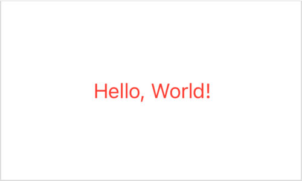
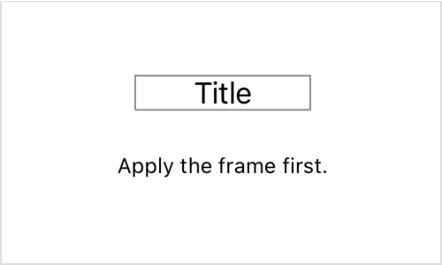
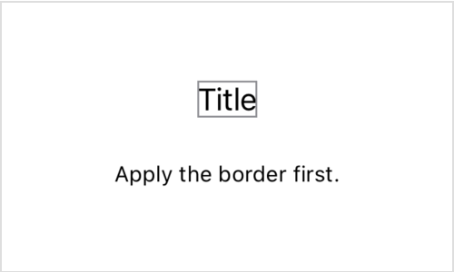
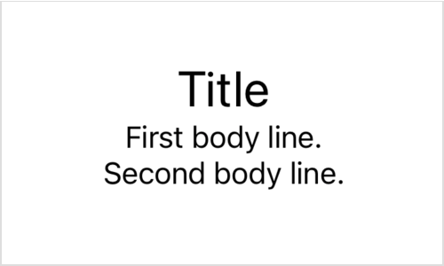

> Navigation: [Technologies](../technologies.md) · [SwiftUI](../swiftui.md) · [View fundamentals](view-fundamentals.md)

# Configuring views

<sub>Article</sub>

Adjust the characteristics of a view by applying view modifiers.

## Overview

In SwiftUI, you assemble views into a hierarchy that describes your app’s user interface. To help you customize the appearance and behavior of your app’s views, you use _view modifiers_. For example, you can use modifiers to:

- Add accessibility features to a view.
- Adjust a view’s styling, layout, and other appearance characteristics.
- Respond to events, like copy and paste.
- Conditionally present modal views, like popovers.
- Configure supporting views, like toolbars.

Because view modifiers are Swift methods with behavior provided by the [View](view.md) protocol, you can apply them to any type that conforms to the [View](view.md) protocol. That includes built-in views like [Text](text.md), [Image](image.md), and [Button](button.md), as well as views that you define.

### Configure a view with a modifier

Like other Swift methods, a modifier operates on an instance — a view of some kind in this case — and can optionally take input parameters. For example, you can apply the [foregroundStyle(_:)](<view/foregroundstyle(__).md>) modifier to set the color of a [Text](text.md) view:

```swift
Text("Hello, World!")
    .foregroundStyle(.red) // Display red text.
```

Modifiers return a view that wraps the original view and replaces it in the view hierarchy. You can think of the two lines in the example above as resolving to a single view that displays red text.



While the code above follows the rules of Swift, the code’s structure might be unfamiliar for developers new to SwiftUI. SwiftUI uses a declarative approach, where you declare and configure a view at the point in your code that corresponds to the view’s position in the view hierarchy. For more information, see [Declaring a custom view](declaring-a-custom-view.md).

### Chain modifiers to achieve complex effects

You commonly chain modifiers, each wrapping the result of the previous one, by calling them one after the other. For example, you can wrap a text view in an invisible box with a given width using the [frame(width:height:alignment:)](<view/frame(width_height_alignment_).md>) modifier to influence its layout, and then use the [border(_:width:)](<view/border(__width_).md>) modifier to draw an outline around that:

```swift
Text("Title")
    .frame(width: 100)
    .border(Color.gray)
```

The order in which you apply modifiers matters. For example, the border that results from the code above outlines the full width of the frame.



<sub>A screenshot of a text view displaying the string Title, outlined by a gray rectangle that’s wider than the string it encloses, leaving empty space inside the rectangle on either side of the string. A caption reads, Apply the frame first.</sub>

By specifying the frame modifier after the border modifier, SwiftUI applies the border only to the text view, which never takes more space than it needs to render its contents.

```swift
Text("Title")
    .border(Color.gray) // Apply the border first this time.
    .frame(width: 100)
```

Wrapping that view in an invisible one with a fixed 100 point width affects the layout of the composite view, but has no effect on the border.



<sub>A screenshot of a text view displaying the string Title, outlined by a gray rectangle that closely surrounds the text. A caption reads, Apply the border first.</sub>

### Configure child views

You can apply any view modifier defined by the [View](view.md) protocol to any concrete view, even when the modifier doesn’t have an immediate effect on its target view. The effects of a modifier propagate to child views that don’t explicitly override the modifier.

For example, a [VStack](vstack.md) instance on its own acts only to vertically stack other views — it doesn’t have any text to display. Therefore, applying a [font(_:)](<view/font(__).md>) modifier to the stack has no effect on the stack. Yet the font modifier does apply to any of the stack’s child views, some of which might display text. You can, however, locally override the stack’s modifier by adding another to a specific child view:

```swift
VStack {
    Text("Title")
        .font(.title) // Override the font of this view.
    Text("First body line.")
    Text("Second body line.")
}
.font(.body) // Set a default font for text in the stack.
```



<sub>A screenshot of a vertical stack of text views. The first appears in a larger, title font, and reads Title. The others appear in a smaller, body font and read First body line and Second body line, respectively.</sub>

### Use view-specific modifiers

While many view types rely on standard view modifiers for customization and control, some views do define modifiers that are specific to that view type. You can’t use such a modifier on anything but the appropriate kind of view. For example, [Text](text.md) defines the [bold()](<text/bold().md>) modifier as a convenience for adding a bold effect to the view’s text. While you can use [font(_:)](<view/font(__).md>) on any view because it’s part of the [View](view.md) protocol, you can use [bold()](<text/bold().md>) only on [Text](text.md) views. As a result, you can’t use it on a container view:

```swift
VStack {
    Text("Hello, world!")
}
.bold() // Fails because 'VStack' doesn't have a 'bold' modifier.
```

You also can’t use it on a [Text](text.md) view after applying another general modifier because general modifiers return an [opaque type](https://docs.swift.org/swift-book/LanguageGuide/OpaqueTypes.html). For example, the return value from the padding modifier isn’t [Text](text.md), but rather an opaque result type that can’t take a bold modifier:

```swift
Text("Hello, world!")
    .padding()
    .bold() // Fails because 'some View' doesn't have a 'bold' modifier.
```

Instead, apply the bold modifier directly to the [Text](text.md) view and then add the padding:

```swift
Text("Hello, world!")
    .bold() // Succeeds.
    .padding()
```

## See Also

### Modifying a view

- [Reducing view modifier maintenance](reducing-view-modifier-maintenance.md) — Bundle view modifiers that you regularly reuse into a custom view modifier.
- [modifier(_:)](<view/modifier(__).md>) — Applies a modifier to a view and returns a new view.
- [ViewModifier](viewmodifier.md) — A modifier that you apply to a view or another view modifier, producing a different version of the original value.
- [EmptyModifier](emptymodifier.md) — An empty, or identity, modifier, used during development to switch modifiers at compile time.
- [ModifiedContent](modifiedcontent.md) — A value with a modifier applied to it.
- [EnvironmentalModifier](environmentalmodifier.md) — A modifier that must resolve to a concrete modifier in an environment before use.
- [ManipulableModifier](manipulablemodifier.md)
- [ManipulableResponderModifier](manipulablerespondermodifier.md)
- [ManipulableTransformBindingModifier](manipulabletransformbindingmodifier.md)
- [ManipulationGeometryModifier](manipulationgeometrymodifier.md)
- [ManipulationGestureModifier](manipulationgesturemodifier.md)
- [ManipulationUsingGestureStateModifier](manipulationusinggesturestatemodifier.md)
- [Manipulable](manipulable.md) — A namespace for various manipulable related types.
