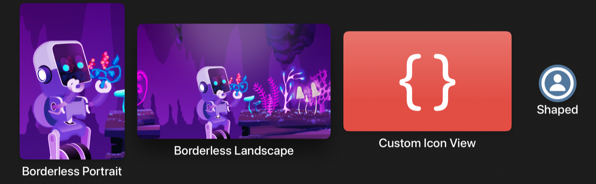
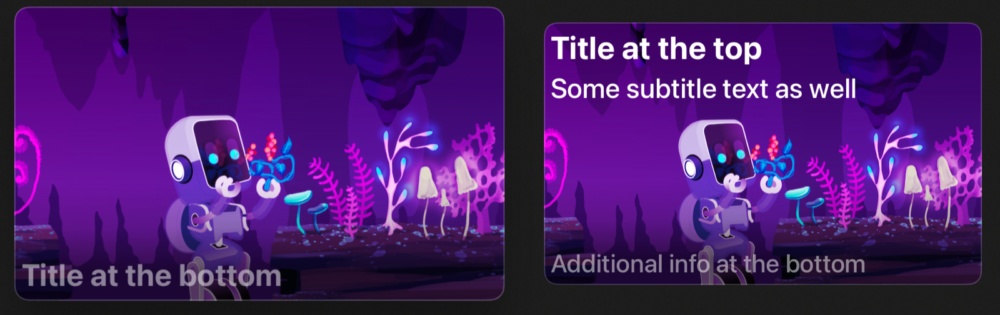
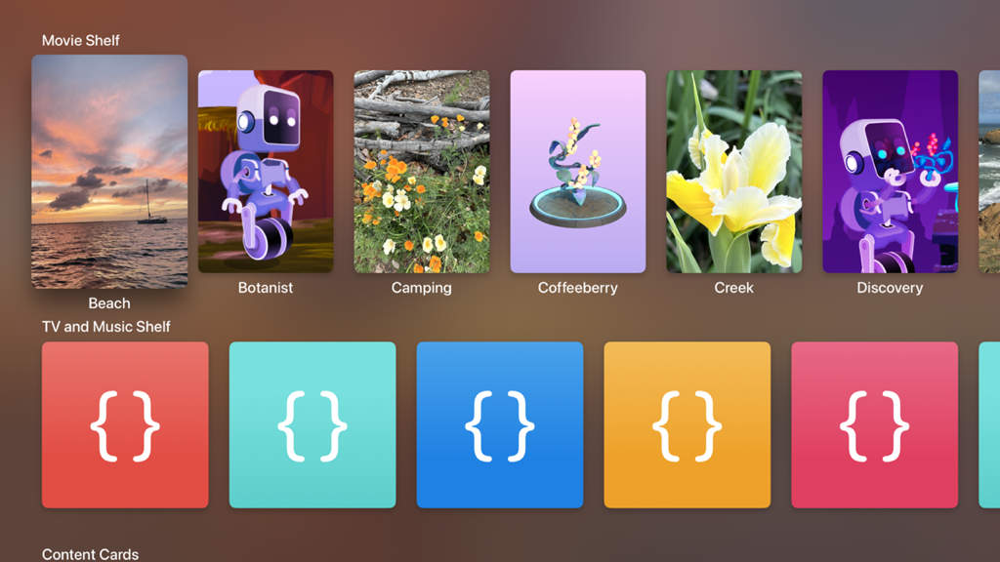
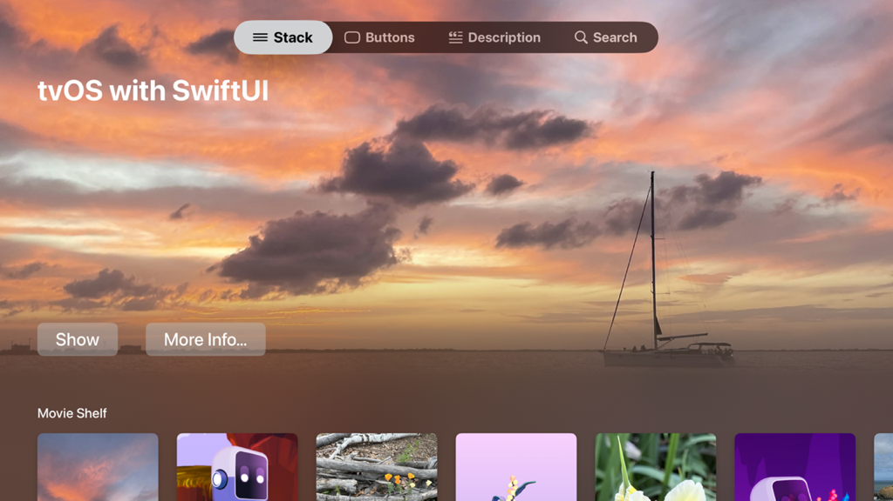
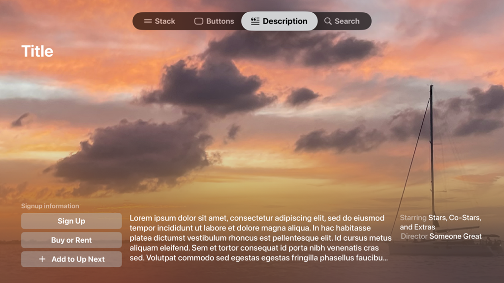
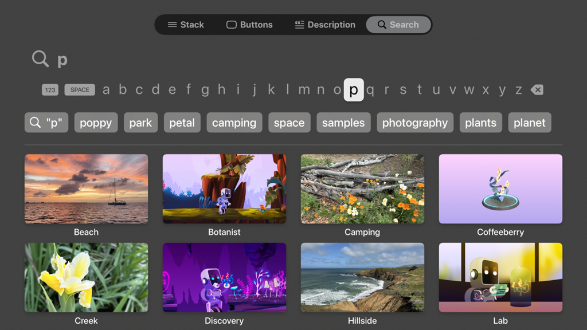

> Navigation: [Technologies](../technologies.md) · [SwiftUI](../swiftui.md) · [App organization](app-organization.md)

# Creating a tvOS media catalog app in SwiftUI

<sub>Sample Code</sub>

Build standard content lockups and rows of content shelves for your tvOS app.

## Overview

This sample code project shows how to create the standard content lockups for tvOS, and provides best practices for building out rows of content shelves. It also includes examples for product pages, search views, and tab views, including the new sidebar adaptive tab view style that provides a sidebar in tvOS.

> [!note] Note
> This sample code project is associated with WWDC24 session 10207: [Migrate your TVML app to SwiftUI](https://developer.apple.com/wwdc24/10207/).

The sample project contains the following examples:

- `StackView` implements an example landing page for a content catalog app, defining several shelves with a showcase or hero header area above them. It also gives an example of an above- and below-the-fold switching animation.
- `ButtonsView` provides a showcase of the various button styles available in tvOS.
- `DescriptionView` provides an example of how to build a product page similar to those you see on the Apple TV app, with a custom material blur.
- `SearchView` shows an example of a simple search page using the [searchable(text:placement:prompt:)](<view/searchable(text_placement_prompt_)-18a8f.md>) and [searchSuggestions(_:)](<view/searchsuggestions(__).md>) modifiers.
- `SidebarContentView` shows how to make a sectioned sidebar using the new tab bar APIs in tvOS 18.
- `HeroHeaderView` gives an example of creating a material gradient to blur content in a certain area, fading it into unblurred content.

### Create content lockups

The [borderless](primitivebuttonstyle/borderless.md) button style provides the primary lockup style you use in tvOS, including all the focus interactions and hover effects. The button’s title and any nearby section titles automatically move out of the way of the button’s image as it scales up on focus.



<sub>Four borderless buttons, each with an image above a textual title. From left to right, the buttons include a portrait image titled Borderless Portrait, a landscape image titled Borderless Landscape, a tvOS app icon titled Custom Icon View, and a circular symbol depicting a person’s head and shoulders titled Shaped.</sub>

Provide a separate [Image](image.md) and [Text](text.md) view in the button’s label closure to ensure the correct vertical appearance. Using a [Label](label.md) usually results in a horizontal layout, and, depending on the current label style, may not give you the appearance you expect.

```swift
Button { /* action */ } label: {
    Image("discovery_portrait")
        .resizable()
        .frame(width: 250, height: 375)
    Text("Borderless Portrait")
}
```

By default, the button style locates the first `Image` within the button’s label and attaches a [highlight](hovereffect/highlight.md) hover effect to it, providing lift, a specular highlight, and gimbal motion effects.

To ensure the hover effect applies to exactly the right view, you can manually attach it to a particular subview of the button’s label using the [hoverEffect(_:)](<view/hovereffect(__).md>) modifier. For instance, to ensure an SF Symbols image hovers along with its background, do the following:

```swift
Button { /* action */ } label: {
    Image(systemName: "person.circle")
        .font(.title)
        .background(Color.blue.grayscale(0.7))
        .hoverEffect(.highlight)
    Text("Shaped")
}
.buttonBorderShape(.circle)
```

You can also attach the hover effect to a custom view.

```swift
Button { /* action */ } label: {
    CodeSampleArtwork(size: .appIconSize)
        .frame(width: 400, height: 240)
        .hoverEffect(.highlight)
    Text("Custom Icon View")
}
```

### Show information-dense lockups

For lockups with more dense information, consider using the [card](primitivebuttonstyle/card.md) button style, which provides a platter and a more subtle motion effect on focus. Providing containers with padding as the button’s label gives you something similar to the search result lockups on the Apple TV app.



<sub>Two buttons in landscape orientation. On the left is an image with rounded corners and a faint border, with text toward its lower edge that says: Title at the bottom. On the right is the same image with rounded corners and a faint border, and two lines of text at the top reading: Title at the top and Some subtitle text as well. Text at its lower edge reads: Additional info at the bottom.</sub>

```swift
Button { /* action */ } label: {
    HStack(alignment: .top, spacing: 10) {
        Image( . . . )
            .resizable()
            .aspectRatio(contentMode: .fit)
            .clipShape(RoundedRectangle(cornerRadius: 12))

        VStack(alignment: .leading) {
            Text(asset.title)
                .font(.body)
            Text("Subtitle text goes here, limited to two lines.")
                .font(.caption2)
                .foregroundStyle(.secondary)
                .lineLimit(2)
            Spacer(minLength: 0)
            HStack(spacing: 4) {
                ForEach(1..<4) { _ in
                    Image(systemName: "ellipsis.rectangle.fill")
                }
            }
            .foregroundStyle(.secondary)
        }
    }
    .padding(12)
}
```

You can also use a custom [LabelStyle](labelstyle.md) to create a standard card-based lockup appearance while keeping your button’s declarations clean at the point of use.

```swift
struct CardOverlayLabelStyle: LabelStyle {
    func makeBody(configuration: Configuration) -> some View {
        ZStack(alignment: .bottomLeading) {
            configuration.icon
                .resizable()
                .aspectRatio(400/240, contentMode: .fit)
                .overlay {
                    LinearGradient(
                        stops: [
                            .init(color: .black.opacity(0.6), location: 0.1),
                            .init(color: .black.opacity(0.2), location: 0.25),
                            .init(color: .black.opacity(0), location: 0.4)
                        ],
                        startPoint: .bottom, endPoint: .top
                    )
                }
                .overlay {
                    RoundedRectangle(cornerRadius: 12)
                        .stroke(lineWidth: 2)
                        .foregroundStyle(.quaternary)
                }

            configuration.title
                .font(.caption.bold())
                .foregroundStyle(.secondary)
                .padding(6)
        }
        .frame(maxWidth: 400)
    }
}

Button { /* action */ } label: {
    Label("Title at the bottom", image: "discovery_landscape")
}
```

### Display content shelves

Content shelves are usually horizontal stacks in scroll views.



<sub>Two horizontal rows of buttons displaying colorful icons. The upper row is titled Movie Shelf and contains images in portrait orientation with titles below them. The left-most icon is enlarged and raised with a drop shadow, and its title is lower to avoid occlusion. The lower row contains square icons, each a different color, with no titles.</sub>

Disabling scroll clipping is necessary to allow the focus effects to scale up and lift each lockup. Shelves typically contain only a single style of lockup, so assign your button style on the outside of the shelf container.

```swift
ScrollView(.horizontal) {
    LazyHStack(spacing: 40) {
        ForEach(Asset.allCases) { asset in
            // . . .
        }
    }
}
.scrollClipDisabled()
.buttonStyle(.borderless)
```

To arrange your lockups nicely, use the [containerRelativeFrame(_:count:span:spacing:alignment:)](<view/containerrelativeframe(__count_span_spacing_alignment_).md>) modifier to let SwiftUI determine the best size for each. You can specify how many lockups you want on the screen, and the amount of spacing your stack view provides. Then SwiftUI arranges the content so that the edges of the leading and trailing items align with the leading and trailing safe area insets of its container.

For borderless buttons, you can attach the modifier to the `Image` instance within the button’s label closure to make the image the source of the frame calculations and alignments.

```swift
asset.portraitImage
    .resizable()
    .aspectRatio(250 / 375, contentMode: .fit)
    .containerRelativeFrame(.horizontal, count: 6, spacing: 40)
Text(asset.title)
```

### Show content above and below the fold

For a landing page you can implement above- and below-the-fold appearances through a combination of [ScrollTargetBehavior](scrolltargetbehavior.md) and a background view with a gradient mask.



<sub>An Apple TV app screen showing a large photograph of a sailboat at sunset. At the top of the screen is a tab bar with items arranged left to right titled Stack, Buttons, Description, and Search. The Stack item is currently selected. Below the tab bar is the title: tvOS with SwiftUI in large text. Toward the bottom of the screen are two buttons titled Show and More Info. Just visible at the bottom of the screen is a horizontal row of images with rounded corners with the title Movie Shelf above them.</sub>

Define your showcase or header section as a stack with a container relative frame to make it take up a particular percentage of the available space. Attach a [focusSection()](<view/focussection().md>) modifier to the stack as well, so that its full width can act as a target for focus movement, which it then diverts to its content. Otherwise, moving focus up from the right side of the shelves below might fail, or might jump all the way to the tab bar because the focus engine searches for the nearest focusable view along a straight line from the currently focused item.

```swift
VStack(alignment: .leading) {
    // Header content.
}
.frame(maxWidth: .infinity, alignment: .leading)
.focusSection()
.containerRelativeFrame(.vertical, alignment: .topLeading) {
    length, _ in length * 0.8
}
```

The code above is the above-the-fold section. To detect when focus moves below the fold, use [onScrollVisibilityChange(threshold:_:)](<view/onscrollvisibilitychange(threshold___).md>) to detect when the header view moves more than halfway off the screen.

```swift
.onScrollVisibilityChange { visible in
    // When the header scrolls more than 50% offscreen, toggle
    // to the below-the-fold state.
    withAnimation {
        belowFold = !visible
    }
}
```

You can define the background of your landing page using a full-screen image with a material in an overlay. Then you can turn the material into a gradient by masking it with a [LinearGradient](lineargradient.md), and you can adjust the opacity of that gradient’s stops according to the view’s above- or below-the-fold status.

```swift
Image("beach_landscape")
    .resizable()
    .aspectRatio(contentMode: .fill)
    .overlay {
        // Build the gradient material by filling an area with a material, and
        // then masking that area using a linear gradient.
        Rectangle()
            .fill(.regularMaterial)
            .mask {
                LinearGradient(
                    stops: [
                        .init(color: .black, location: 0.25),
                        .init(color: .black.opacity(belowFold ? 1 : 0.3), location: 0.375),
                        .init(color: .black.opacity(belowFold ? 1 : 0), location: 0.5)
                    ],
                    startPoint: .bottom, endPoint: .top
                )
            }
    }
    .ignoresSafeArea()
```

By adjusting the opacity of the gradient stops, rather than swapping out the mask view, you achieve a smooth animation between the above-the-fold appearance, where the material fades out above a certain height to reveal the image behind, and the below-the-fold appearance where the entire image blurs.

### Snap at the fold point

You can implement a custom [ScrollTargetBehavior](scrolltargetbehavior.md) to create a fold-snapping effect. Then add a check to determine whether the target of a scroll event is crossing a fold threshold, and update that target to either the top of the page (if moving upward) or to the top of your first content shelf (if moving downward). With your view already tracking the above/below fold state, it can pass that information into the behavior to indicate which operation to check for.

```swift
ScrollView {
    // . . .
}
.scrollTargetBehavior(
    FoldSnappingScrollTargetBehavior(
        aboveFold: !belowFold, showcaseHeight: showcaseHeight))

struct FoldSnappingScrollTargetBehavior: ScrollTargetBehavior {
    var aboveFold: Bool
    var showcaseHeight: CGFloat

    func updateTarget(_ target: inout ScrollTarget, context: TargetContext) {
        // The view is above the fold and not moving far enough down, so make no
        // change.
        if aboveFold && target.rect.minY < showcaseHeight * 0.3 {
            return
        }

        // The view is below the fold, and the header isn't coming onscreen, so
        // make no change.
        if !aboveFold && target.rect.minY > showcaseHeight {
            return
        }

        // Upward movement: Require revealing over 30% of the header, or don't let
        // the scroll go upward.
        let showcaseRevealThreshold = showcaseHeight * 0.7
        let snapToHideRange = showcaseRevealThreshold...showcaseHeight

        if aboveFold || snapToHideRange.contains(target.rect.origin.y) {
            // Snap to align the first content shelf at the top of the screen.
            target.rect.origin.y = showcaseHeight
        }
        else {
            // Snap upward to reveal the header.
            target.rect.origin.y = 0
        }
    }
}
```

### Provide product highlight pages

It’s common for product pages to use a material gradient appearance with above- and below-the-fold snapping. You most likely need to tune the gradient a little differently to account for a taller bar of content at the bottom of the screen, but you typically want to keep the content’s showcase image, with a suitable blur, as a background for the view when scrolling below.



<sub>An Apple TV app screen showing a large photograph of a sailboat at sunset. At the top of the screen is a tab bar with items arranged left to right titled Stack, Buttons, Description, and Search. The Description item is currently selected. Below the tab bar the word Title appears in large text. In the lower quarter of the screen is a three-column section that contains information about a product. The left column has the title Signup Information above three vertically stacked buttons titled Sign Up, Buy or Rent, and Add to Up Next. The middle column contains a block of placeholder text, and the right column contains two vertically-stacked lines of text. The first says Starring: Stars, costars, and extras, and the second says Director: Someone great.</sub>

This makes each product’s page unique, with its defining artwork tinting the content. This is the same effect that root screen on the Apple TV uses — the system blurs the most recently displayed top-shelf image and uses it as the background of the tvOS home screen.

In your description view, you may want to display a stack of bordered buttons, and stretch each to the same width. SwiftUI implements bordered buttons by attaching a background to their labels, so increasing the size of the button view isn’t necessarily going to cause the background platter to grow. Instead, you need to specify that the _label content_ is able to expand, and its background then expands as well. Attaching a [frame(minWidth:idealWidth:maxWidth:minHeight:idealHeight:maxHeight:alignment:)](<view/frame(minwidth_idealwidth_maxwidth_minheight_idealheight_maxheight_alignment_).md>) modifier to the button’s label content achieves this for you.

```swift
VStack(spacing: 12) {
    Button { /* action */ } label: {
        Text("Sign Up")
            .font(.body.bold())
            .frame(maxWidth: .infinity)
    }

    Button { /* action */ } label: {
        Text("Buy or Rent")
            .font(.body.bold())
            .frame(maxWidth: .infinity)
    }

    Button { /* action */ } label: {
        Label("Add to Up Next", systemImage: "plus")
            .font(.body.bold())
            .frame(maxWidth: .infinity)
    }
}
```

When displaying your content’s description, allow it to truncate on the page, and place it within a [Button](button.md) using the `.plain` style. People can then select it, and you can present the full description using an overlay view that you attach with the [fullScreenCover(isPresented:onDismiss:content:)](<view/fullscreencover(ispresented_ondismiss_content_).md>) modifier.

```swift
.fullScreenCover(isPresented: $showDescription) {
    VStack(alignment: .center) {
        Text(loremIpsum)
            .frame(maxWidth: 600)
    }
}
```

### Search for content

For your search page, prefer using a [LazyVGrid](lazyvgrid.md) to contain your results, and a landscape orientation for the lockups themselves. This allows more content to appear onscreen at one time, with several rows of three to five items per row. A tall content container area makes it much easier to see the effects of changes to your search term.



<sub>An Apple TV app screen showing a search pane. At the top of the screen is a tab bar with items arranged left to right titled Stack, Buttons, Description, and Search. The “Search” item is currently selected. Below the tab bar is a search field with a magnifying class icon to its left and the letter P entered. Below that is a keyboard containing roman letters, and below that is a list of words in rounded rectangles representing potential matches. At the bottom is a four-by-two grid of landscape-orientation images with titles below them.</sub>

The search implementation consists of simple view modifiers that function identically on each Apple platform. The [searchable(text:placement:prompt:)](<view/searchable(text_placement_prompt_)-18a8f.md>) modifier provides the entire search UI for you, binding the search field to the provided text. By attaching a [searchSuggestions(_:)](<view/searchsuggestions(__).md>) modifier, you can present a list of potential search keyword completions. These are commonly `Text` instances, but `Button` and [Label](label.md) also work.

Be sure to sort your search results so that the content of your grid is stable and predictable.

```swift
ScrollView(.vertical) {
    LazyVGrid(
        columns: Array(repeating: .init(.flexible(), spacing: 40), count: 4), 
        spacing: 40
    ) {
        ForEach(/* matching assets, sorted */) { asset in
            Button { /* action */ } label: {
                asset.landscapeImage
                    .resizable()
                    .aspectRatio(16 / 9, contentMode: .fit)
                Text(asset.title)
            }
        }
    }
    .buttonStyle(.borderless)
}
.scrollClipDisabled()
.searchable(text: $searchTerm)
.searchSuggestions {
    ForEach(/* keywords matching search term */, id: \.self) { suggestion in
        Text(suggestion)
    }
}
```

## Download

- [CreatingATvOSMediaCatalogAppInSwiftUI.zip](https://docs-assets.developer.apple.com/published/4151095c6511/CreatingATvOSMediaCatalogAppInSwiftUI.zip)
