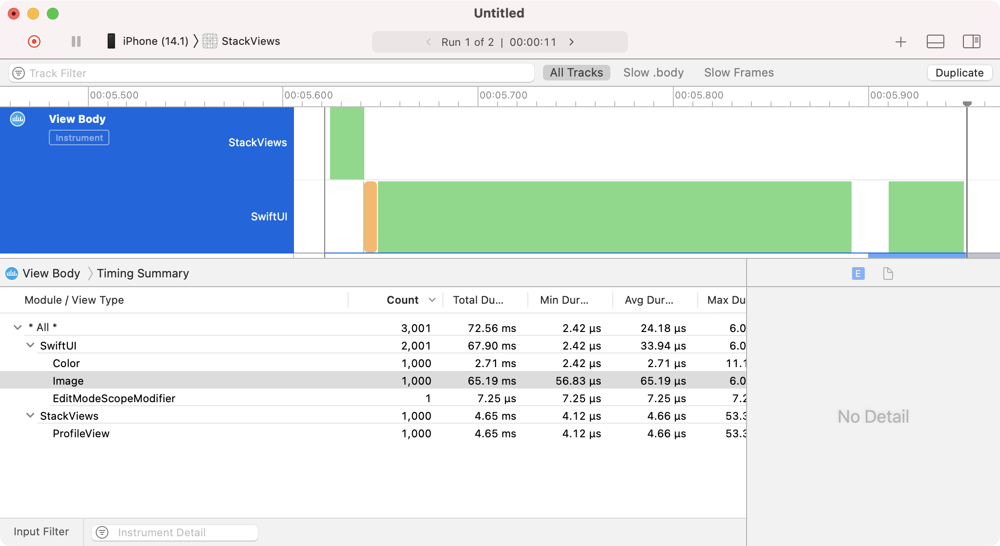
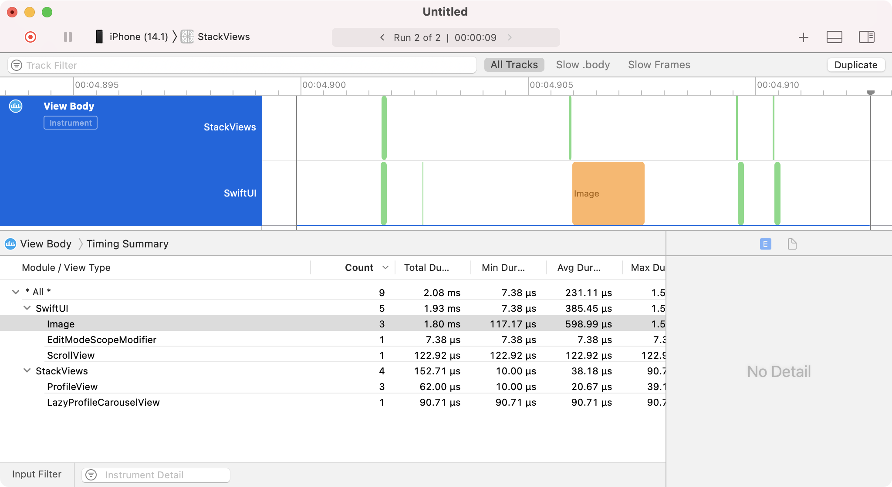

> Navigation: [Technologies](../technologies.md) · [SwiftUI](../swiftui.md) · [Layout fundamentals](layout-fundamentals.md)

# Creating performant scrollable stacks

<sub>Article</sub>

Display large numbers of repeated views efficiently with scroll views, stack views, and lazy stacks.

## Overview

Your apps often need to display more data within a container view than there is space for on a device’s screen. Horizontal and vertical stacks are a good solution for repeating views or groups of views, but they don’t have a built-in mechanism for scrolling. You can add scrolling by wrapping stacks inside a [ScrollView](scrollview.md), and switch to lazy stacks as performance issues arise.

### Display groups of views in a scrollable container

Implementing repeating views or groups of views can be as simple as wrapping them in an [HStack](hstack.md) or [VStack](vstack.md) inside a [ScrollView](scrollview.md).

```swift
ScrollView(.horizontal) {
    HStack {
        ProfileView()
        ProfileView()
        ProfileView()
        ProfileView()
        ProfileView()
    }
}
.frame(maxWidth: 500)
```

If the `ProfileView` in the example code above has an intrinsic content size of 200 x 200 points, the maximum width of 500 points that the [frame(minWidth:idealWidth:maxWidth:minHeight:idealHeight:maxHeight:alignment:)](<view/frame(minwidth_idealwidth_maxwidth_minheight_idealheight_maxheight_alignment_).md>) view modifier applies to the [ScrollView](scrollview.md) causes the stack to scroll inside it.


<sub>Five profile views displaying in a row inside a stack view. The scroll view’s maximum width clips its content,  causing the last two-and-a-half profile views in the stack to be outside of the viewport.</sub>

For an introduction to using stacks to group views together, see [Building layouts with stack views](building-layouts-with-stack-views.md).

### Repeat views for your data

Use [ForEach](foreach.md) to repeat views for the data in your app. From a list of profile data in a `profiles` array, use [ForEach](foreach.md) to create one `ProfileView` per element in the array inside an [HStack](hstack.md).

```swift
ScrollView(.horizontal) {
    HStack {
        ForEach(profiles) { profile in
            ProfileView(profile: profile)
        }
    }
}
.frame(maxWidth: 500)
```

> [!note] Note
> When you use [ForEach](foreach.md), each element you iterate over must be uniquely identifiable. Either conform elements to the [Identifiable](../swift/identifiable.md) protocol, or pass a key path to a unique identifier as the `id` parameter of [init(_:id:content:)](<foreach/init(__id_content_).md>).

### Consider lazy stacks for large numbers of views

The three standard stack views, [HStack](hstack.md), [VStack](vstack.md), and [ZStack](zstack.md), all load their contained view hierarchy when they display, and loading large numbers of views all at once can result in slow runtime performance.

In the above example, `ProfileView` is a compound view that consists of nested stack views, text labels, and an image view. Loading a large number of profiles all at once causes a noticeable slowdown.

As the number of views inside a stack grows, consider using a [LazyHStack](lazyhstack.md) and [LazyVStack](lazyvstack.md) instead of [HStack](hstack.md) and [VStack](vstack.md). Lazy stacks load and render their subviews on-demand, providing significant performance gains when loading large numbers of subviews.


<sub>Diagram showing a lazy stack view inside a scroll view container. Loaded views are visible in the viewport in the center, and views that have yet to load are pending on the right.</sub>

Stack views and lazy stacks have similar functionality, and they may feel interchangeable, but they each have strengths in different situations. Stack views load their child views all at once, making layout fast and reliable, because the system knows the size and shape of every subview as it loads them. Lazy stacks trade some degree of layout correctness for performance, because the system only calculates the geometry for subviews as they become visible.

When choosing the type of stack view to use, always start with a standard stack view and only switch to a lazy stack if profiling your code shows a worthwhile performance improvement.

### Profile to find performance problems

When considering which type of stack to use, use the Instruments tool to profile your application to identify the areas of your user interface code where large numbers of views are loading inside a stack.

To profile SwiftUI view loading, open the Instruments tool by selecting Profile from the Xcode Product menu and choosing the SwiftUI profiling template. This template loads four instruments: View Body, View Properties, Core Animation Commits, and Time Profiler. The combination of these instruments provides a good starting point to find opportunities to speed up your app.

> [!note] Note
> Never profile your code using the iOS simulator. Always use real devices for performance testing.



When profiling the above code, the View Body instrument shows that 1,000 `ProfileView` instances load into memory at the same time as the [HStack](hstack.md). You can also see the same number of [Image](image.md) views load as the system loads each profile.

In this case, the solution is to replace the [HStack](hstack.md) with a [LazyHStack](lazyhstack.md) as the following code shows:

```swift
ScrollView(.horizontal) {
    LazyHStack {
        ForEach(profiles) { profile in
            ProfileView(profile: profile)
        }
    }
}
.frame(maxWidth: 500)
```

Running another trace shows a drastic reduction in the number of initially loaded views as only four `ProfileView` instances start as visible. You can also see a corresponding decrease in the Total Duration column.



For more information about using the Instruments tool, see [Improving your app’s performance](../xcode/improving-your-app-s-performance.md).

## See Also

### Dynamically arranging views in one dimension

- [Grouping data with lazy stack views](grouping-data-with-lazy-stack-views.md) — Split content into logical sections inside lazy stack views.
- [LazyHStack](lazyhstack.md) — A view that arranges its children in a line that grows horizontally, creating items only as needed.
- [LazyVStack](lazyvstack.md) — A view that arranges its children in a line that grows vertically, creating items only as needed.
- [PinnedScrollableViews](pinnedscrollableviews.md) — A set of view types that may be pinned to the bounds of a scroll view.
