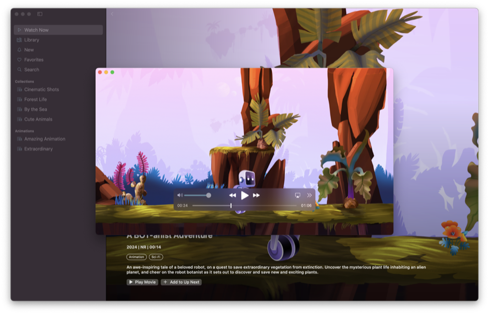
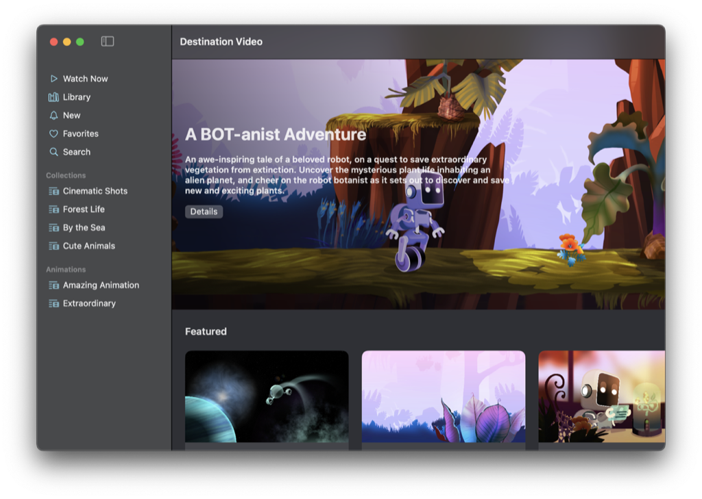
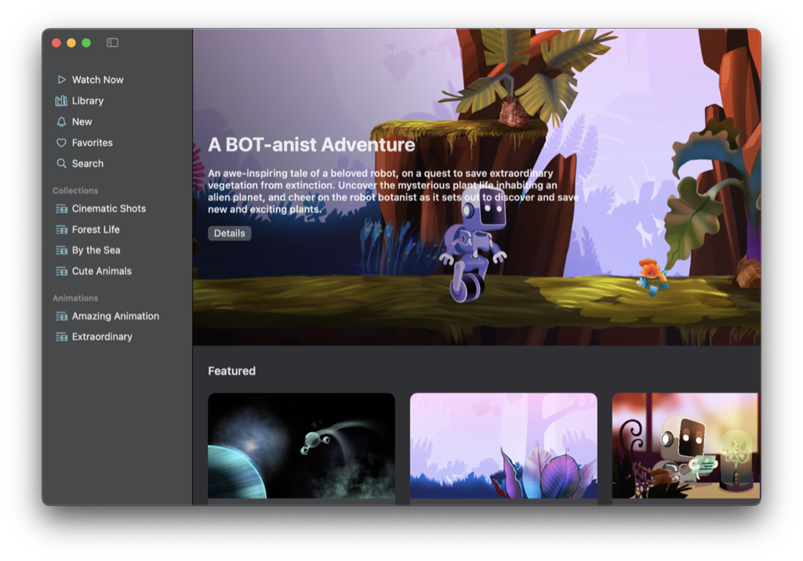
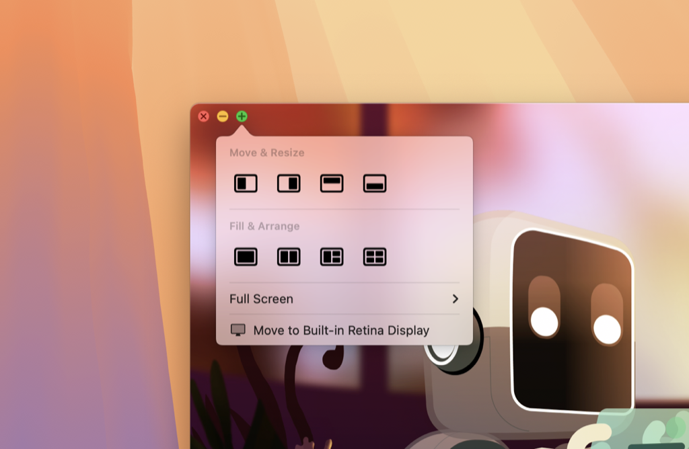

> Navigation: [Technologies](../technologies.md) · [SwiftUI](../swiftui.md) · [Windows](windows.md)

# Customizing window styles and state-restoration behavior in macOS

<sub>Sample Code</sub>

Configure how your app’s windows look and function in macOS to provide an engaging and more coherent experience.

## Overview

The macOS target of [Destination Video](../visionos/destination-video.md) demonstrates how you can leverage the window and scene customization APIs (available in macOS 15 and later) to tailor an app’s experience in macOS. This includes changing a toolbar’s appearance and visibility, extending a window’s drag region, participating in a window’s zoom action, and modifying a window’s state restoration behavior.



## Remove the title and background from the window’s toolbar

Destination Video uses a tab view as its main user interface component, and in macOS, this appears similar to a two-column navigation split view. In this configuration, each tab appears as an entry in the sidebar and participates in the app’s navigation. Because the sidebar provides a visual indication of where you are in that navigation hierarchy, and the app’s content doesn’t require any additional toolbar items, a toolbar isn’t necessary. Removing the toolbar can elevate the underlying content by letting it extend right up to the window’s edge.

To remove the toolbar’s background, `ContentView` calls the [toolbarBackgroundVisibility(_:for:)](<view/toolbarbackgroundvisibility(__for_).md>) view method:

```swift
.toolbarBackgroundVisibility(.hidden, for: .windowToolbar)
```

And then removes the toolbar’s title:

```swift
.toolbar(removing: .title)
```

In this instance, the app still requires the window control buttons to close or minimize the window or enter full-screen mode, so it uses individual view methods to remove only the title and bar background. To remove the toolbar entirely, use the [toolbarVisibility(_:for:)](<view/toolbarvisibility(__for_).md>) view method instead.

**Before**



**After**



It’s important to note that these are visual changes only. The system continues to provide the window’s title to accessibility tools such as screen readers, and the app’s Window menu continues to show the title while the window is open.

## Extend the window’s drag region

To move a window in macOS, you typically drag that window’s toolbar. However, if you choose to remove the background from a toolbar, or hide the toolbar completely, use [WindowDragGesture](windowdraggesture.md) to extend that window’s drag region and make sure the window is still draggable.

Destination Video’s `PlayerView` adds this gesture to a transparent overlay and inserts the overlay between the video content and the playback controls. This enables you to safely drag the window and not interfere with the system playback UI that AVKit provides.

```swift
.gesture(WindowDragGesture())
```

The player also uses the [allowsWindowActivationEvents(_:)](<view/allowswindowactivationevents(__).md>) view method to enable the installed window drag gesture to receive events that activate the window — for example, if the window is in the background and you click it and immediately drag.

```swift
.allowsWindowActivationEvents(true)
```

## Customize the window’s zoom behavior

By default, a window’s toolbar provides buttons that close the window, minimize the window, and enter full-screen mode. If you press and hold the Option key and click the green button, the window zooms instead of going full screen.



<sub>A screenshot showing a window's toolbar buttons. The green button has a popover pointing to it. The popover contains different options for arranging and sizing the window.</sub>

Typically, a window zooms to either its defined maximum size, or as large as the display permits. However, you can use the [windowIdealPlacement(_:)](<scene/windowidealplacement(__).md>) scene method to override this behavior and provide a size and position that’s more appropriate for the window’s contents. The app uses this method to provide a maximum size for the video player that maintains the video’s aspect ratio to prevent black bars appearing above and below it.

```swift
.windowIdealPlacement { proxy, context in
    let displayBounds = context.defaultDisplay.visibleRect
    let idealSize = proxy.sizeThatFits(.unspecified)
    
    // Calculate the content's aspect ratio.
    let aspectRatio = aspectRatio(of: idealSize)
    // Determine the deltas between the display's size and the content's size.
    let deltas = deltas(of: displayBounds.size, idealSize)
    
    // Calculate the window's zoomed size while maintaining the aspect ratio
    // of the content.
    let size = calculateZoomedSize(
        of: idealSize,
        inBounds: displayBounds,
        withAspectRatio: aspectRatio,
        andDeltas: deltas
    )
    
    // Position the window in the center of the display and return the
    // corresponding window placement.
    let position = position(of: size, centeredIn: displayBounds)
    return WindowPlacement(position, size: size)
}
```

This implementation also ensures the zoomed window appears in the center of the display while zooming.

## Modify how the window participates in state restoration

In macOS, state restoration is optional and a person enables (or disables) it systemwide in System Settings. By default, your SwiftUI app respects this setting, but you can choose to override it and specify the preferred restoration behavior for each of your app’s windows. For example, you may want to opt out of state restoration for a window that represents a transient activity, or where it’s difficult or expensive to restore the underlying state from a previous session.

When running in macOS, Destination Video uses the [SceneRestorationBehavior](scenerestorationbehavior.md) view modifier to disable state restoration for the video player view.

```swift
.restorationBehavior(.disabled)
```

As the app’s videos are brief, and a person’s interactions with them are short-lived, it doesn’t make sense to restore the video player on the next launch.

## See Also

#### Related samples

- [Destination Video](../visionos/destination-video.md)

#### Related videos

- [Tailor macOS windows with SwiftUI](../https_/developer.apple.com/videos/play/wwdc2024/10148.md)

## See Also

### Essentials

- [Bringing multiple windows to your SwiftUI app](bringing-multiple-windows-to-your-swiftui-app.md) — Compose rich views by reacting to state changes and customize your app’s scene presentation and behavior on iPadOS and macOS.

## Download

- [DestinationVideo.zip](https://docs-assets.developer.apple.com/published/08bd3c5ea0b3/DestinationVideo.zip)
