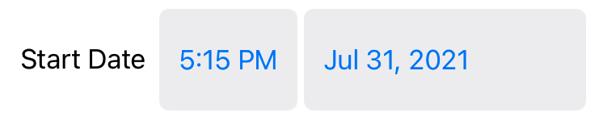
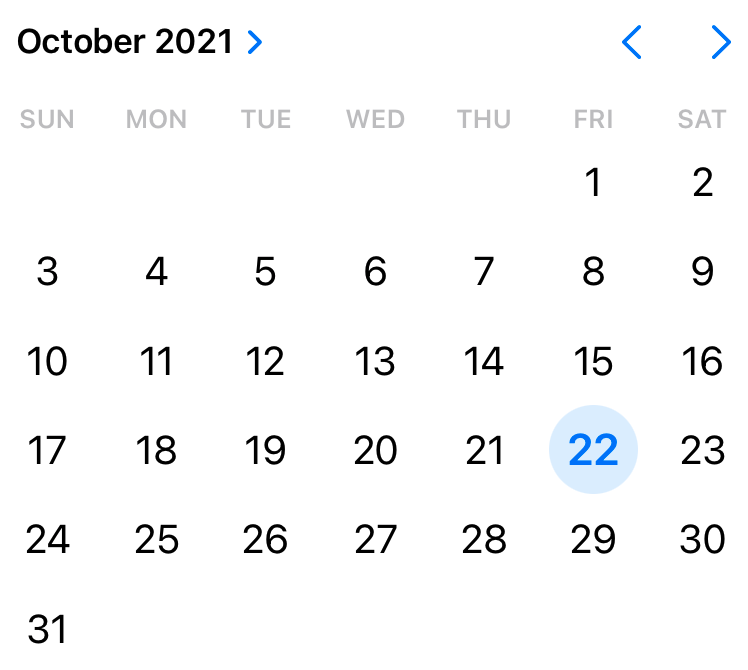

> Navigation: [Technologies](../technologies.md) · [SwiftUI](../swiftui.md)

# DatePicker

<sub>Structure</sub>

A control for selecting an absolute date.

<sub>iOS, iPadOS, Mac Catalyst, macOS, visionOS, watchOS</sub>

```swift
nonisolated struct DatePicker<Label> where Label : View
```

## Overview

Use a `DatePicker` when you want to provide a view that allows the user to select a calendar date, and optionally a time. The view binds to a [Date](../foundation/date.md) instance.

The following example creates a basic `DatePicker`, which appears on iOS as text representing the date. This example limits the display to only the calendar date, not the time. When the user taps or clicks the text, a calendar view animates in, from which the user can select a date. When the user dismisses the calendar view, the view updates the bound [Date](../foundation/date.md).

```swift
@State private var date = Date()

var body: some View {
    DatePicker(
        "Start Date",
        selection: $date,
        displayedComponents: [.date]
    )
}
```


For cases where adding a subtitle to the label is desired, use a view builder that creates multiple `Text` views where the first text represents the title and the second text represents the subtitle:

```swift
@State private var date = Date()

var body: some View {
    DatePicker(selection: $date) {
        Text("Start Date")
        Text("Select the starting date for the event")
    }
}
```

You can limit the `DatePicker` to specific ranges of dates, allowing selections only before or after a certain date, or between two dates. The following example shows a date-and-time picker that only permits selections within the year 2021 (in the `UTC` time zone).

```swift
@State private var date = Date()
let dateRange: ClosedRange<Date> = {
    let calendar = Calendar.current
    let startComponents = DateComponents(year: 2021, month: 1, day: 1)
    let endComponents = DateComponents(year: 2021, month: 12, day: 31, hour: 23, minute: 59, second: 59)
    return calendar.date(from:startComponents)!
        ...
        calendar.date(from:endComponents)!
}()

var body: some View {
    DatePicker(
        "Start Date",
         selection: $date,
         in: dateRange,
         displayedComponents: [.date, .hourAndMinute]
    )
}
```



### Styling date pickers

To use a different style of date picker, use the [datePickerStyle(_:)](<view/datepickerstyle(__).md>) view modifier. The following example shows the graphical date picker style.

```swift
@State private var date = Date()

var body: some View {
    DatePicker(
        "Start Date",
        selection: $date,
        displayedComponents: [.date]
    )
    .datePickerStyle(.graphical)
}
```



## Relationships

- **Conforms To**: [View](view.md)

## Topics

### Creating a date picker for any date

- [init(_:selection:displayedComponents:)](<datepicker/init(__selection_displayedcomponents_).md>) — Creates an instance that selects a `Date` with an unbounded range.
- [init(selection:displayedComponents:label:)](<datepicker/init(selection_displayedcomponents_label_).md>) — Creates an instance that selects a `Date` with an unbounded range.

### Creating a date picker for specific dates

- [init(_:selection:in:displayedComponents:)](<datepicker/init(__selection_in_displayedcomponents_).md>) — Creates an instance that selects a `Date` in a closed range.
- [init(selection:in:displayedComponents:label:)](<datepicker/init(selection_in_displayedcomponents_label_).md>) — Creates an instance that selects a `Date` in a closed range.

### Setting date picker components

- [Components](datepicker/components.md)
- [DatePickerComponents](datepickercomponents.md)

## See Also

### Choosing dates

- [datePickerStyle(_:)](<view/datepickerstyle(__).md>) — Sets the style for date pickers within this view.
- [MultiDatePicker](multidatepicker.md) — A control for picking multiple dates.
- [calendar](environmentvalues/calendar.md) — The current calendar that views should use when handling dates.
- [timeZone](environmentvalues/timezone.md) — The current time zone that views should use when handling dates.
