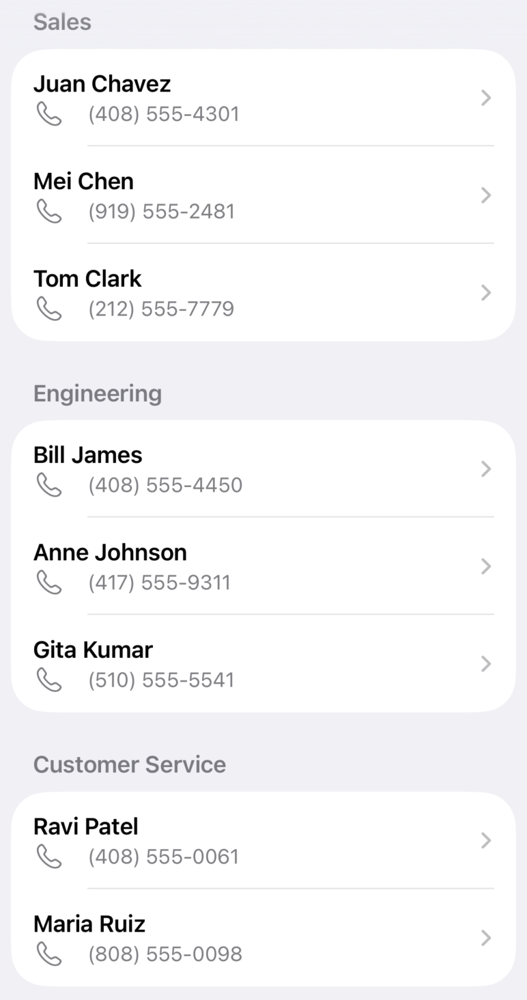

> Navigation: [Technologies](../technologies.md) · [SwiftUI](../swiftui.md) · [Lists](lists.md)

# Displaying data in lists

<sub>Article</sub>

Visualize collections of data with platform-appropriate appearance.

## Overview

Displaying a collection of data in a vertical list is a common requirement in many apps. Whether it’s a list of contacts, a schedule of events, an index of categories, or a shopping list, you’ll often find a use for a [List](list.md).

List views display collections of items vertically, load rows as needed, and add scrolling when the rows don’t fit on the screen, making them suitable for displaying large collections of data.

By default, list views also apply platform-appropriate styling to their elements. For example, on iOS, the default configuration of a list displays a separator line between each row, and adds disclosure indicators next to items that initiate navigation actions.

> [!note] Note
> If you want to remove the platform-appropriate styling — such as row separators or automatic disclosure indicators — from your list, consider using [LazyVStack](lazyvstack.md) instead. For more information on working with lazy stacks, see [Creating performant scrollable stacks](creating-performant-scrollable-stacks.md).

The code in this article shows the use of list views to display a company’s staff directory. Each section enhances the usefulness of the list, by adding custom cells, splitting the list into sections, and using the list selection to navigate to a detail view.

### Prepare your data for iteration

The most common use of [List](list.md) is for representing collections of information in your data model. The following example defines a `Person` as an [Identifiable](../swift/identifiable.md) type with the properties `name` and `phoneNumber`. An array called `staff` contains two instances of this type.

```swift
struct Person: Identifiable {
     let id = UUID()
     var name: String
     var phoneNumber: String
 }

var staff = [
    Person(name: "Juan Chavez", phoneNumber: "(408) 555-4301"),
    Person(name: "Mei Chen", phoneNumber: "(919) 555-2481")
]
```

To present the contents of the array as a list, the example creates a `List` instance. The list’s content builder uses a [ForEach](foreach.md) to iterate over the `staff` array. For each member of the array, the listing creates a row view by instantiating a new [Text](text.md) that contains the name of the `Person`.

```swift
struct StaffList: View {
    var body: some View {
        List {
            ForEach(staff) { person in
                Text(person.name)
            }
        }
    }
}
```


Members of a list must be uniquely identifiable from one another. Unique identifiers allow SwiftUI to automatically generate animations for changes in the underlying data, like inserts, deletions, and moves. Identify list members either by using a type that conforms to [Identifiable](../swift/identifiable.md), as `Person` does, or by providing an `id` parameter with the key path to a unique property of the type. The `ForEach` that populates the list above depends on this behavior, as do the `List` initializers that take a [RandomAccessCollection](../swift/randomaccesscollection.md) of members to iterate over.

> [!important] Important
> The values you use for [Identifiable](../swift/identifiable.md) data must be unique. Using a [UUID](../foundation/uuid.md) or a database row identifier are both good choices, whereas using data like a person’s name or phone number could potentially contain duplicates.

### Display data inside a row

Each row inside a [List](list.md) must be a SwiftUI [View](view.md). You may be able to represent your data with a single view such as an [Image](image.md) or [Text](text.md) view, or you may need to define a custom view to compose several views into something more complex.

As your row views get more sophisticated, refactor the views into separate view structures, passing in the data that the row needs to render. The following example defines a `PersonRowView` to create a two-line view for a `Person`, using fonts, colors, and the system “phone” icon image to visually style the data.

```swift
struct PersonRowView: View {
    var person: Person

    var body: some View {
        VStack(alignment: .leading, spacing: 3) {
            Text(person.name)
                .foregroundColor(.primary)
                .font(.headline)
            HStack(spacing: 3) {
                Label(person.phoneNumber, systemImage: "phone")
            }
            .foregroundColor(.secondary)
            .font(.subheadline)
        }
    }
}

struct StaffList: View {
    var body: some View {
        List {
            ForEach(staff) { person in
                PersonRowView(person: person)
            }
        }
    }
}
```


<sub>A list with two entries, each showing a name and phone number. Each list item has a two-line cell. The first line shows the name in bold. The second shows a phone icon, followed by the phone number with a plain font and a lighter color.</sub>

For more information on composing the types of views commonly used inside list rows, see [Building layouts with stack views](building-layouts-with-stack-views.md).

### Represent data hierarchy with sections

[List](list.md) views can also display data with a level of hierarchy, grouping associated data into sections.

Consider an expanded data model that represents an entire company, including multiple departments. Each `Department` has a name and an array of `Person` instances, and the company has an array of the `Department` type.

```swift
struct Department: Identifiable {
    let id = UUID()
    var name: String
    var staff: [Person]
}

struct Company {
    var departments: [Department]
}

var company = Company(departments: [
    Department(name: "Sales", staff: [
        Person(name: "Juan Chavez", phoneNumber: "(408) 555-4301"),
        Person(name: "Mei Chen", phoneNumber: "(919) 555-2481"),
        // ...
    ]),
    Department(name: "Engineering", staff: [
        Person(name: "Bill James", phoneNumber: "(408) 555-4450"),
        Person(name: "Anne Johnson", phoneNumber: "(417) 555-9311"),
        // ...
    ]),
    // ...
])
```

Use [Section](section.md) views to give the data inside a `List` a level of hierarchy. Start by creating the `List`, using a [ForEach](foreach.md) to iterate over the `company.departments` array, and then create `Section` views for each department. Within the section’s view builder, use a `ForEach` to iterate over the department’s `staff`, and return a customized view for each `Person`.

```swift
List {
    ForEach(company.departments) { department in
        Section {
            ForEach(department.staff) { person in
                PersonRowView(person: person)
            }
        } header: {
            Text(department.name)
        }
    }
 }
```



<sub>A list with sections. The first has a section header with the title Sales, followed by four person entries as individual rows in this section. The next section, Engineering, contains four entries, followed by Customer Service with two entries.</sub>

> [!note] Note
> If your data hierarchy is too deep to represent with a single level of sections and rows, [OutlineGroup](outlinegroup.md) and [DisclosureGroup](disclosuregroup.md) might be a better fit. These views use a disclosure metaphor to allow someone to drill down to an arbitrary depth in the hierarchy.

### Use Lists for Navigation

Using a [NavigationLink](navigationlink.md) within a [List](list.md) contained inside a [NavigationStack](navigationstack.md) adds platform-appropriate visual styling for navigation. SwiftUI navigates to a destination view you provide when a person chooses a list item.

The following example sets up a navigation-based UI by wrapping the list with a navigation stack. Instances of `NavigationLink` wrap the list’s rows to provide a `destination` view to navigate to when a person taps the row.

```swift
NavigationStack {
    List {
        ForEach(company.departments) { department in
            Section {
                ForEach(department.staff) { person in
                    NavigationLink {
                        PersonDetailView(person: person)
                    } label: {
                        PersonRowView(person: person)
                    }
                }
            } header: {
                Text(department.name)
            }
        }
    }
    .navigationTitle("Staff Directory")
}
```

In this example, the view passed in as the `destination` is a `PersonDetailView`, which repeats the information from the list. In a more complex app, this detail view could show more information about a `Person` than would fit inside the list row.

```swift
struct PersonDetailView: View {
    var person: Person

    var body: some View {
        VStack {
            Text(person.name)
                .foregroundColor(.primary)
                .font(.title)
                .padding()
            HStack {
                Label(person.phoneNumber, systemImage: "phone")
            }
            .foregroundColor(.secondary)
        }
    }
}
```

For more information about navigation stacks, see [Understanding the navigation stack](understanding-the-navigation-stack.md).

## See Also

### Creating a list

- [List](list.md) — A container that presents rows of data arranged in a single column, optionally providing the ability to select one or more members.
- [listStyle(_:)](<view/liststyle(__).md>) — Sets the style for lists within this view.
