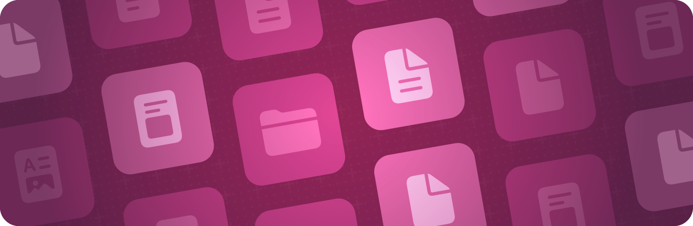

> Navigation: [Technologies](../technologies.md) · [SwiftUI](../swiftui.md)

# Documents

API Collection

Enable people to open and manage documents.

## Overview

Create a user interface for opening and editing documents.

Use the [ReadableDocument](readabledocument.md) and [WritableDocument](writabledocument.md) protocols to define your document model, or adopt [Document](document.md), a convenience protocol that combines both, when your document needs to support reading and writing. They give you direct access to file URLs, integrate with Swift concurrency, and support progress reporting. You can also use SwiftData-backed documents using an initializer like [init(editing:contentType:editor:prepareDocument:)](<documentgroup/init(editing_contenttype_editor_preparedocument_).md>).

SwiftUI supports standard behaviors people expect from a document-based app, appropriate for each platform, like multiwindow support, open and save panels. For related design guidance, see [Patterns](../design/human-interface-guidelines/patterns.md) in the Human Interface Guidelines.

## Topics

### Creating a document

- [Creating a document-based app](creating-a-document-based-app.md) — Build apps that people can use to open, edit, and save files using coordinated file access.
- [Handling advanced document scenarios](handling-advanced-document-scenarios.md) — Extend your document-based app to support custom file formats, on-demand file access, and progress reporting.
- [Updating your document-based app](updating-your-document-based-app.md) — Migrate an existing app to adopt URL-based document reading and writing with Swift concurrency.
- [Building a document-based app with SwiftUI](building-a-document-based-app-with-swiftui.md) — Create, save, and open documents in a multiplatform app.
- [Building a document-based app using SwiftData](building-a-document-based-app-using-swiftdata.md) — Code along with the WWDC presenter to transform an app with SwiftData.
- [DocumentGroup](documentgroup.md) — A scene that enables support for opening, creating, and saving documents.

### Storing document data in a reference type instance

- [Document](document.md) — A document that supports both reading and writing. _(beta)_
- [ReadableDocument](readabledocument.md) — A document type that supports reading from file. _(beta)_
- [WritableDocument](writabledocument.md) — A document type that supports writing to file. _(beta)_
- [URLDocumentConfiguration](urldocumentconfiguration.md) — The configuration of an open document that stores its file URL, last modification date, and related metadata. _(beta)_
- [DocumentCreationContext](documentcreationcontext.md) — Context about how a document was created. _(beta)_
- [DocumentBaseBox](documentbasebox.md) — A Box that allows setting its Document base not requiring the caller to know the exact types of the box and its base.

### Accessing document configuration

- [documentConfiguration](environmentvalues/documentconfiguration.md) — The configuration of a document in a [DocumentGroup](documentgroup.md).
- [DocumentConfiguration](documentconfiguration.md) — The configuration of a document in a [DocumentGroup](documentgroup.md).
- [undoManager](environmentvalues/undomanager.md) — The undo manager used to register a view’s undo operations.

### Reading and writing documents

- [DocumentReadConfiguration](documentreadconfiguration.md) — The context SwiftUI passes to [reader(configuration:)](<readabledocument/reader(configuration_).md>). _(beta)_
- [DocumentWriteConfiguration](documentwriteconfiguration.md) — The context SwiftUI passes to [writer(configuration:)](<writabledocument/writer(configuration_).md>). _(beta)_
- [DocumentReader](documentreader.md) — A type that reads a document’s content from a file. _(beta)_
- [DocumentWriter](documentwriter.md) — A type that writes a document’s content to a file. _(beta)_
- [FileWrapperDocumentReader](filewrapperdocumentreader.md) — A document reader that deserializes a `FileWrapper` into a snapshot. _(beta)_
- [FileWrapperDocumentWriter](filewrapperdocumentwriter.md) — A document writer that serializes a snapshot into a `FileWrapper`. _(beta)_

### Opening a document programmatically

- [newDocument](environmentvalues/newdocument.md) — An action in the environment that presents a new document.
- [openDocument](environmentvalues/opendocument.md) — An action in the environment that presents an existing document.
- [OpenDocumentAction](opendocumentaction.md) — An action that presents an existing document.

### Configuring the document launch experience

- [DocumentGroupLaunchScene](documentgrouplaunchscene.md) — A launch scene for document-based applications.
- [documentLaunchTitle(_:)](<scene/documentlaunchtitle(__).md>) — Sets the title displayed on the document launch card. _(beta)_
- [documentLaunchSubtitle(_:)](<scene/documentlaunchsubtitle(__).md>) — Sets the subtitle displayed beneath the title on the document launch card. _(beta)_
- [DocumentLaunchView](documentlaunchview.md) — A view to present when launching document-related user experience.
- [documentLaunchTitle(_:)](<view/documentlaunchtitle(__).md>) — Sets the title displayed on the document launch card. _(beta)_
- [documentLaunchSubtitle(_:)](<view/documentlaunchsubtitle(__).md>) — Sets the subtitle displayed beneath the title on the document launch card. _(beta)_
- [documentBrowserContextMenu(_:)](<view/documentbrowsercontextmenu(__).md>) — Adds to a `DocumentLaunchView` actions that accept a list of selected files as their parameter.
- [DocumentLaunchGeometryProxy](documentlaunchgeometryproxy.md) — A proxy for access to the frame of the scene and its title view.
- [DefaultDocumentGroupLaunchActions](defaultdocumentgrouplaunchactions.md) — The default actions for the document group launch scene and the document launch view.
- [NewDocumentButton](newdocumentbutton.md) — A button that creates and opens new documents.
- [DefaultNewDocumentButtonLabel](defaultnewdocumentbuttonlabel.md) — The default label used for a new document button. _(beta)_
- [DocumentCreationSource](documentcreationsource.md) — Describes the source used to create a new document. _(beta)_

### Renaming a document

- [RenameButton](renamebutton.md) — A button that triggers a standard rename action.
- [renameAction(_:)](<view/renameaction(__).md>) — Sets a closure to run for the rename action.
- [rename](environmentvalues/rename.md) — An action that activates the standard rename interaction.
- [RenameAction](renameaction.md) — An action that activates a standard rename interaction.

### Deprecated

- [FileDocument](filedocument.md) — A type that you use to serialize documents to and from file. _(deprecated)_
- [FileDocumentConfiguration](filedocumentconfiguration.md) — The properties of an open file document. _(deprecated)_
- [FileDocumentReadConfiguration](filedocumentreadconfiguration.md) — The configuration for reading file contents. _(deprecated)_
- [FileDocumentWriteConfiguration](filedocumentwriteconfiguration.md) — The configuration for serializing file contents. _(deprecated)_
- [NewDocumentAction](newdocumentaction.md) — An action that presents a new document. _(deprecated)_
- [ReferenceFileDocument](referencefiledocument.md) — A type that you use to serialize reference type documents to and from file. _(deprecated)_
- [ReferenceFileDocumentConfiguration](referencefiledocumentconfiguration.md) — The properties of an open reference file document. _(deprecated)_

## See Also

### App structure

- [App organization](app-organization.md) — Define the entry point and top-level structure of your app.
- [Scenes](scenes.md) — Declare the user interface groupings that make up the parts of your app.
- [Windows](windows.md) — Display user interface content in a window or a collection of windows.
- [Immersive spaces](immersive-spaces.md) — Display unbounded content in a person’s surroundings.
- [Navigation](navigation.md) — Enable people to move between different parts of your app’s view hierarchy within a scene.
- [Modal presentations](modal-presentations.md) — Present content in a separate view that offers focused interaction.
- [Toolbars](toolbars.md) — Provide immediate access to frequently used commands and controls.
- [Search](search.md) — Enable people to search for text or other content within your app.
- [App extensions](app-extensions.md) — Extend your app’s basic functionality to other parts of the system, like by adding a Widget.
