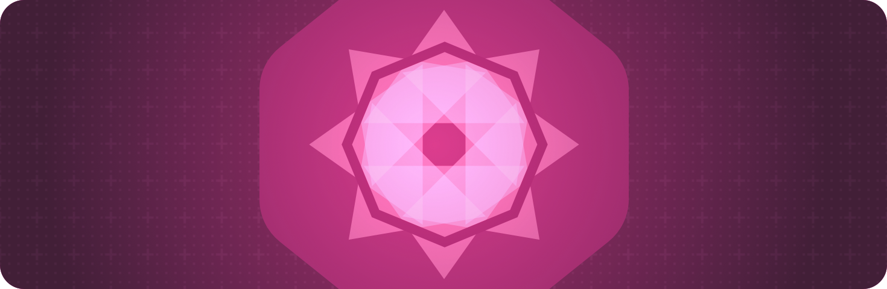

> Navigation: [Technologies](../technologies.md) · [SwiftUI](../swiftui.md)

# Drawing and graphics

API Collection

Enhance your views with graphical effects and customized drawings.

## Overview

You create rich, dynamic user interfaces with the built-in views and [Shapes](shapes.md) that SwiftUI provides. To enhance any view, you can apply many of the graphical effects typically associated with a graphics context, like setting colors, adding masks, and creating composites.

When you need the flexibility of immediate mode drawing in a graphics context, use a [Canvas](canvas.md) view. This can be particularly helpful when you want to draw an extremely large number of dynamic shapes — for example, to create particle effects.

For design guidance, see [Materials](../design/human-interface-guidelines/materials.md) and [Color](../design/human-interface-guidelines/color.md) in the Human Interface Guidelines.

## Topics

### Composing graphics effects

- [Composing advanced graphics effects with SwiftUI](composing-advanced-graphics-effects-with-swiftui.md) — Create compelling visuals in your app by combining graphical effects.

### Immediate mode drawing

- [Add rich graphics to your SwiftUI app](add-rich-graphics-to-your-swiftui-app.md) — Make your apps stand out by adding background materials, vibrancy, custom graphics, and animations.
- [Canvas](canvas.md) — A view type that supports immediate mode drawing.
- [GraphicsContext](graphicscontext.md) — An immediate mode drawing destination, and its current state.

### Setting a color

- [tint(_:)](<view/tint(__).md>) — Sets the tint color within this view.
- [Color](color.md) — A representation of a color that adapts to a given context.

### Styling content

- [border(_:width:)](<view/border(__width_).md>) — Adds a border to this view with the specified style and width.
- [foregroundStyle(_:)](<view/foregroundstyle(__).md>) — Sets a view’s foreground elements to use a given style.
- [foregroundStyle(_:_:)](<view/foregroundstyle(____).md>) — Sets the primary and secondary levels of the foreground style in the child view.
- [foregroundStyle(_:_:_:)](<view/foregroundstyle(______).md>) — Sets the primary, secondary, and tertiary levels of the foreground style.
- [backgroundStyle(_:)](<view/backgroundstyle(__).md>) — Sets the specified style to render backgrounds within the view.
- [backgroundStyle](environmentvalues/backgroundstyle.md) — An optional style that overrides the default system background style when set.
- [ShapeStyle](shapestyle.md) — A color or pattern to use when rendering a shape.
- [AnyShapeStyle](anyshapestyle.md) — A type-erased ShapeStyle value.
- [Gradient](gradient.md) — A color gradient represented as an array of color stops, each having a parametric location value.
- [MeshGradient](meshgradient.md) — A two-dimensional gradient defined by a 2D grid of positioned colors.
- [AnyGradient](anygradient.md) — A color gradient.
- [ShadowStyle](shadowstyle.md) — A style to use when rendering shadows.
- [Glass](glass.md) — A structure that defines the configuration of the Liquid Glass material.

### Transforming colors

- [brightness(_:)](<view/brightness(__).md>) — Brightens this view by the specified amount.
- [contrast(_:)](<view/contrast(__).md>) — Sets the contrast and separation between similar colors in this view.
- [colorInvert()](<view/colorinvert().md>) — Inverts the colors in this view.
- [colorMultiply(_:)](<view/colormultiply(__).md>) — Adds a color multiplication effect to this view.
- [saturation(_:)](<view/saturation(__).md>) — Adjusts the color saturation of this view.
- [grayscale(_:)](<view/grayscale(__).md>) — Adds a grayscale effect to this view.
- [hueRotation(_:)](<view/huerotation(__).md>) — Applies a hue rotation effect to this view.
- [luminanceToAlpha()](<view/luminancetoalpha().md>) — Adds a luminance to alpha effect to this view.
- [materialActiveAppearance(_:)](<view/materialactiveappearance(__).md>) — Sets an explicit active appearance for materials in this view.
- [materialActiveAppearance](environmentvalues/materialactiveappearance.md) — The behavior materials should use for their active state, defaulting to `automatic`.
- [MaterialActiveAppearance](materialactiveappearance.md) — The behavior for how materials appear active and inactive.

### Scaling, rotating, or transforming a view

- [scaledToFill()](<view/scaledtofill().md>) — Scales this view to fill its parent.
- [scaledToFit()](<view/scaledtofit().md>) — Scales this view to fit its parent.
- [scaleEffect(_:anchor:)](<view/scaleeffect(__anchor_).md>) — Scales this view uniformly by the specified factor, relative to an anchor point.
- [scaleEffect(x:y:anchor:)](<view/scaleeffect(x_y_anchor_).md>) — Scales this view’s rendered output by the given horizontal and vertical amounts, relative to an anchor point.
- [scaleEffect(x:y:z:anchor:)](<view/scaleeffect(x_y_z_anchor_).md>) — Scales this view by the specified horizontal, vertical, and depth factors, relative to an anchor point.
- [aspectRatio(_:contentMode:)](<view/aspectratio(__contentmode_).md>) — Constrains this view’s dimensions to the specified aspect ratio.
- [rotationEffect(_:anchor:)](<view/rotationeffect(__anchor_).md>) — Rotates a view’s rendered output in two dimensions around the specified point.
- [rotation3DEffect(_:axis:anchor:anchorZ:perspective:)](<view/rotation3deffect(__axis_anchor_anchorz_perspective_).md>) — Renders a view’s content as if it’s rotated in three dimensions around the specified axis.
- [perspectiveRotationEffect(_:axis:anchor:anchorZ:perspective:)](<view/perspectiverotationeffect(__axis_anchor_anchorz_perspective_).md>) — Renders a view’s content as if it’s rotated in three dimensions around the specified axis.
- [rotation3DEffect(_:anchor:)](<view/rotation3deffect(__anchor_).md>) — Rotates the view’s content by the specified 3D rotation value.
- [rotation3DEffect(_:axis:anchor:)](<view/rotation3deffect(__axis_anchor_).md>) — Rotates the view’s content by an angle about an axis that you specify as a tuple of elements.
- [transformEffect(_:)](<view/transformeffect(__).md>) — Applies an affine transformation to this view’s rendered output.
- [transform3DEffect(_:)](<view/transform3deffect(__).md>) — Applies a 3D transformation to this view’s rendered output.
- [projectionEffect(_:)](<view/projectioneffect(__).md>) — Applies a projection transformation to this view’s rendered output.
- [ProjectionTransform](projectiontransform.md)
- [ContentMode](contentmode.md) — Constants that define how a view’s content fills the available space.

### Masking and clipping

- [mask(alignment:_:)](<view/mask(alignment___).md>) — Masks this view using the alpha channel of the given view.
- [clipped(antialiased:)](<view/clipped(antialiased_).md>) — Clips this view to its bounding rectangular frame.
- [clipShape(_:style:)](<view/clipshape(__style_).md>) — Sets a clipping shape for this view.

### Applying blur and shadows

- [blur(radius:opaque:)](<view/blur(radius_opaque_).md>) — Applies a Gaussian blur to this view.
- [shadow(color:radius:x:y:)](<view/shadow(color_radius_x_y_).md>) — Adds a shadow to this view.
- [ColorMatrix](colormatrix.md) — A matrix to use in an RGBA color transformation.

### Applying effects based on geometry

- [visualEffect(_:)](<view/visualeffect(__).md>) — Applies effects to this view, while providing access to layout information through a geometry proxy.
- [visualEffect3D(_:)](<view/visualeffect3d(__).md>) — Applies effects to this view, while providing access to layout information through a 3D geometry proxy.
- [VisualEffect](visualeffect.md) — Visual Effects change the visual appearance of a view without changing its ancestors or descendents.
- [EmptyVisualEffect](emptyvisualeffect.md) — The base visual effect that you apply additional effect to.

### Compositing views

- [blendMode(_:)](<view/blendmode(__).md>) — Sets the blend mode for compositing this view with overlapping views.
- [compositingGroup()](<view/compositinggroup().md>) — Wraps this view in a compositing group.
- [drawingGroup(opaque:colorMode:)](<view/drawinggroup(opaque_colormode_).md>) — Composites this view’s contents into an offscreen image before final display.
- [BlendMode](blendmode.md) — Modes for compositing a view with overlapping content.
- [ColorRenderingMode](colorrenderingmode.md) — The set of possible working color spaces for color-compositing operations.
- [CompositorContent](compositorcontent.md)
- [CompositorContentBuilder](compositorcontentbuilder.md) — A result builder for composing a collection of [CompositorContent](compositorcontent.md) elements.
- [AnyCompositorContent](anycompositorcontent.md) — Type erased compositor content.

### Measuring a view

- [GeometryReader](geometryreader.md) — A container view that defines its content as a function of its own size and coordinate space.
- [GeometryReader3D](geometryreader3d.md) — A container view that defines its content as a function of its own size and coordinate space.
- [GeometryProxy](geometryproxy.md) — A proxy for access to the size and coordinate space (for anchor resolution) of the container view.
- [GeometryProxy3D](geometryproxy3d.md) — A proxy for access to the size and coordinate space of the container view.
- [coordinateSpace(_:)](<view/coordinatespace(__).md>) — Assigns a name to the view’s coordinate space, so other code can operate on dimensions like points and sizes relative to the named space.
- [CoordinateSpace](coordinatespace.md) — A resolved coordinate space created by the coordinate space protocol.
- [CoordinateSpaceProtocol](coordinatespaceprotocol.md) — A frame of reference within the layout system.
- [PhysicalMetric](physicalmetric.md) — Provides access to a value in points that corresponds to the specified physical measurement.
- [PhysicalMetricsConverter](physicalmetricsconverter.md) — A physical metrics converter provides conversion between point values and their extent in 3D space, in the form of physical length measurements.

### Responding to a geometry change

- [onGeometryChange(for:of:action:)](<view/ongeometrychange(for_of_action_).md>) — Adds an action to be performed when a value, created from a geometry proxy, changes.

### Accessing Metal shaders

- [colorEffect(_:isEnabled:)](<view/coloreffect(__isenabled_).md>) — Returns a new view that applies `shader` to `self` as a filter effect on the color of each pixel.
- [distortionEffect(_:maxSampleOffset:isEnabled:)](<view/distortioneffect(__maxsampleoffset_isenabled_).md>) — Returns a new view that applies `shader` to `self` as a geometric distortion effect on the location of each pixel.
- [layerEffect(_:maxSampleOffset:isEnabled:)](<view/layereffect(__maxsampleoffset_isenabled_).md>) — Returns a new view that applies `shader` to `self` as a filter on the raster layer created from `self`.
- [Shader](shader.md) — A reference to a function in a Metal shader library, along with its bound uniform argument values.
- [ShaderFunction](shaderfunction.md) — A reference to a function in a Metal shader library.
- [ShaderLibrary](shaderlibrary.md) — A Metal shader library.

### Accessing geometric constructs

- [Axis](axis.md) — The horizontal or vertical dimension in a 2D coordinate system.
- [Angle](angle.md) — A geometric angle whose value you access in either radians or degrees.
- [UnitPoint](unitpoint.md) — A normalized 2D point in a view’s coordinate space.
- [UnitPoint3D](unitpoint3d.md) — A normalized 3D point in a view’s coordinate space.
- [Anchor](anchor.md) — An opaque value derived from an anchor source and a particular view.
- [DepthAlignmentID](depthalignmentid.md)
- [Alignment3D](alignment3d.md) — An alignment in all three axes.
- [GeometryProxyCoordinateSpace3D](geometryproxycoordinatespace3d.md) — A representation of a `GeometryProxy3D` which can be used for `CoordinateSpace3D` based conversions.

## See Also

### Views

- [View fundamentals](view-fundamentals.md) — Define the visual elements of your app using a hierarchy of views.
- [View configuration](view-configuration.md) — Adjust the characteristics of views in a hierarchy.
- [View styles](view-styles.md) — Apply built-in and custom appearances and behaviors to different types of views.
- [Animations](animations.md) — Create smooth visual updates in response to state changes.
- [Text input and output](text-input-and-output.md) — Display formatted text and get text input from the user.
- [Images](images.md) — Add images and symbols to your app’s user interface.
- [Controls and indicators](controls-and-indicators.md) — Display values and get user selections.
- [Menus and commands](menus-and-commands.md) — Provide space-efficient, context-dependent access to commands and controls.
- [Shapes](shapes.md) — Trace and fill built-in and custom shapes with a color, gradient, or other pattern.
