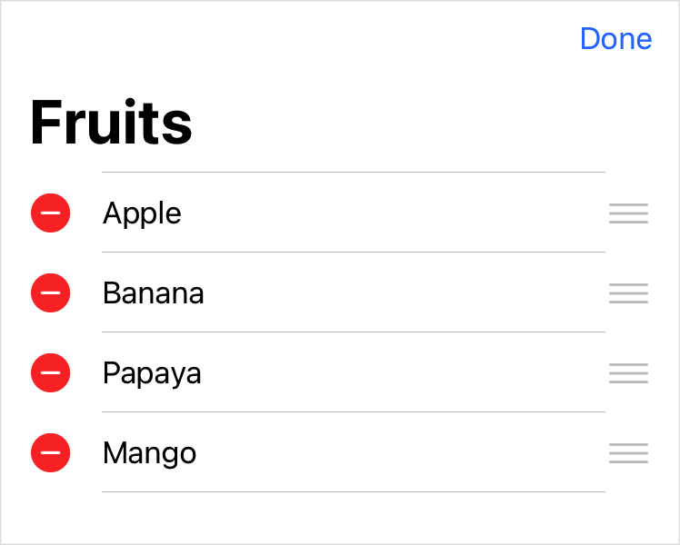

> Navigation: [Technologies](../technologies.md) · [SwiftUI](../swiftui.md)

# EditButton

<sub>Structure</sub>

A button that toggles the edit mode environment value.

<sub>iOS, iPadOS, Mac Catalyst, visionOS</sub>

```swift
nonisolated struct EditButton
```

## Overview

An edit button toggles the environment’s [editMode](environmentvalues/editmode.md) value for content within a container that supports edit mode. In the following example, an edit button placed inside a [NavigationView](navigationview.md) supports editing of a [List](list.md):

```swift
@State private var fruits = [
    "Apple",
    "Banana",
    "Papaya",
    "Mango"
]

var body: some View {
    NavigationView {
        List {
            ForEach(fruits, id: \.self) { fruit in
                Text(fruit)
            }
            .onDelete { fruits.remove(atOffsets: $0) }
            .onMove { fruits.move(fromOffsets: $0, toOffset: $1) }
        }
        .navigationTitle("Fruits")
        .toolbar {
            EditButton()
        }
    }
}
```

Because the [ForEach](foreach.md) in the above example defines behaviors for [onDelete(perform:)](<dynamicviewcontent/ondelete(perform_).md>) and [onMove(perform:)](<dynamicviewcontent/onmove(perform_).md>), the editable list displays the delete and move UI when the user taps Edit. Notice that the Edit button displays the title “Done” while edit mode is active:



You can also create custom views that react to changes in the edit mode state, as described in [EditMode](editmode.md).

## Relationships

- **Conforms To**: [View](view.md)

## Topics

### Creating an edit button

- [init()](<editbutton/init().md>) — Creates an Edit button instance.

## See Also

### Creating special-purpose buttons

- [PasteButton](pastebutton.md) — A system button that reads items from the pasteboard and delivers it to a closure.
- [RenameButton](renamebutton.md) — A button that triggers a standard rename action.
