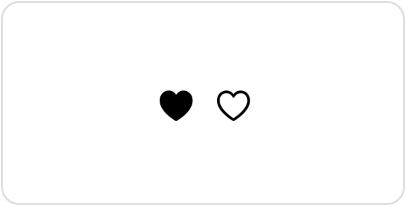

> Navigation: [Technologies](../../technologies.md) · [SwiftUI](../../swiftui.md) · [EnvironmentValues](../environmentvalues.md)

# symbolVariants

<sub>Instance Property</sub>

The symbol variant to use in this environment.

<sub>iOS, iPadOS, Mac Catalyst, macOS, tvOS, visionOS, watchOS</sub>

```swift
var symbolVariants: SymbolVariants { get set }
```

## Discussion

You set this environment value indirectly by using the [symbolVariant(_:)](<../view/symbolvariant(__).md>) view modifier. However, you access the environment variable directly using the [environment(_:_:)](<../view/environment(____).md>) modifier. Do this when you want to use the [none](../symbolvariants/none.md) variant to ignore the value that’s already in the environment:

```swift
HStack {
    Image(systemName: "heart")
    Image(systemName: "heart")
        .environment(\.symbolVariants, .none)
}
.symbolVariant(.fill)
```



## See Also

### Setting a symbol variant

- [symbolVariant(_:)](<../view/symbolvariant(__).md>) — Makes symbols within the view show a particular variant.
- [SymbolVariants](../symbolvariants.md) — A variant of a symbol.
