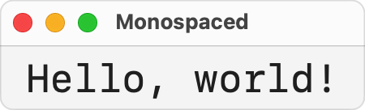

> Navigation: [Technologies](../../technologies.md) · [SwiftUI](../../swiftui.md) · [Font](../font.md)

# monospaced(_:)

<sub>Instance Method</sub>

Returns a font adding or removing fixed-width design from the same family as the base font.

<sub>iOS, iPadOS, Mac Catalyst, macOS, tvOS, visionOS, watchOS</sub>

```swift
func monospaced(_ isActive: Bool) -> Font
```

## Return Value

A font with the fixed-width design added or removed, from the same family as the base font, if one is available, and a default font otherwise.

## Discussion

If there’s no suitable font face in the same family, SwiftUI returns a default font.

The following example adds the `monospaced()` modifier to the default system font, then applies this font to a [Text](../text.md) view:

```swift
struct ContentView: View {
    let myFont = Font
        .system(size: 24)
        .monospaced(true)

    var body: some View {
        Text("Hello, world!")
            .font(myFont)
            .padding()
            .navigationTitle("Monospaced")
    }
}
```



SwiftUI may provide different fixed-width replacements for standard user interface fonts (such as [title](title.md), or a system font created with [system(_:design:)](<system(__design_).md>)) than for those same fonts when created by name with [custom(_:size:)](<custom(__size_).md>).

The [font(_:)](<../view/font(__).md>) modifier applies the font to all text within the view. To mix fixed-width text with other styles in the same `Text` view, use the [init(_:)](<../text/init(__)-1a4oh.md>) initializer to use an appropriately-styled [AttributedString](../../foundation/attributedstring.md) for the text view’s content. You can use the [init(markdown:options:baseURL:)](<../../foundation/attributedstring/init(markdown_options_baseurl_)-52n3u.md>) initializer to provide a Markdown-formatted string containing the backtick-syntax (`…`) to apply code voice to specific ranges of the attributed string.
