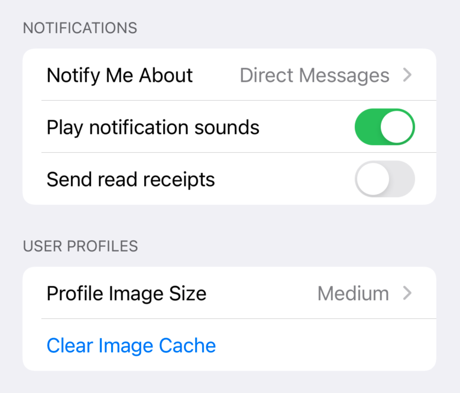
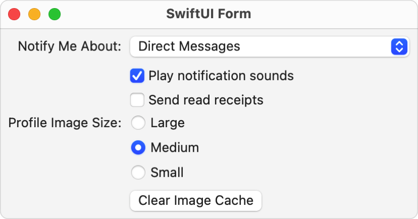

> Navigation: [Technologies](../technologies.md) · [SwiftUI](../swiftui.md)

# Form

<sub>Structure</sub>

A container for grouping controls used for data entry, such as in settings or inspectors.

<sub>iOS, iPadOS, Mac Catalyst, macOS, tvOS, visionOS, watchOS</sub>

```swift
nonisolated struct Form<Content> where Content : View
```

## Overview

SwiftUI applies platform-appropriate styling to views contained inside a form, to group them together. Form-specific styling applies to things like buttons, toggles, labels, lists, and more. Keep in mind that these stylings may be platform-specific. For example, forms appear as grouped lists on iOS, and as aligned vertical stacks on macOS.

The following example shows a simple data entry form on iOS, grouped into two sections. The supporting types (`NotifyMeAboutType` and `ProfileImageSize`) and state variables (`notifyMeAbout`, `profileImageSize`, `playNotificationSounds`, and `sendReadReceipts`) are omitted for simplicity.

```swift
var body: some View {
    NavigationView {
        Form {
            Section(header: Text("Notifications")) {
                Picker("Notify Me About", selection: $notifyMeAbout) {
                    Text("Direct Messages").tag(NotifyMeAboutType.directMessages)
                    Text("Mentions").tag(NotifyMeAboutType.mentions)
                    Text("Anything").tag(NotifyMeAboutType.anything)
                }
                Toggle("Play notification sounds", isOn: $playNotificationSounds)
                Toggle("Send read receipts", isOn: $sendReadReceipts)
            }
            Section(header: Text("User Profiles")) {
                Picker("Profile Image Size", selection: $profileImageSize) {
                    Text("Large").tag(ProfileImageSize.large)
                    Text("Medium").tag(ProfileImageSize.medium)
                    Text("Small").tag(ProfileImageSize.small)
                }
                Button("Clear Image Cache") {}
            }
        }
    }
}
```



On macOS, a similar form renders as a vertical stack. To adhere to macOS platform conventions, this version doesn’t use sections, and uses colons at the end of its labels. It also sets the picker to use the [inline](pickerstyle/inline.md) style, which produces radio buttons on macOS.

```swift
var body: some View {
    Spacer()
    HStack {
        Spacer()
        Form {
            Picker("Notify Me About:", selection: $notifyMeAbout) {
                Text("Direct Messages").tag(NotifyMeAboutType.directMessages)
                Text("Mentions").tag(NotifyMeAboutType.mentions)
                Text("Anything").tag(NotifyMeAboutType.anything)
            }
            Toggle("Play notification sounds", isOn: $playNotificationSounds)
            Toggle("Send read receipts", isOn: $sendReadReceipts)

            Picker("Profile Image Size:", selection: $profileImageSize) {
                Text("Large").tag(ProfileImageSize.large)
                Text("Medium").tag(ProfileImageSize.medium)
                Text("Small").tag(ProfileImageSize.small)
            }
            .pickerStyle(.inline)

            Button("Clear Image Cache") {}
        }
        Spacer()
    }
    Spacer()
}
```



## Relationships

- **Conforms To**: [View](view.md)

## Topics

### Creating a form

- [init(content:)](<form/init(content_).md>) — Creates a form with the provided content.

### Creating a form from a configuration

- [init(_:)](<form/init(__).md>) — Creates a form based on a form style configuration.

## See Also

### Grouping inputs

- [formStyle(_:)](<view/formstyle(__).md>) — Sets the style for forms in a view hierarchy.
- [LabeledContent](labeledcontent.md) — A container for attaching a label to a value-bearing view.
- [labeledContentStyle(_:)](<view/labeledcontentstyle(__).md>) — Sets a style for labeled content.
