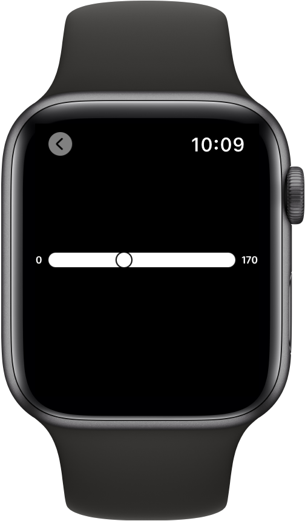
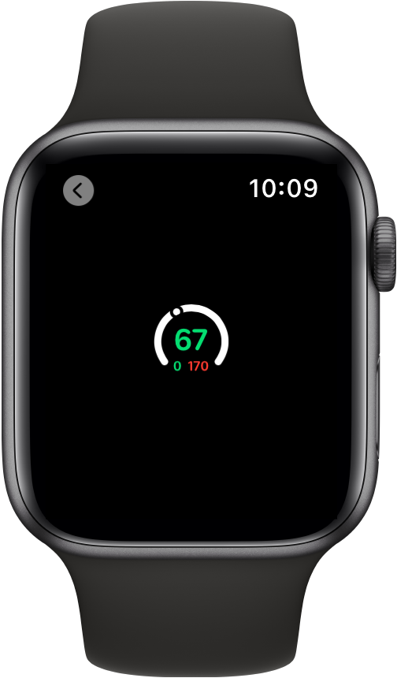
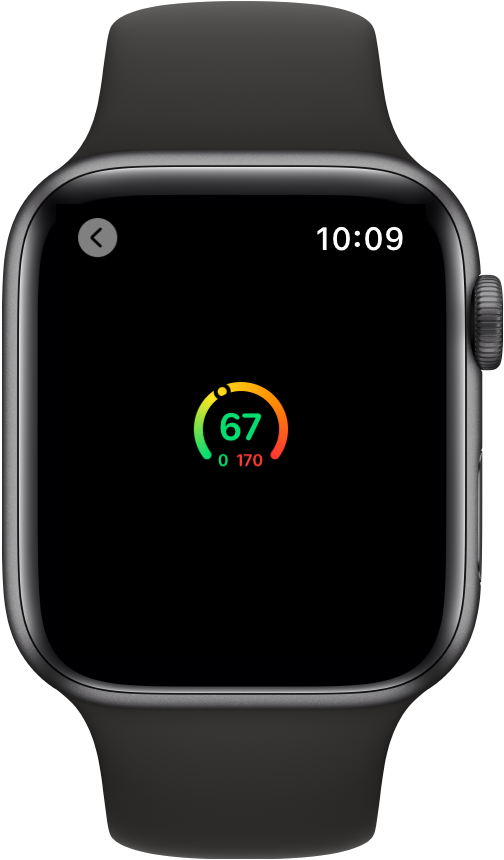

> Navigation: [Technologies](../technologies.md) · [SwiftUI](../swiftui.md)

# Gauge

<sub>Structure</sub>

A view that shows a value within a range.

<sub>iOS, iPadOS, Mac Catalyst, macOS, visionOS, watchOS</sub>

```swift
nonisolated struct Gauge<Label, CurrentValueLabel, BoundsLabel, MarkedValueLabels> where Label : View, CurrentValueLabel : View, BoundsLabel : View, MarkedValueLabels : View
```

## Overview

A gauge is a view that shows a current level of a value in relation to a specified finite capacity, very much like a fuel gauge in an automobile. Gauge displays are configurable; they can show any combination of the gauge’s current value, the range the gauge can display, and a label describing the purpose of the gauge itself.

In its most basic form, a gauge displays a single value along the path of the gauge mapped into a range from 0 to 100 percent. The example below sets the gauge’s indicator to a position 40 percent along the gauge’s path:

```swift
struct SimpleGauge: View {
    @State private var batteryLevel = 0.4

    var body: some View {
        Gauge(value: batteryLevel) {
            Text("Battery Level")
        }
    }
}
```


You can make a gauge more descriptive by describing its purpose, showing its current value and its start and end values. This example shows the gauge variant that accepts a range and adds labels using multiple trailing closures describing the current value and the minimum and maximum values of the gauge:

```swift
struct LabeledGauge: View {
    @State private var current = 67.0
    @State private var minValue = 0.0
    @State private var maxValue = 170.0

    var body: some View {
        Gauge(value: current, in: minValue...maxValue) {
            Text("BPM")
        } currentValueLabel: {
            Text("\(Int(current))")
        } minimumValueLabel: {
            Text("\(Int(minValue))")
        } maximumValueLabel: {
            Text("\(Int(maxValue))")
        }
    }
}
```



As shown above, the default style for gauges is a linear, continuous bar with an indicator showing the current value, and optional labels describing the gauge’s purpose, current, minimum, and maximum values.

> [!note] Note
> Some visual presentations of `Gauge` don’t display all the labels required by the API. However, the accessibility system does use the label content and you should use these labels to fully describe the gauge for accessibility users.

To change the style of a gauge, use the [gaugeStyle(_:)](<view/gaugestyle(__).md>) view modifier and supply an initializer for a specific gauge style. For example, to display the same gauge in a circular style, apply the [circular](gaugestyle/circular.md) style to the view:

```swift
struct LabeledGauge: View {
    @State private var current = 67.0
    @State private var minValue = 0.0
    @State private var maxValue = 170.0

    var body: some View {
        Gauge(value: current, in: minValue...maxValue) {
            Text("BPM")
        } currentValueLabel: {
            Text("\(Int(current))")
        } minimumValueLabel: {
            Text("\(Int(minValue))")
        } maximumValueLabel: {
            Text("\(Int(maxValue))")
        }
        .gaugeStyle(.circular)
    }
}
```


To style elements of a gauge’s presentation, you apply view modifiers to the elements that you want to change. In the example below, the current value, minimum and maximum value labels have custom colors:

```swift
struct StyledGauge: View {
    @State private var current = 67.0
    @State private var minValue = 50.0
    @State private var maxValue = 170.0

    var body: some View {
        Gauge(value: current, in: minValue...maxValue) {
            Image(systemName: "heart.fill")
                .foregroundColor(.red)
        } currentValueLabel: {
            Text("\(Int(current))")
                .foregroundColor(Color.green)
        } minimumValueLabel: {
            Text("\(Int(minValue))")
                .foregroundColor(Color.green)
        } maximumValueLabel: {
            Text("\(Int(maxValue))")
                .foregroundColor(Color.red)
        }
        .gaugeStyle(.circular)
    }
}
```



You can further style a gauge’s appearance by supplying a tint color or a gradient to the style’s initializer. The following example shows the effect of a gradient in the initialization of a [CircularGaugeStyle](circulargaugestyle.md) gauge with a colorful gradient across the length of the gauge:

```swift
struct StyledGauge: View {
    @State private var current = 67.0
    @State private var minValue = 50.0
    @State private var maxValue = 170.0
    let gradient = Gradient(colors: [.green, .yellow, .orange, .red])

    var body: some View {
        Gauge(value: current, in: minValue...maxValue) {
            Image(systemName: "heart.fill")
                .foregroundColor(.red)
        } currentValueLabel: {
            Text("\(Int(current))")
                .foregroundColor(Color.green)
        } minimumValueLabel: {
            Text("\(Int(minValue))")
                .foregroundColor(Color.green)
        } maximumValueLabel: {
            Text("\(Int(maxValue))")
                .foregroundColor(Color.red)
        }
        .gaugeStyle(CircularGaugeStyle(tint: gradient))
    }
}
```



## Relationships

- **Conforms To**: [View](view.md)

## Topics

### Creating a gauge

- [init(value:in:label:)](<gauge/init(value_in_label_).md>) — Creates a gauge showing a value within a range and describes the gauge’s purpose and current value.
- [init(value:in:label:currentValueLabel:)](<gauge/init(value_in_label_currentvaluelabel_).md>) — Creates a gauge showing a value within a range and that describes the gauge’s purpose and current value.
- [init(value:in:label:currentValueLabel:markedValueLabels:)](<gauge/init(value_in_label_currentvaluelabel_markedvaluelabels_).md>) — Creates a gauge representing a value within a range.
- [init(value:in:label:currentValueLabel:minimumValueLabel:maximumValueLabel:)](<gauge/init(value_in_label_currentvaluelabel_minimumvaluelabel_maximumvaluelabel_).md>) — Creates a gauge showing a value within a range and describes the gauge’s current, minimum, and maximum values.
- [init(value:in:label:currentValueLabel:minimumValueLabel:maximumValueLabel:markedValueLabels:)](<gauge/init(value_in_label_currentvaluelabel_minimumvaluelabel_maximumvaluelabel_markedvaluelabels_).md>) — Creates a gauge representing a value within a range.

## See Also

### Indicating a value

- [gaugeStyle(_:)](<view/gaugestyle(__).md>) — Sets the style for gauges within this view.
- [ProgressView](progressview.md) — A view that shows the progress toward completion of a task.
- [progressViewStyle(_:)](<view/progressviewstyle(__).md>) — Sets the style for progress views in this view.
- [DefaultDateProgressLabel](defaultdateprogresslabel.md) — The default type of the current value label when used by a date-relative progress view.
- [DefaultButtonLabel](defaultbuttonlabel.md) — The default label to use for a button.
