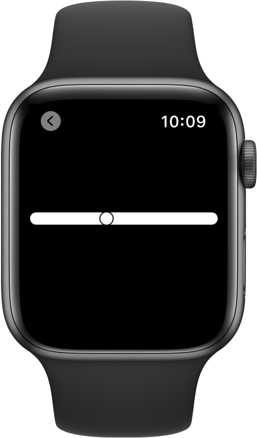

> Navigation: [Technologies](../../technologies.md) · [SwiftUI](../../swiftui.md) · [Gauge](../gauge.md)

# init(value:in:label:)

<sub>Initializer</sub>

Creates a gauge showing a value within a range and describes the gauge’s purpose and current value.

<sub>iOS, iPadOS, Mac Catalyst, macOS, visionOS, watchOS</sub>

```swift
nonisolated init<V>(value: V, in bounds: ClosedRange<V> = 0...1, @ContentBuilder label: () -> Label) where CurrentValueLabel == EmptyView, BoundsLabel == EmptyView, MarkedValueLabels == EmptyView, V : BinaryFloatingPoint
```

## Parameters

- `value` — The value to show in the gauge.

- `bounds` — The range of the valid values. Defaults to `0...1`.

- `label` — A view that describes the purpose of the gauge.

## Discussion

Use this modifier to create a gauge that shows the value at its relative position along the gauge and a label describing the gauge’s purpose. In the example below, the gauge has a range of `0...1`, the indicator is set to `0.4`, or 40 percent of the distance along the gauge:

```swift
struct SimpleGauge: View {
    @State private var batteryLevel = 0.4

    var body: some View {
        Gauge(value: batteryLevel) {
            Text("Battery Level")
        }
    }
}
```



## See Also

### Creating a gauge

- [init(value:in:label:currentValueLabel:)](<init(value_in_label_currentvaluelabel_).md>) — Creates a gauge showing a value within a range and that describes the gauge’s purpose and current value.
- [init(value:in:label:currentValueLabel:markedValueLabels:)](<init(value_in_label_currentvaluelabel_markedvaluelabels_).md>) — Creates a gauge representing a value within a range.
- [init(value:in:label:currentValueLabel:minimumValueLabel:maximumValueLabel:)](<init(value_in_label_currentvaluelabel_minimumvaluelabel_maximumvaluelabel_).md>) — Creates a gauge showing a value within a range and describes the gauge’s current, minimum, and maximum values.
- [init(value:in:label:currentValueLabel:minimumValueLabel:maximumValueLabel:markedValueLabels:)](<init(value_in_label_currentvaluelabel_minimumvaluelabel_maximumvaluelabel_markedvaluelabels_).md>) — Creates a gauge representing a value within a range.
