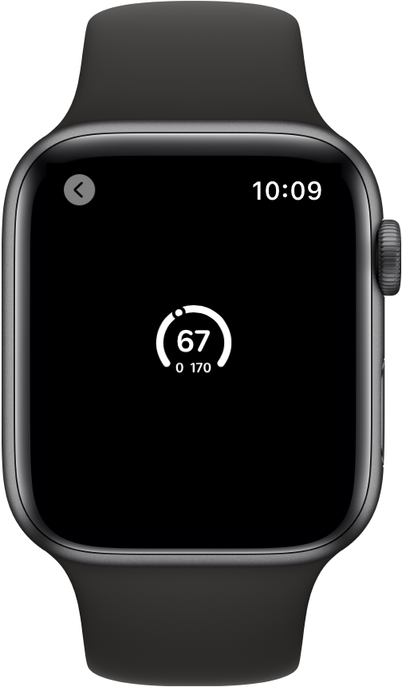

> Navigation: [Technologies](../../technologies.md) · [SwiftUI](../../swiftui.md) · [Gauge](../gauge.md)

# init(value:in:label:currentValueLabel:minimumValueLabel:maximumValueLabel:)

<sub>Initializer</sub>

Creates a gauge showing a value within a range and describes the gauge’s current, minimum, and maximum values.

<sub>iOS, iPadOS, Mac Catalyst, macOS, visionOS, watchOS</sub>

```swift
nonisolated init<V>(value: V, in bounds: ClosedRange<V> = 0...1, @ContentBuilder label: () -> Label, @ContentBuilder currentValueLabel: () -> CurrentValueLabel, @ContentBuilder minimumValueLabel: () -> BoundsLabel, @ContentBuilder maximumValueLabel: () -> BoundsLabel) where MarkedValueLabels == EmptyView, V : BinaryFloatingPoint
```

## Parameters

- `value` — The value to show on the gauge.

- `bounds` — The range of the valid values. Defaults to `0...1`.

- `label` — A view that describes the purpose of the gauge.

- `currentValueLabel` — A view that describes the current value of the gauge.

- `minimumValueLabel` — A view that describes the lower bounds of the gauge.

- `maximumValueLabel` — A view that describes the upper bounds of the gauge.

## Discussion

Use this method to create a gauge that shows a value within a prescribed bounds. The gauge has labels that describe its purpose, and for the gauge’s current, minimum, and maximum values.

```swift
struct LabeledGauge: View {
    @State private var current = 67.0
    @State private var minValue = 0.0
    @State private var maxValue = 170.0

    var body: some View {
        Gauge(value: current, in: minValue...maxValue) {
            Text("BPM")
        } currentValueLabel: {
            Text("\(Int(current))")
        } minimumValueLabel: {
            Text("\(Int(minValue))")
        } maximumValueLabel: {
            Text("\(Int(maxValue))")
        }
    }
}
```



## See Also

### Creating a gauge

- [init(value:in:label:)](<init(value_in_label_).md>) — Creates a gauge showing a value within a range and describes the gauge’s purpose and current value.
- [init(value:in:label:currentValueLabel:)](<init(value_in_label_currentvaluelabel_).md>) — Creates a gauge showing a value within a range and that describes the gauge’s purpose and current value.
- [init(value:in:label:currentValueLabel:markedValueLabels:)](<init(value_in_label_currentvaluelabel_markedvaluelabels_).md>) — Creates a gauge representing a value within a range.
- [init(value:in:label:currentValueLabel:minimumValueLabel:maximumValueLabel:markedValueLabels:)](<init(value_in_label_currentvaluelabel_minimumvaluelabel_maximumvaluelabel_markedvaluelabels_).md>) — Creates a gauge representing a value within a range.
