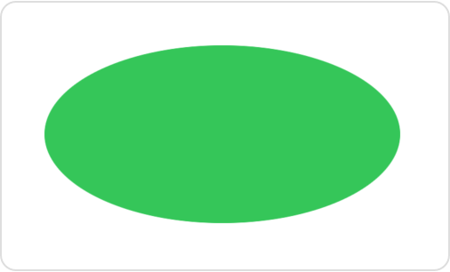
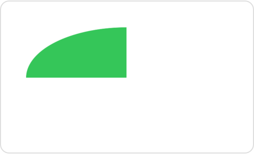
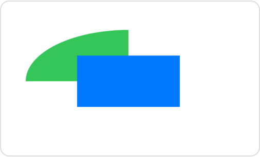

> Navigation: [Technologies](../technologies.md) · [SwiftUI](../swiftui.md)

# GraphicsContext

<sub>Structure</sub>

An immediate mode drawing destination, and its current state.

<sub>iOS, iPadOS, Mac Catalyst, macOS, tvOS, visionOS, watchOS</sub>

```swift
@frozen struct GraphicsContext
```

## Overview

Use a context to execute 2D drawing primitives. For example, you can draw filled shapes using the [fill(_:with:style:)](<graphicscontext/fill(__with_style_).md>) method inside a [Canvas](canvas.md) view:

```swift
Canvas { context, size in
    context.fill(
        Path(ellipseIn: CGRect(origin: .zero, size: size)),
        with: .color(.green))
}
.frame(width: 300, height: 200)
```

The example above draws an ellipse that just fits inside a canvas that’s constrained to 300 points wide and 200 points tall:



In addition to outlining or filling paths, you can draw images, text, and SwiftUI views. You can also use the context to perform many common graphical operations, like adding masks, applying filters and transforms, and setting a blend mode. For example you can add a mask using the [clip(to:style:options:)](<graphicscontext/clip(to_style_options_).md>) method:

```swift
let halfSize = size.applying(CGAffineTransform(scaleX: 0.5, y: 0.5))
context.clip(to: Path(CGRect(origin: .zero, size: halfSize)))
context.fill(
    Path(ellipseIn: CGRect(origin: .zero, size: size)),
    with: .color(.green))
```

The rectangular mask hides all but one quadrant of the ellipse:



The order of operations matters. Changes that you make to the state of the context, like adding a mask or a filter, apply to later drawing operations. If you reverse the fill and clip operations in the example above, so that the fill comes first, the mask doesn’t affect the ellipse.

Each context references a particular layer in a tree of transparency layers, and also contains a full copy of the drawing state. You can modify the state of one context without affecting the state of any other, even if they refer to the same layer. For example you can draw the masked ellipse from the previous example into a copy of the main context, and then add a rectangle into the main context:

```swift
// Create a copy of the context to draw a clipped ellipse.
var maskedContext = context
let halfSize = size.applying(CGAffineTransform(scaleX: 0.5, y: 0.5))
maskedContext.clip(to: Path(CGRect(origin: .zero, size: halfSize)))
maskedContext.fill(
    Path(ellipseIn: CGRect(origin: .zero, size: size)),
    with: .color(.green))

// Go back to the original context to draw the rectangle.
let origin = CGPoint(x: size.width / 4, y: size.height / 4)
context.fill(
    Path(CGRect(origin: origin, size: halfSize)),
    with: .color(.blue))
```

The mask doesn’t clip the rectangle because the mask isn’t part of the main context. However, both contexts draw into the same view because you created one context as a copy of the other:



The context has access to an [EnvironmentValues](environmentvalues.md) instance called [environment](graphicscontext/environment.md) that’s initially copied from the environment of its enclosing view. SwiftUI uses environment values — like the display resolution and color scheme — to resolve types like [Image](image.md) and [Color](color.md) that appear in the context. You can also access values stored in the environment for your own purposes.

## Topics

### Drawing a path

- [stroke(_:with:lineWidth:)](<graphicscontext/stroke(__with_linewidth_).md>) — Draws a path into the context with a specified line width.
- [stroke(_:with:style:)](<graphicscontext/stroke(__with_style_).md>) — Draws a path into the context with a specified stroke style.
- [fill(_:with:style:)](<graphicscontext/fill(__with_style_).md>) — Draws a path into the context and fills the outlined region.
- [Shading](graphicscontext/shading.md) — A color or pattern that you can use to outline or fill a path.
- [GradientOptions](graphicscontext/gradientoptions.md) — Options that affect the rendering of color gradients.

### Drawing images, text, and views

- [draw(_:in:)](<graphicscontext/draw(__in_).md>) — Draws a resolved symbol into the context, using the specified rectangle as a layout frame.
- [draw(_:in:style:)](<graphicscontext/draw(__in_style_).md>) — Draws a resolved image into the context, using the specified rectangle as a layout frame.
- [draw(_:at:anchor:)](<graphicscontext/draw(__at_anchor_).md>) — Draws a resolved image into the context, aligning an anchor within the image to a point in the context.

### Drawing into a new layer

- [drawLayer(content:)](<graphicscontext/drawlayer(content_).md>) — Draws a new layer, created by drawing code that you provide, into the context.

### Resolving a drawn entity

- [resolve(_:)](<graphicscontext/resolve(__).md>) — Gets a version of an image that’s fixed with the current values of the graphics context’s environment.
- [resolveSymbol(id:)](<graphicscontext/resolvesymbol(id_).md>) — Gets the identified child view as a resolved symbol, if the view exists.
- [ResolvedSymbol](graphicscontext/resolvedsymbol.md) — A static sequence of drawing operations that may be drawn multiple times, preserving their resolution independence.
- [ResolvedImage](graphicscontext/resolvedimage.md) — An image resolved to a particular environment.
- [ResolvedText](graphicscontext/resolvedtext.md) — A text view resolved to a particular environment.

### Masking

- [clip(to:style:options:)](<graphicscontext/clip(to_style_options_).md>) — Adds a path to the context’s array of clip shapes.
- [clipToLayer(opacity:options:content:)](<graphicscontext/cliptolayer(opacity_options_content_).md>) — Adds a clip shape that you define in a new layer to the context’s array of clip shapes.
- [clipBoundingRect](graphicscontext/clipboundingrect.md) — The bounding rectangle of the intersection of all current clip shapes in the current user space.
- [ClipOptions](graphicscontext/clipoptions.md) — Options that affect the use of clip shapes.

### Setting opacity and the blend mode

- [opacity](graphicscontext/opacity.md) — The opacity of drawing operations in the context.
- [blendMode](graphicscontext/blendmode-swift.property.md) — The blend mode used by drawing operations in the context.
- [BlendMode](graphicscontext/blendmode-swift.struct.md) — The ways that a graphics context combines new content with background content.

### Filtering

- [addFilter(_:options:)](<graphicscontext/addfilter(__options_).md>) — Adds a filter that applies to subsequent drawing operations.
- [Filter](graphicscontext/filter.md) — A type that applies image processing operations to rendered content.
- [FilterOptions](graphicscontext/filteroptions.md) — Options that configure a filter that you add to a graphics context.
- [BlurOptions](graphicscontext/bluroptions.md) — Options that configure the graphics context filter that creates blur.
- [ShadowOptions](graphicscontext/shadowoptions.md) — Options that configure the graphics context filter that creates shadows.

### Applying transforms

- [scaleBy(x:y:)](<graphicscontext/scaleby(x_y_).md>) — Scales subsequent drawing operations by an amount in each dimension.
- [rotate(by:)](<graphicscontext/rotate(by_).md>) — Rotates subsequent drawing operations by an angle.
- [translateBy(x:y:)](<graphicscontext/translateby(x_y_).md>) — Moves subsequent drawing operations by an amount in each dimension.
- [concatenate(_:)](<graphicscontext/concatenate(__).md>) — Appends the given transform to the context’s existing transform.
- [transform](graphicscontext/transform.md) — The current transform matrix, defining user space coordinates.

### Drawing with a core graphics context

- [withCGContext(content:)](<graphicscontext/withcgcontext(content_).md>) — Provides a Core Graphics context that you can use as a proxy to draw into this context.

### Accessing the environment

- [environment](graphicscontext/environment.md) — The environment associated with the graphics context.

### Instance Methods

- [draw(_:options:)](<graphicscontext/draw(__options_).md>) — Draws `line` into the graphics context.

## See Also

### Immediate mode drawing

- [Add rich graphics to your SwiftUI app](add-rich-graphics-to-your-swiftui-app.md) — Make your apps stand out by adding background materials, vibrancy, custom graphics, and animations.
- [Canvas](canvas.md) — A view type that supports immediate mode drawing.
