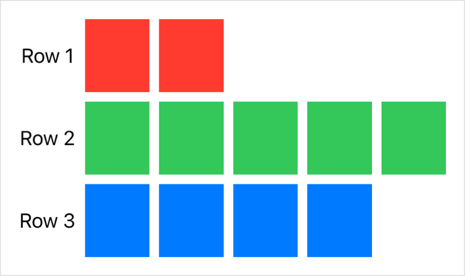
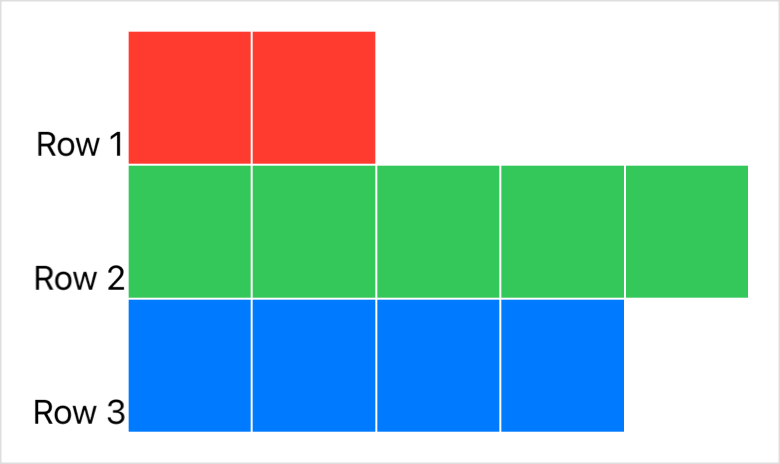

> Navigation: [Technologies](../technologies.md) · [SwiftUI](../swiftui.md)

# Grid

<sub>Structure</sub>

A container view that arranges other views in a two dimensional layout.

<sub>iOS, iPadOS, Mac Catalyst, macOS, tvOS, visionOS, watchOS</sub>

```swift
@frozen nonisolated struct Grid<Content> where Content : View
```

## Overview

Create a two dimensional layout by initializing a `Grid` with a collection of [GridRow](gridrow.md) structures. The first view in each grid row appears in the grid’s first column, the second view in the second column, and so on. The following example creates a grid with two rows and two columns:

```swift
Grid {
    GridRow {
        Text("Hello")
        Image(systemName: "globe")
    }
    GridRow {
        Image(systemName: "hand.wave")
        Text("World")
    }
}
```

A grid and its rows behave something like a collection of [HStack](hstack.md) instances wrapped in a [VStack](vstack.md). However, the grid handles row and column creation as a single operation, which applies alignment and spacing to cells, rather than first to rows and then to a column of unrelated rows. The grid produced by the example above demonstrates this:


> [!note] Note
> If you need a grid that conforms to the [Layout](layout.md) protocol, like when you want to create a conditional layout using [AnyLayout](anylayout.md), use [GridLayout](gridlayout.md) instead.

### Multicolumn cells

If you provide a view rather than a [GridRow](gridrow.md) as an element in the grid’s content, the grid uses the view to create a row that spans all of the grid’s columns. For example, you can add a [Divider](divider.md) between the rows of the previous example:

```swift
Grid {
    GridRow {
        Text("Hello")
        Image(systemName: "globe")
    }
    Divider()
    GridRow {
        Image(systemName: "hand.wave")
        Text("World")
    }
}
```

Because a divider takes as much horizontal space as its parent offers, the entire grid widens to fill the width offered by its parent view.


To prevent a flexible view from taking more space on a given axis than the other cells in a row or column require, add the [gridCellUnsizedAxes(_:)](<view/gridcellunsizedaxes(__).md>) view modifier to the view:

```swift
Divider()
    .gridCellUnsizedAxes(.horizontal)
```

This restores the grid to the width that the text and images require:


To make a cell span a specific number of columns rather than the whole grid, use the [gridCellColumns(_:)](<view/gridcellcolumns(__).md>) modifier on a view that’s contained inside a [GridRow](gridrow.md).

### Column count

The grid’s column count grows to handle the row with the largest number of columns. If you create rows with different numbers of columns, the grid adds empty cells to the trailing edge of rows that have fewer columns. The example below creates three rows with different column counts:

```swift
Grid {
    GridRow {
        Text("Row 1")
        ForEach(0..<2) { _ in Color.red }
    }
    GridRow {
        Text("Row 2")
        ForEach(0..<5) { _ in Color.green }
    }
    GridRow {
        Text("Row 3")
        ForEach(0..<4) { _ in Color.blue }
    }
}
```

The resulting grid has as many columns as the widest row, adding empty cells to rows that don’t specify enough views:



The grid sets the width of all the cells in a column to match the needs of column’s widest cell. In the example above, the width of the first column depends on the width of the widest [Text](text.md) view that the column contains. The other columns, which contain flexible [Color](color.md) views, share the remaining horizontal space offered by the grid’s parent view equally.

Similarly, the tallest cell in a row sets the height of the entire row. The cells in the first column of the grid above need only the height required for each string, but the [Color](color.md) cells expand to equally share the total height available to the grid. As a result, the color cells determine the row heights.

### Cell spacing and alignment

You can control the spacing between cells in both the horizontal and vertical dimensions and set a default alignment for the content in all the grid cells when you initialize the grid using the [init(alignment:horizontalSpacing:verticalSpacing:content:)](<grid/init(alignment_horizontalspacing_verticalspacing_content_).md>) initializer. Consider a modified version of the previous example:

```swift
Grid(alignment: .bottom, horizontalSpacing: 1, verticalSpacing: 1) {
    // ...
}
```

This configuration causes all of the cells to use [bottom](alignment/bottom.md) alignment — which only affects the text cells because the colors fill their cells completely — and it reduces the spacing between cells:



You can override the alignment of specific cells or groups of cells. For example, you can change the horizontal alignment of the cells in a column by adding the [gridColumnAlignment(_:)](<view/gridcolumnalignment(__).md>) modifier, or the vertical alignment of the cells in a row by configuring the row’s [init(alignment:content:)](<gridrow/init(alignment_content_).md>) initializer. You can also align a single cell with the [gridCellAnchor(_:)](<view/gridcellanchor(__).md>) modifier.

### Performance considerations

A grid can size its rows and columns correctly because it renders all of its child views immediately. If your app exhibits poor performance when it first displays a large grid that appears inside a [ScrollView](scrollview.md), consider switching to a [LazyVGrid](lazyvgrid.md) or [LazyHGrid](lazyhgrid.md) instead.

Lazy grids render their cells when SwiftUI needs to display them, rather than all at once. This reduces the initial cost of displaying a large scrollable grid that’s never fully visible, but also reduces the grid’s ability to optimally lay out cells. Switch to a lazy grid only if profiling your code shows a worthwhile performance improvement.

## Relationships

- **Conforms To**: [Copyable](../swift/copyable.md), [Escapable](../swift/escapable.md), [View](view.md)

## Topics

### Creating a grid

- [init(alignment:horizontalSpacing:verticalSpacing:content:)](<grid/init(alignment_horizontalspacing_verticalspacing_content_).md>) — Creates a grid with the specified spacing, alignment, and child views.

## See Also

### Statically arranging views in two dimensions

- [GridRow](gridrow.md) — A horizontal row in a two dimensional grid container.
- [gridCellColumns(_:)](<view/gridcellcolumns(__).md>) — Tells a view that acts as a cell in a grid to span the specified number of columns.
- [gridCellAnchor(_:)](<view/gridcellanchor(__).md>) — Specifies a custom alignment anchor for a view that acts as a grid cell.
- [gridCellUnsizedAxes(_:)](<view/gridcellunsizedaxes(__).md>) — Asks grid layouts not to offer the view extra size in the specified axes.
- [gridColumnAlignment(_:)](<view/gridcolumnalignment(__).md>) — Overrides the default horizontal alignment of the grid column that the view appears in.
