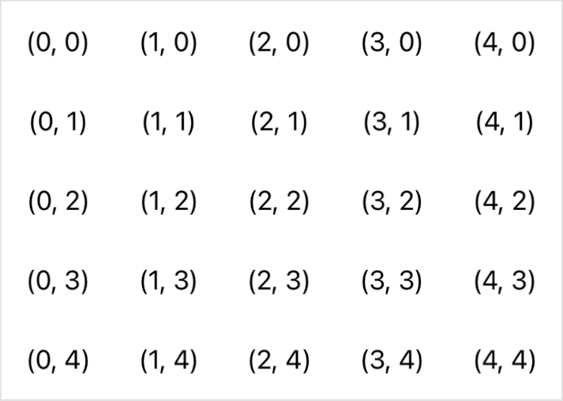

> Navigation: [Technologies](../../technologies.md) · [SwiftUI](../../swiftui.md) · [Grid](../grid.md)

# init(alignment:horizontalSpacing:verticalSpacing:content:)

<sub>Initializer</sub>

Creates a grid with the specified spacing, alignment, and child views.

<sub>iOS, iPadOS, Mac Catalyst, macOS, tvOS, visionOS, watchOS</sub>

```swift
nonisolated init(alignment: Alignment = .center, horizontalSpacing: CGFloat? = nil, verticalSpacing: CGFloat? = nil, @ContentBuilder content: () -> Content)
```

## Parameters

- `alignment` — The guide for aligning the child views within the space allocated for a given cell. The default is [center](../alignment/center.md).

- `horizontalSpacing` — The horizontal distance between each cell, given in points. The value is `nil` by default, which results in a default distance between cells that’s appropriate for the platform.

- `verticalSpacing` — The vertical distance between each cell, given in points. The value is `nil` by default, which results in a default distance between cells that’s appropriate for the platform.

- `content` — A closure that creates the grid’s rows.

## Discussion

Use this initializer to create a [Grid](../grid.md). Provide a content closure that defines the rows of the grid, and optionally customize the spacing between cells and the alignment of content within each cell. The following example customizes the spacing between cells:

```swift
Grid(horizontalSpacing: 30, verticalSpacing: 30) {
    ForEach(0..<5) { row in
        GridRow {
            ForEach(0..<5) { column in
                Text("(\(column), \(row))")
            }
        }
    }
}
```

You can list rows and the cells within rows directly, or you can use a [ForEach](../foreach.md) structure to generate either, as the example above does:



By default, the grid’s alignment value applies to all of the cells in the grid. However, you can also change the alignment for particular cells or groups of cells:

- Override the vertical alignment for the cells in a row by specifying a [VerticalAlignment](../verticalalignment.md) parameter to the corresponding row’s [init(alignment:content:)](<../gridrow/init(alignment_content_).md>) initializer.
- Override the horizontal alignment for the cells in a column by adding a [gridColumnAlignment(_:)](<../view/gridcolumnalignment(__).md>) view modifier to exactly one of the cells in the column, and specifying a [HorizontalAlignment](../horizontalalignment.md) parameter.
- Specify a custom alignment anchor for a particular cell by using the [gridCellAnchor(_:)](<../view/gridcellanchor(__).md>) modifier on the cell’s view.
