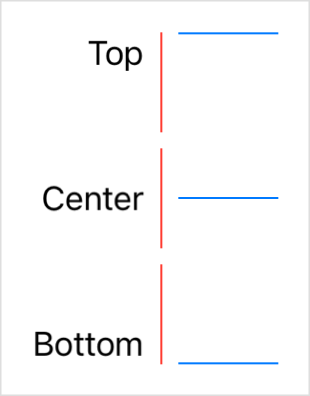

> Navigation: [Technologies](../../technologies.md) · [SwiftUI](../../swiftui.md) · [GridRow](../gridrow.md)

# init(alignment:content:)

<sub>Initializer</sub>

Creates a horizontal row of child views in a grid.

<sub>iOS, iPadOS, Mac Catalyst, macOS, tvOS, visionOS, watchOS</sub>

```swift
nonisolated init(alignment: VerticalAlignment? = nil, @ContentBuilder content: () -> Content)
```

## Parameters

- `alignment` — An optional [VerticalAlignment](../verticalalignment.md) for the row. If you don’t specify a value, the row uses the vertical alignment component of the [Alignment](../alignment.md) parameter that you specify in the grid’s [init(alignment:horizontalSpacing:verticalSpacing:content:)](<../grid/init(alignment_horizontalspacing_verticalspacing_content_).md>) initializer, which is [center](../verticalalignment/center.md) by default.

- `content` — The builder closure that contains the child views. Each view in the closure implicitly maps to a cell in the grid.

## Discussion

Use this initializer to create a [GridRow](../gridrow.md) inside of a [Grid](../grid.md). Provide a content closure that defines the cells of the row, and optionally customize the vertical alignment of content within each cell. The following example customizes the vertical alignment of the cells in the first and third rows:

```swift
Grid(alignment: .trailing) {
    GridRow(alignment: .top) { // Use top vertical alignment.
        Text("Top")
        Color.red.frame(width: 1, height: 50)
        Color.blue.frame(width: 50, height: 1)
    }
    GridRow { // Use the default (center) alignment.
        Text("Center")
        Color.red.frame(width: 1, height: 50)
        Color.blue.frame(width: 50, height: 1)
    }
    GridRow(alignment: .bottom) { // Use bottom vertical alignment.
        Text("Bottom")
        Color.red.frame(width: 1, height: 50)
        Color.blue.frame(width: 50, height: 1)
    }
}
```

The example above specifies [trailing](../alignment/trailing.md) alignment for the grid, which is composed of [center](../verticalalignment/center.md) vertical alignment and [trailing](../horizontalalignment/trailing.md) horizontal alignment. The middle row relies on the center vertical alignment, but the other two rows specify custom vertical alignments:



> [!important] Important
> A grid row behaves like a [Group](../group.md) if you create it outside of a grid.

To override column alignment, use [gridColumnAlignment(_:)](<../view/gridcolumnalignment(__).md>). To override alignment for a single cell, use [gridCellAnchor(_:)](<../view/gridcellanchor(__).md>).
