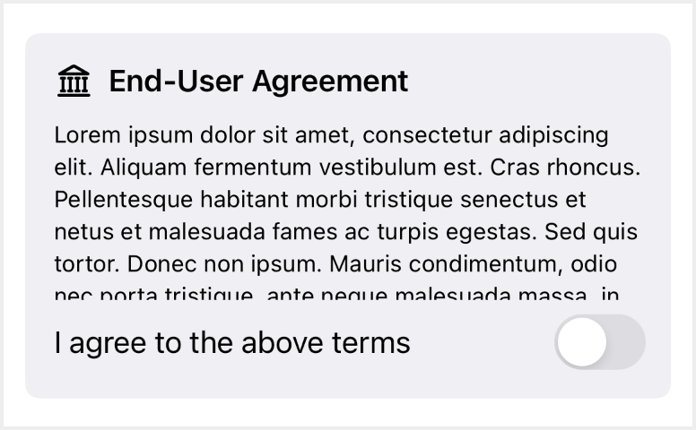

> Navigation: [Technologies](../technologies.md) · [SwiftUI](../swiftui.md)

# GroupBox

<sub>Structure</sub>

A stylized view, with an optional label, that visually collects a logical grouping of content.

<sub>iOS, iPadOS, Mac Catalyst, macOS, visionOS</sub>

```swift
nonisolated struct GroupBox<Label, Content> where Label : View, Content : View
```

## Overview

Use a group box when you want to visually distinguish a portion of your user interface with an optional title for the boxed content.

The following example sets up a `GroupBox` with the label “End-User Agreement”, and a long `agreementText` string in a [Text](text.md) view wrapped by a [ScrollView](scrollview.md). The box also contains a [Toggle](toggle.md) for the user to interact with after reading the text.

```swift
var body: some View {
    GroupBox(label:
        Label("End-User Agreement", systemImage: "building.columns")
    ) {
        ScrollView(.vertical, showsIndicators: true) {
            Text(agreementText)
                .font(.footnote)
        }
        .frame(height: 100)
        Toggle(isOn: $userAgreed) {
            Text("I agree to the above terms")
        }
    }
}
```



## Relationships

- **Conforms To**: [View](view.md)

## Topics

### Creating a group box

- [init(content:)](<groupbox/init(content_).md>) — Creates an unlabeled group box with the provided view content.
- [init(content:label:)](<groupbox/init(content_label_).md>) — Creates a group box with the provided label and view content.
- [init(_:content:)](<groupbox/init(__content_).md>) — Creates a group box with the provided view content and title.

### Creating a group box from a configuration

- [init(_:)](<groupbox/init(__).md>) — Creates a group box based on a style configuration.

### Deprecated initializers

- [init(label:content:)](<groupbox/init(label_content_).md>) _(deprecated)_

## See Also

### Grouping views into a box

- [groupBoxStyle(_:)](<view/groupboxstyle(__).md>) — Sets the style for group boxes within this view.
