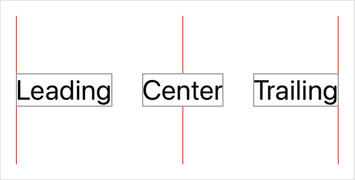
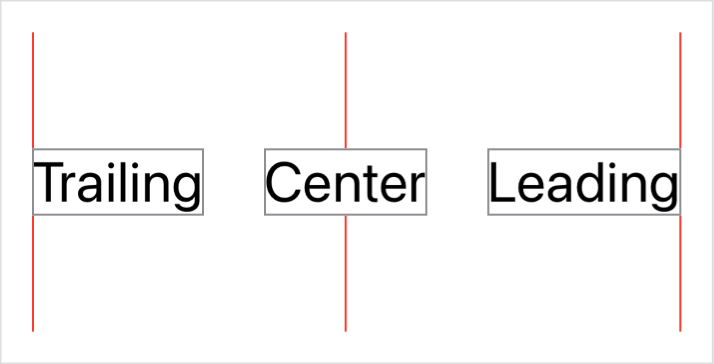
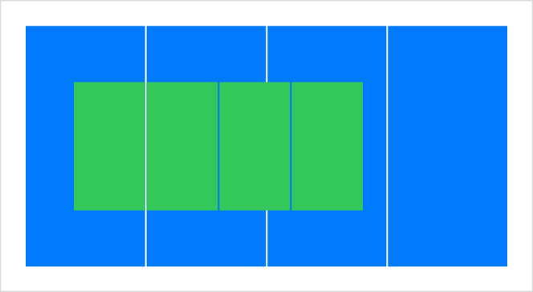

> Navigation: [Technologies](../technologies.md) · [SwiftUI](../swiftui.md)

# HorizontalAlignment

<sub>Structure</sub>

An alignment position along the horizontal axis.

<sub>iOS, iPadOS, Mac Catalyst, macOS, tvOS, visionOS, watchOS</sub>

```swift
@frozen struct HorizontalAlignment
```

## Overview

Use horizontal alignment guides to tell SwiftUI how to position views relative to one another horizontally, like when you place views vertically in an [VStack](vstack.md). The following example demonstrates common built-in horizontal alignments:



You can generate the example above by creating a series of columns implemented as vertical stacks, where you configure each stack with a different alignment guide:

```swift
private struct HorizontalAlignmentGallery: View {
    var body: some View {
        HStack(spacing: 30) {
            column(alignment: .leading, text: "Leading")
            column(alignment: .center, text: "Center")
            column(alignment: .trailing, text: "Trailing")
        }
        .frame(height: 150)
    }

    private func column(alignment: HorizontalAlignment, text: String) -> some View {
        VStack(alignment: alignment, spacing: 0) {
            Color.red.frame(width: 1)
            Text(text).font(.title).border(.gray)
            Color.red.frame(width: 1)
        }
    }
}
```

During layout, SwiftUI aligns the views inside each stack by bringing together the specified guides of the affected views. SwiftUI calculates the position of a guide for a particular view based on the characteristics of the view. For example, the [center](horizontalalignment/center.md) guide appears at half the width of the view. You can override the guide calculation for a particular view using the [alignmentGuide(_:computeValue:)](<view/alignmentguide(__computevalue_).md>) view modifier.

### Layout direction

When a user configures their device to use a left-to-right language like English, the system places the leading alignment on the left and the trailing alignment on the right, as the example from the previous section demonstrates. However, in a right-to-left language, the system reverses these. You can see this by using the [environment(_:_:)](<view/environment(____).md>) view modifier to explicitly override the [layoutDirection](environmentvalues/layoutdirection.md) environment value for the view defined above:

```swift
HorizontalAlignmentGallery()
    .environment(\.layoutDirection, .rightToLeft)
```



This automatic layout adjustment makes it easier to localize your app, but it’s still important to test your app for the different locales that you ship into. For more information about the localization process, see [Localization](../xcode/localization.md).

### Custom alignment guides

You can create a custom horizontal alignment by creating a type that conforms to the [AlignmentID](alignmentid.md) protocol, and then using that type to initialize a new static property on `HorizontalAlignment`:

```swift
private struct OneQuarterAlignment: AlignmentID {
    static func defaultValue(in context: ViewDimensions) -> CGFloat {
        context.width / 4
    }
}

extension HorizontalAlignment {
    static let oneQuarter = HorizontalAlignment(OneQuarterAlignment.self)
}
```

You implement the [defaultValue(in:)](<alignmentid/defaultvalue(in_).md>) method to calculate a default value for the custom alignment guide. The method receives a [ViewDimensions](viewdimensions.md) instance that you can use to calculate an appropriate value based on characteristics of the view. The example above places the guide at one quarter of the width of the view, as measured from the view’s origin.

You can then use the custom alignment guide like any built-in guide. For example, you can use it as the `alignment` parameter to a [VStack](vstack.md), or you can change it for a specific view using the [alignmentGuide(_:computeValue:)](<view/alignmentguide(__computevalue_).md>) view modifier. Custom alignment guides also automatically reverse in a right-to-left environment, just like built-in guides.

### Composite alignment

Combine a [VerticalAlignment](verticalalignment.md) with a `HorizontalAlignment` to create a composite [Alignment](alignment.md) that indicates both vertical and horizontal positioning in one value. For example, you could combine your custom `oneQuarter` horizontal alignment from the previous section with a built-in [center](verticalalignment/center.md) vertical alignment to use in a [ZStack](zstack.md):

```swift
struct LayeredVerticalStripes: View {
    var body: some View {
        ZStack(alignment: Alignment(horizontal: .oneQuarter, vertical: .center)) {
            verticalStripes(color: .blue)
                .frame(width: 300, height: 150)
            verticalStripes(color: .green)
                .frame(width: 180, height: 80)
        }
    }

    private func verticalStripes(color: Color) -> some View {
        HStack(spacing: 1) {
            ForEach(0..<4) { _ in color }
        }
    }
}
```

The example above uses widths and heights that generate two mismatched sets of four vertical stripes. The [ZStack](zstack.md) centers the two sets vertically and aligns them horizontally one quarter of the way from the leading edge of each set. In a left-to-right locale, this aligns the right edges of the left-most stripes of each set:



## Relationships

- **Conforms To**: [BitwiseCopyable](../swift/bitwisecopyable.md), [Copyable](../swift/copyable.md), [Equatable](../swift/equatable.md), [Sendable](../swift/sendable.md), [SendableMetatype](../swift/sendablemetatype.md)

## Topics

### Getting guides

- [leading](horizontalalignment/leading.md) — A guide that marks the leading edge of the view.
- [center](horizontalalignment/center.md) — A guide that marks the horizontal center of the view.
- [trailing](horizontalalignment/trailing.md) — A guide that marks the trailing edge of the view.
- [listRowSeparatorLeading](horizontalalignment/listrowseparatorleading.md) — A guide marking the leading edge of a `List` row separator.
- [listRowSeparatorTrailing](horizontalalignment/listrowseparatortrailing.md) — A guide marking the trailing edge of a `List` row separator.

### Creating a custom alignment

- [init(_:)](<horizontalalignment/init(__).md>) — Creates a custom horizontal alignment of the specified type.
- [combineExplicit(_:)](<horizontalalignment/combineexplicit(__).md>) — Merges a sequence of explicit alignment values produced by this instance.

## See Also

### Aligning views

- [Aligning views within a stack](aligning-views-within-a-stack.md) — Position views inside a stack using alignment guides.
- [Aligning views across stacks](aligning-views-across-stacks.md) — Create a custom alignment and use it to align views across multiple stacks.
- [alignmentGuide(_:computeValue:)](<view/alignmentguide(__computevalue_).md>) — Sets the view’s horizontal alignment.
- [Alignment](alignment.md) — An alignment in both axes.
- [VerticalAlignment](verticalalignment.md) — An alignment position along the vertical axis.
- [DepthAlignment](depthalignment.md) — An alignment position along the depth axis.
- [AlignmentID](alignmentid.md) — A type that you use to create custom alignment guides.
- [ViewDimensions](viewdimensions.md) — A view’s size and alignment guides in its own coordinate space.
- [ViewDimensions3D](viewdimensions3d.md) — A view’s 3D size and alignment guides in its own coordinate space.
- [SpatialContainer](spatialcontainer.md) — A layout container that aligns overlapping content in 3D space.
