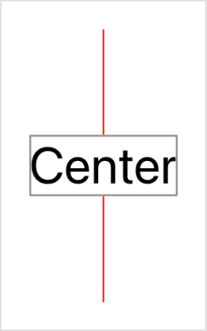

> Navigation: [Technologies](../../technologies.md) · [SwiftUI](../../swiftui.md) · [HorizontalAlignment](../horizontalalignment.md)

# center

<sub>Type Property</sub>

A guide that marks the horizontal center of the view.

<sub>iOS, iPadOS, Mac Catalyst, macOS, tvOS, visionOS, watchOS</sub>

```swift
static let center: HorizontalAlignment
```

## Discussion

Use this guide to align the centers of views:



The following code generates the image above using a [VStack](../vstack.md):

```swift
struct HorizontalAlignmentCenter: View {
    var body: some View {
        VStack(alignment: .center, spacing: 0) {
            Color.red.frame(width: 1)
            Text("Center").font(.title).border(.gray)
            Color.red.frame(width: 1)
        }
    }
}
```

## See Also

### Getting guides

- [leading](leading.md) — A guide that marks the leading edge of the view.
- [trailing](trailing.md) — A guide that marks the trailing edge of the view.
- [listRowSeparatorLeading](listrowseparatorleading.md) — A guide marking the leading edge of a `List` row separator.
- [listRowSeparatorTrailing](listrowseparatortrailing.md) — A guide marking the trailing edge of a `List` row separator.
