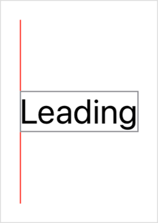

> Navigation: [Technologies](../../technologies.md) · [SwiftUI](../../swiftui.md) · [HorizontalAlignment](../horizontalalignment.md)

# leading

<sub>Type Property</sub>

A guide that marks the leading edge of the view.

<sub>iOS, iPadOS, Mac Catalyst, macOS, tvOS, visionOS, watchOS</sub>

```swift
static let leading: HorizontalAlignment
```

## Discussion

Use this guide to align the leading edges of views. For a device that uses a left-to-right language, the leading edge is on the left:



The following code generates the image above using a [VStack](../vstack.md):

```swift
struct HorizontalAlignmentLeading: View {
    var body: some View {
        VStack(alignment: .leading, spacing: 0) {
            Color.red.frame(width: 1)
            Text("Leading").font(.title).border(.gray)
            Color.red.frame(width: 1)
        }
    }
}
```

## See Also

### Getting guides

- [center](center.md) — A guide that marks the horizontal center of the view.
- [trailing](trailing.md) — A guide that marks the trailing edge of the view.
- [listRowSeparatorLeading](listrowseparatorleading.md) — A guide marking the leading edge of a `List` row separator.
- [listRowSeparatorTrailing](listrowseparatortrailing.md) — A guide marking the trailing edge of a `List` row separator.
