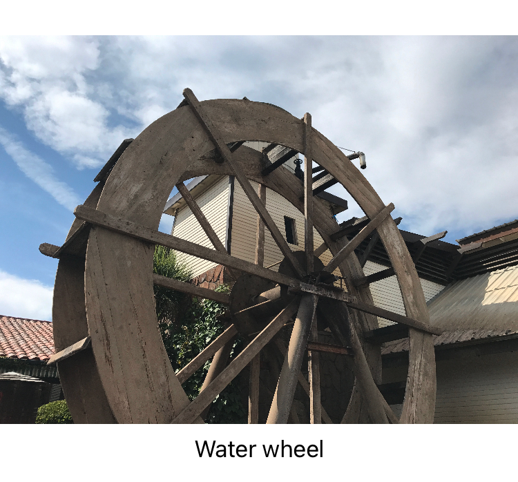

> Navigation: [Technologies](../technologies.md) · [SwiftUI](../swiftui.md)

# Image

<sub>Structure</sub>

A view that displays an image.

<sub>iOS, iPadOS, Mac Catalyst, macOS, tvOS, visionOS, watchOS</sub>

```swift
@frozen struct Image
```

## Overview

Use an `Image` instance when you want to add images to your SwiftUI app. You can create images from many sources:

- Image files in your app’s asset library or bundle. Supported types include PNG, JPEG, HEIC, and more.
- Instances of platform-specific image types, like [UIImage](../uikit/uiimage.md) and [NSImage](../appkit/nsimage.md).
- A bitmap stored in a Core Graphics [CGImage](../coregraphics/cgimage.md) instance.
- System graphics from the SF Symbols set.

The following example shows how to load an image from the app’s asset library or bundle and scale it to fit within its container:

```swift
Image("Landscape_4")
    .resizable()
    .aspectRatio(contentMode: .fit)
Text("Water wheel")
```



You can use methods on the `Image` type as well as standard view modifiers to adjust the size of the image to fit your app’s interface. Here, the `Image` type’s [resizable(capInsets:resizingMode:)](<image/resizable(capinsets_resizingmode_).md>) method scales the image to fit the current view. Then, the [aspectRatio(_:contentMode:)](<view/aspectratio(__contentmode_).md>) view modifier adjusts this resizing behavior to maintain the image’s original aspect ratio, rather than scaling the x- and y-axes independently to fill all four sides of the view. The article [Fitting images into available space](fitting-images-into-available-space.md) shows how to apply scaling, clipping, and tiling to `Image` instances of different sizes.

An `Image` is a late-binding token; the system resolves its actual value only when it’s about to use the image in an environment.

### Making images accessible

To use an image as a control, use one of the initializers that takes a `label` parameter. This allows the system’s accessibility frameworks to use the label as the name of the control for users who use features like VoiceOver. For images that are only present for aesthetic reasons, use an initializer with the `decorative` parameter; the accessibility systems ignore these images.

## Relationships

- **Conforms To**: [Copyable](../swift/copyable.md), [Equatable](../swift/equatable.md), [Escapable](../swift/escapable.md), [JournalingSuggestionAsset](../journalingsuggestions/journalingsuggestionasset.md), [Sendable](../swift/sendable.md), [SendableMetatype](../swift/sendablemetatype.md), [Transferable](../coretransferable/transferable.md), [View](view.md)

## Topics

### Creating an image

- [init(_:bundle:)](<image/init(__bundle_).md>) — Creates a labeled image that you can use as content for controls.
- [init(_:variableValue:bundle:)](<image/init(__variablevalue_bundle_).md>) — Creates a labeled image that you can use as content for controls, with a variable value.
- [init(_:)](<image/init(__).md>) — Initialize an `Image` with an image resource.

### Creating an image for use as a control

- [init(_:bundle:label:)](<image/init(__bundle_label_).md>) — Creates a labeled image that you can use as content for controls, with the specified label.
- [init(_:variableValue:bundle:label:)](<image/init(__variablevalue_bundle_label_).md>) — Creates a labeled image that you can use as content for controls, with the specified label and variable value.
- [init(_:scale:orientation:label:)](<image/init(__scale_orientation_label_).md>) — Creates a labeled image based on a Core Graphics image instance, usable as content for controls.

### Creating an image for decorative use

- [init(decorative:bundle:)](<image/init(decorative_bundle_).md>) — Creates an unlabeled, decorative image.
- [init(decorative:variableValue:bundle:)](<image/init(decorative_variablevalue_bundle_).md>) — Creates an unlabeled, decorative image, with a variable value.
- [init(decorative:scale:orientation:)](<image/init(decorative_scale_orientation_).md>) — Creates an unlabeled, decorative image based on a Core Graphics image instance.

### Creating a system symbol image

- [init(systemName:)](<image/init(systemname_).md>) — Creates a system symbol image.
- [init(systemName:variableValue:)](<image/init(systemname_variablevalue_).md>) — Creates a system symbol image with a variable value.

### Creating an image from another image

- [init(uiImage:)](<image/init(uiimage_).md>) — Creates a SwiftUI image from a UIKit image instance.
- [init(nsImage:)](<image/init(nsimage_).md>) — Creates a SwiftUI image from an AppKit image instance.

### Creating an image from drawing instructions

- [init(size:label:opaque:colorMode:renderer:)](<image/init(size_label_opaque_colormode_renderer_).md>) — Initializes an image of the given size, with contents provided by a custom rendering closure.

### Resizing images

- [resizable(capInsets:resizingMode:)](<image/resizable(capinsets_resizingmode_).md>) — Sets the mode by which SwiftUI resizes an image to fit its space.

### Specifying rendering behavior

- [antialiased(_:)](<image/antialiased(__).md>) — Specifies whether SwiftUI applies antialiasing when rendering the image.
- [symbolRenderingMode(_:)](<image/symbolrenderingmode(__).md>) — Sets the rendering mode for symbol images within this view.
- [renderingMode(_:)](<image/renderingmode(__).md>) — Indicates whether SwiftUI renders an image as-is, or by using a different mode.
- [interpolation(_:)](<image/interpolation(__).md>) — Specifies the current level of quality for rendering an image that requires interpolation.
- [TemplateRenderingMode](image/templaterenderingmode.md) — A type that indicates how SwiftUI renders images.
- [Interpolation](image/interpolation.md) — The level of quality for rendering an image that requires interpolation, such as a scaled image.

### Specifying dynamic range

- [allowedDynamicRange(_:)](<image/alloweddynamicrange(__).md>) — Returns a new image configured with the specified allowed dynamic range.
- [allowedDynamicRange](environmentvalues/alloweddynamicrange.md) — The allowed dynamic range for the view, or nil.
- [DynamicRange](image/dynamicrange.md)

### Instance Methods

- [symbolColorRenderingMode(_:)](<image/symbolcolorrenderingmode(__).md>) — Sets the color rendering mode of the image.
- [symbolVariableValueMode(_:)](<image/symbolvariablevaluemode(__).md>) — Sets the variable value mode mode for symbol images within this view.
- [widgetAccentedRenderingMode(_:)](<image/widgetaccentedrenderingmode(__).md>) — Specifies the how to render an `Image` when using the `WidgetKit/WidgetRenderingMode/accented` mode.

### Enumerations

- [Orientation](image/orientation.md) — The orientation of an image.
- [ResizingMode](image/resizingmode.md) — The modes that SwiftUI uses to resize an image to fit within its containing view.
- [Scale](image/scale.md) — A scale to apply to vector images relative to text.
