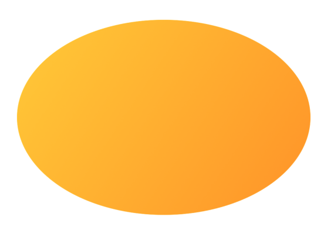

> Navigation: [Technologies](../../technologies.md) · [SwiftUI](../../swiftui.md) · [Image](../image.md)

# init(size:label:opaque:colorMode:renderer:)

<sub>Initializer</sub>

Initializes an image of the given size, with contents provided by a custom rendering closure.

<sub>iOS, iPadOS, Mac Catalyst, macOS, tvOS, visionOS, watchOS</sub>

```swift
init(size: CGSize, label: Text? = nil, opaque: Bool = false, colorMode: ColorRenderingMode = .nonLinear, renderer: @escaping (inout GraphicsContext) -> Void)
```

## Parameters

- `size` — The size of the newly-created image.

- `label` — The label associated with the image. SwiftUI uses the label for accessibility.

- `opaque` — A Boolean value that indicates whether the image is fully opaque. This may improve performance when `true`. Don’t render non-opaque pixels to an image declared as opaque. Defaults to `false`.

- `colorMode` — The working color space and storage format of the image. Defaults to [ColorRenderingMode.nonLinear](../colorrenderingmode/nonlinear.md).

- `renderer` — A closure to draw the contents of the image. The closure receives a [GraphicsContext](../graphicscontext.md) as its parameter.

## Discussion

Use this initializer to create an image by calling drawing commands on a [GraphicsContext](../graphicscontext.md) provided to the `renderer` closure.

The following example shows a custom image created by passing a `GraphicContext` to draw an ellipse and fill it with a gradient:

```swift
let mySize = CGSize(width: 300, height: 200)
let image = Image(size: mySize) { context in
    context.fill(
        Path(
            ellipseIn: CGRect(origin: .zero, size: mySize)),
            with: .linearGradient(
                Gradient(colors: [.yellow, .orange]),
                startPoint: .zero,
                endPoint: CGPoint(x: mySize.width, y:mySize.height))
    )
}
```


