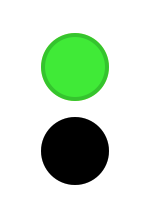

> Navigation: [Technologies](../../technologies.md) · [SwiftUI](../../swiftui.md) · [Image](../image.md)

# renderingMode(_:)

<sub>Instance Method</sub>

Indicates whether SwiftUI renders an image as-is, or by using a different mode.

<sub>iOS, iPadOS, Mac Catalyst, macOS, tvOS, visionOS, watchOS</sub>

```swift
func renderingMode(_ renderingMode: Image.TemplateRenderingMode?) -> Image
```

## Parameters

- `renderingMode` — The mode SwiftUI uses to render images.

## Return Value

A modified [Image](../image.md).

## Discussion

The [TemplateRenderingMode](templaterenderingmode.md) enumeration has two cases: [Image.TemplateRenderingMode.original](templaterenderingmode/original.md) and [Image.TemplateRenderingMode.template](templaterenderingmode/template.md). The original mode renders pixels as they appear in the original source image. Template mode renders all nontransparent pixels as the foreground color, which you can use for purposes like creating image masks.

The following example shows both rendering modes, as applied to an icon image of a green circle with darker green border:

```swift
Image("dot_green")
    .renderingMode(.original)
Image("dot_green")
    .renderingMode(.template)
```



You also use `renderingMode` to produce multicolored system graphics from the SF Symbols set. Use the [Image.TemplateRenderingMode.original](templaterenderingmode/original.md) mode to apply a foreground color to all parts of the symbol except those that have a distinct color in the graphic. The following example shows three uses of the `person.crop.circle.badge.plus` symbol to achieve different effects:

- A default appearance with no foreground color or template rendering mode specified. The symbol appears all black in light mode, and all white in Dark Mode.
- The multicolor behavior achieved by using `original` template rendering mode, along with a blue foreground color. This mode causes the graphic to override the foreground color for distinctive parts of the image, in this case the plus icon.
- A single-color template behavior achieved by using `template` rendering mode with a blue foreground color. This mode applies the foreground color to the entire image, regardless of the user’s Appearance preferences.

```swift
HStack {
   Image(systemName: "person.crop.circle.badge.plus")
   Image(systemName: "person.crop.circle.badge.plus")
       .renderingMode(.original)
       .foregroundColor(.blue)
   Image(systemName: "person.crop.circle.badge.plus")
       .renderingMode(.template)
       .foregroundColor(.blue)
}
.font(.largeTitle)
```


Use the SF Symbols app to find system images that offer the multicolor feature. Keep in mind that some multicolor symbols use both the foreground and accent colors.

## See Also

### Specifying rendering behavior

- [antialiased(_:)](<antialiased(__).md>) — Specifies whether SwiftUI applies antialiasing when rendering the image.
- [symbolRenderingMode(_:)](<symbolrenderingmode(__).md>) — Sets the rendering mode for symbol images within this view.
- [interpolation(_:)](<interpolation(__).md>) — Specifies the current level of quality for rendering an image that requires interpolation.
- [TemplateRenderingMode](templaterenderingmode.md) — A type that indicates how SwiftUI renders images.
- [Interpolation](interpolation.md) — The level of quality for rendering an image that requires interpolation, such as a scaled image.
