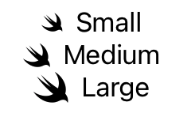

> Navigation: [Technologies](../../technologies.md) · [SwiftUI](../../swiftui.md) · [Image](../image.md)

# Image.Scale

<sub>Enumeration</sub>

A scale to apply to vector images relative to text.

<sub>iOS, iPadOS, Mac Catalyst, macOS, tvOS, visionOS, watchOS</sub>

```swift
enum Scale
```

## Overview

Use this type with the [imageScale(_:)](<../view/imagescale(__).md>) modifier, or the [imageScale](../environmentvalues/imagescale.md) environment key, to set the image scale.

The following example shows the three `Scale` values as applied to a system symbol image, each set against a text view:

```swift
HStack { Image(systemName: "swift").imageScale(.small); Text("Small") }
HStack { Image(systemName: "swift").imageScale(.medium); Text("Medium") }
HStack { Image(systemName: "swift").imageScale(.large); Text("Large") }
```



## Relationships

- **Conforms To**: [Equatable](../../swift/equatable.md), [Hashable](../../swift/hashable.md), [Sendable](../../swift/sendable.md), [SendableMetatype](../../swift/sendablemetatype.md)

## Topics

### Getting image scales

- [Image.Scale.small](scale/small.md) — A scale that produces small images.
- [Image.Scale.medium](scale/medium.md) — A scale that produces medium-sized images.
- [Image.Scale.large](scale/large.md) — A scale that produces large images.

## See Also

### Configuring an image

- [Fitting images into available space](../fitting-images-into-available-space.md) — Adjust the size and shape of images in your app’s user interface by applying view modifiers.
- [imageScale(_:)](<../view/imagescale(__).md>) — Scales images within the view according to one of the relative sizes available including small, medium, and large images sizes.
- [imageScale](../environmentvalues/imagescale.md) — The image scale for this environment.
- [Orientation](orientation.md) — The orientation of an image.
- [ResizingMode](resizingmode.md) — The modes that SwiftUI uses to resize an image to fit within its containing view.
