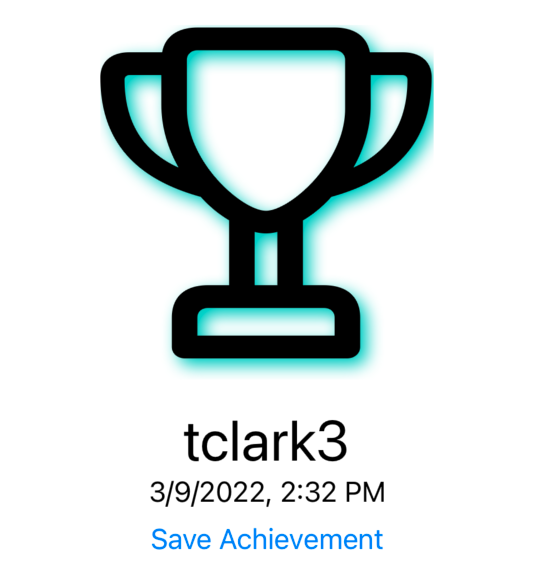

> Navigation: [Technologies](../technologies.md) · [SwiftUI](../swiftui.md)

# ImageRenderer

<sub>Class</sub>

An object that creates images from SwiftUI views.

<sub>iOS, iPadOS, Mac Catalyst, macOS, tvOS, visionOS, watchOS</sub>

```swift
final class ImageRenderer<Content> where Content : View
```

## Overview

Use `ImageRenderer` to export bitmap image data from a SwiftUI view. You initialize the renderer with a view, then render images on demand, either by calling the [render(rasterizationScale:renderer:)](<imagerenderer/render(rasterizationscale_renderer_).md>) method, or by using the renderer’s properties to create a [CGImage](../coregraphics/cgimage.md), [NSImage](../appkit/nsimage.md), or [UIImage](../uikit/uiimage.md).

By drawing to a [Canvas](canvas.md) and exporting with an `ImageRenderer`, you can generate images from any progammatically-rendered content, like paths, shapes, gradients, and more. You can also render standard SwiftUI views like [Text](text.md) views, or containers of multiple view types.

The following example uses a private `createAwardView(forUser:date:)` method to create a game app’s view of a trophy symbol with a user name and date. This view combines a [Canvas](canvas.md) that applies a shadow filter with two [Text](text.md) views into a [VStack](vstack.md). A [Button](button.md) allows the person to save this view. The button’s action uses an `ImageRenderer` to rasterize a `CGImage` and then calls a private `uploadAchievementImage(_:)` method to encode and upload the image.

```swift
var body: some View {
    let trophyAndDate = createAwardView(forUser: playerName,
                                         date: achievementDate)
    VStack {
        trophyAndDate
        Button("Save Achievement") {
            let renderer = ImageRenderer(content: trophyAndDate)
            if let image = renderer.cgImage {
                uploadAchievementImage(image)
            }
        }
    }
}

private func createAwardView(forUser: String, date: Date) -> some View {
    VStack {
        Image(systemName: "trophy")
            .resizable()
            .frame(width: 200, height: 200)
            .frame(maxWidth: .infinity, maxHeight: .infinity)
            .shadow(color: .mint, radius: 5)
        Text(playerName)
            .font(.largeTitle)
        Text(achievementDate.formatted())
    }
    .multilineTextAlignment(.center)
    .frame(width: 200, height: 290)
}
```



Because `ImageRenderer` conforms to [ObservableObject](../combine/observableobject.md), you can use it to produce a stream of images as its properties change. Subscribe to the renderer’s [objectWillChange](imagerenderer/objectwillchange.md) publisher, then use the renderer to rasterize a new image each time the subscriber receives an update.

> [!important] Important
> `ImageRenderer` output only includes views that SwiftUI rasterizes directly using its own drawing primitives, such as text, images, shapes, and composite views of these types. It does not include views whose contents are composited by Core Animation layers, such as more complex controls and containers, web views, media players, and most types of UIKit and AppKit views. In those cases, `ImageRenderer` displays a placeholder image, similar to the behavior of [drawingGroup(opaque:colorMode:)](<view/drawinggroup(opaque_colormode_).md>). Whether a particular view is rendered using SwiftUI’s own drawing primitives or composited by Core Animation may change in future releases. However, any view that is currently supported is guaranteed to remain supported.

### Rendering to a PDF context

The [render(rasterizationScale:renderer:)](<imagerenderer/render(rasterizationscale_renderer_).md>) method renders the specified view to any [CGContext](../coregraphics/cgcontext.md). That means you aren’t limited to creating a rasterized `CGImage`. For example, you can generate PDF data by rendering to a PDF context. The resulting PDF maintains resolution-independence for supported members of the view hierarchy, such as text, symbol images, lines, shapes, and fills.

The following example uses the `createAwardView(forUser:date:)` method from the previous example, and exports its contents as an 800-by-600 point PDF to the file URL `renderURL`. It uses the `size` parameter sent to the rendering closure to center the `trophyAndDate` view vertically and horizontally on the page.

```swift
var body: some View {
    let trophyAndDate = createAwardView(forUser: playerName,
                                        date: achievementDate)
    VStack {
        trophyAndDate
        Button("Save Achievement") {
            let renderer = ImageRenderer(content: trophyAndDate)
            renderer.render { size, renderer in
                var mediaBox = CGRect(origin: .zero,
                                      size: CGSize(width: 800, height: 600))
                guard let consumer = CGDataConsumer(url: renderURL as CFURL),
                      let pdfContext =  CGContext(consumer: consumer,
                                                  mediaBox: &mediaBox, nil)
                else {
                    return
                }
                pdfContext.beginPDFPage(nil)
                pdfContext.translateBy(x: mediaBox.size.width / 2 - size.width / 2,
                                       y: mediaBox.size.height / 2 - size.height / 2)
                renderer(pdfContext)
                pdfContext.endPDFPage()
                pdfContext.closePDF()
            }
        }
    }
}
```

### Creating an image from drawing instructions

`ImageRenderer` makes it possible to create a custom image by drawing into a [Canvas](canvas.md), rendering a `CGImage` from it, and using that to initialize an [Image](image.md). To simplify this process, use the `Image` initializer [init(size:label:opaque:colorMode:renderer:)](<image/init(size_label_opaque_colormode_renderer_).md>), which takes a closure whose argument is a [GraphicsContext](graphicscontext.md) that you can directly draw into.

## Relationships

- **Conforms To**: [Copyable](../swift/copyable.md), [Escapable](../swift/escapable.md), [Observable](../observation/observable.md), [ObservableObject](../combine/observableobject.md)

## Topics

### Creating an image renderer

- [init(content:)](<imagerenderer/init(content_).md>) — Creates a renderer object with a source content view.

### Providing the source view

- [content](imagerenderer/content.md) — The root view rendered by this image renderer.

### Accessing renderer properties

- [proposedSize](imagerenderer/proposedsize.md) — The size proposed to the root view.
- [scale](imagerenderer/scale.md) — The scale at which to render the image.
- [isOpaque](imagerenderer/isopaque.md) — A Boolean value that indicates whether the alpha channel of the image is fully opaque.
- [colorMode](imagerenderer/colormode.md) — The working color space and storage format of the image.
- [allowedDynamicRange](imagerenderer/alloweddynamicrange.md) — The allowed dynamic range of the image, or nil to mark that the dynamic range of the image should be unrestricted. This property defaults to `sdr`, i.e. HDR content will be tone mapped to SDR.

### Rendering images

- [render(rasterizationScale:renderer:)](<imagerenderer/render(rasterizationscale_renderer_).md>) — Draws the renderer’s current contents to an arbitrary Core Graphics context.
- [cgImage](imagerenderer/cgimage.md) — The current contents of the view, rasterized as a Core Graphics image.
- [nsImage](imagerenderer/nsimage.md) — The current contents of the view, rasterized as an AppKit image.
- [uiImage](imagerenderer/uiimage.md) — The current contents of the view, rasterized as a UIKit image.

### Producing a stream of images

- [objectWillChange](imagerenderer/objectwillchange.md) — A publisher that informs subscribers of changes to the image.
- [isObservationEnabled](imagerenderer/isobservationenabled.md) — If observers of this observed object should be notified when the produced image changes.
