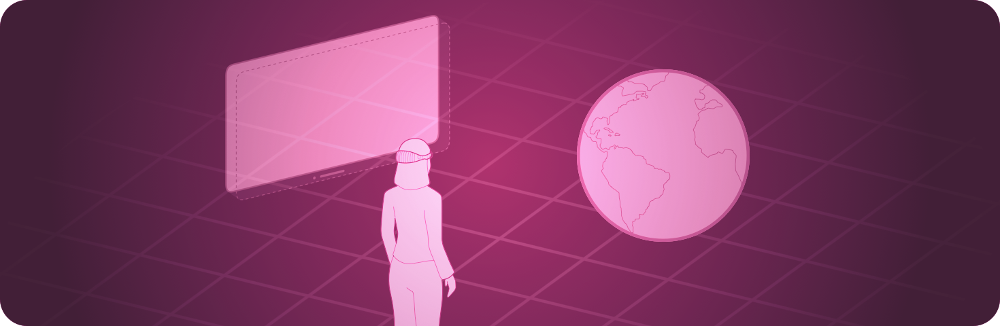

> Navigation: [Technologies](../technologies.md) · [SwiftUI](../swiftui.md)

# Immersive spaces

API Collection

Display unbounded content in a person’s surroundings.

## Overview

Use an immersive space in visionOS to present SwiftUI views outside of any containers. You can include any views in a space, although you typically use a [RealityView](../realitykit/realityview.md) to present RealityKit content.

You can request one of three styles of spaces with the [immersionStyle(selection:in:)](<scene/immersionstyle(selection_in_).md>) scene modifier:

- The [mixed](immersionstyle/mixed.md) style blends your content with passthrough. This enables you to place virtual objects in a person’s surroundings.
- The [full](immersionstyle/full.md) style displays only your content, with passthrough turned off. This enables you to completely control the visual experience, like when you want to transport people to a new world.
- The [progressive](immersionstyle/progressive.md) style completely replaces passthrough in a portion of the display. You might use this style to keep people grounded in the real world while displaying a view into another world.

When you open an immersive space, the system continues to display all of your app’s windows, but hides windows from other apps. The system supports displaying only one space at a time across all apps, so your app can only open a space if one isn’t already open.

## Topics

### Creating an immersive space

- [ImmersiveSpace](immersivespace.md) — A scene that presents its content in an unbounded space.
- [ImmersiveSpaceContentBuilder](immersivespacecontentbuilder.md) — A result builder for composing a collection of immersive space elements.
- [immersionStyle(selection:in:)](<scene/immersionstyle(selection_in_).md>) — Sets the style for an immersive space.
- [ImmersionStyle](immersionstyle.md) — The styles that an immersive space can have.
- [immersiveSpaceDisplacement](environmentvalues/immersivespacedisplacement.md) — The displacement that the system applies to the immersive space when moving the space away from its default position, in meters.
- [ImmersiveEnvironmentBehavior](immersiveenvironmentbehavior.md) — The behavior of the system-provided immersive environments when a scene is opened by your app.
- [ProgressiveImmersionAspectRatio](progressiveimmersionaspectratio.md)

### Opening an immersive space

- [openImmersiveSpace](environmentvalues/openimmersivespace.md) — An action that presents an immersive space.
- [OpenImmersiveSpaceAction](openimmersivespaceaction.md) — An action that presents an immersive space.

### Closing the immersive space

- [dismissImmersiveSpace](environmentvalues/dismissimmersivespace.md) — An immersive space dismissal action stored in a view’s environment.
- [DismissImmersiveSpaceAction](dismissimmersivespaceaction.md) — An action that dismisses an immersive space.

### Hiding upper limbs during immersion

- [upperLimbVisibility(_:)](<scene/upperlimbvisibility(__).md>) — Sets the preferred visibility of the user’s upper limbs, while an [ImmersiveSpace](immersivespace.md) scene is presented.
- [upperLimbVisibility(_:)](<view/upperlimbvisibility(__).md>) — Sets the preferred visibility of the user’s upper limbs, while an [ImmersiveSpace](immersivespace.md) scene is presented.

### Adjusting content brightness

- [immersiveContentBrightness(_:)](<scene/immersivecontentbrightness(__).md>) — Sets the content brightness of an immersive space.
- [ImmersiveContentBrightness](immersivecontentbrightness.md) — The content brightness of an immersive space.

### Responding to immersion changes

- [onImmersionChange(initial:_:)](<view/onimmersionchange(initial___).md>) — Performs an action when the immersion state of your app changes.
- [ImmersionChangeContext](immersionchangecontext.md) — A structure that represents a state of immersion of your app.

### Adding menu items to an immersive space

- [immersiveEnvironmentPicker(content:)](<view/immersiveenvironmentpicker(content_).md>) — Add menu items to open immersive spaces from a media player’s environment picker.

### Handling remote immersive spaces

- [RemoteImmersiveSpace](remoteimmersivespace.md) — A scene that presents its content in an unbounded space on a remote device.
- [RemoteDeviceIdentifier](remotedeviceidentifier.md) — An opaque type that identifies a remote device displaying scene content in a [RemoteImmersiveSpace](remoteimmersivespace.md).

## See Also

### App structure

- [App organization](app-organization.md) — Define the entry point and top-level structure of your app.
- [Scenes](scenes.md) — Declare the user interface groupings that make up the parts of your app.
- [Windows](windows.md) — Display user interface content in a window or a collection of windows.
- [Documents](documents.md) — Enable people to open and manage documents.
- [Navigation](navigation.md) — Enable people to move between different parts of your app’s view hierarchy within a scene.
- [Modal presentations](modal-presentations.md) — Present content in a separate view that offers focused interaction.
- [Toolbars](toolbars.md) — Provide immediate access to frequently used commands and controls.
- [Search](search.md) — Enable people to search for text or other content within your app.
- [App extensions](app-extensions.md) — Extend your app’s basic functionality to other parts of the system, like by adding a Widget.
