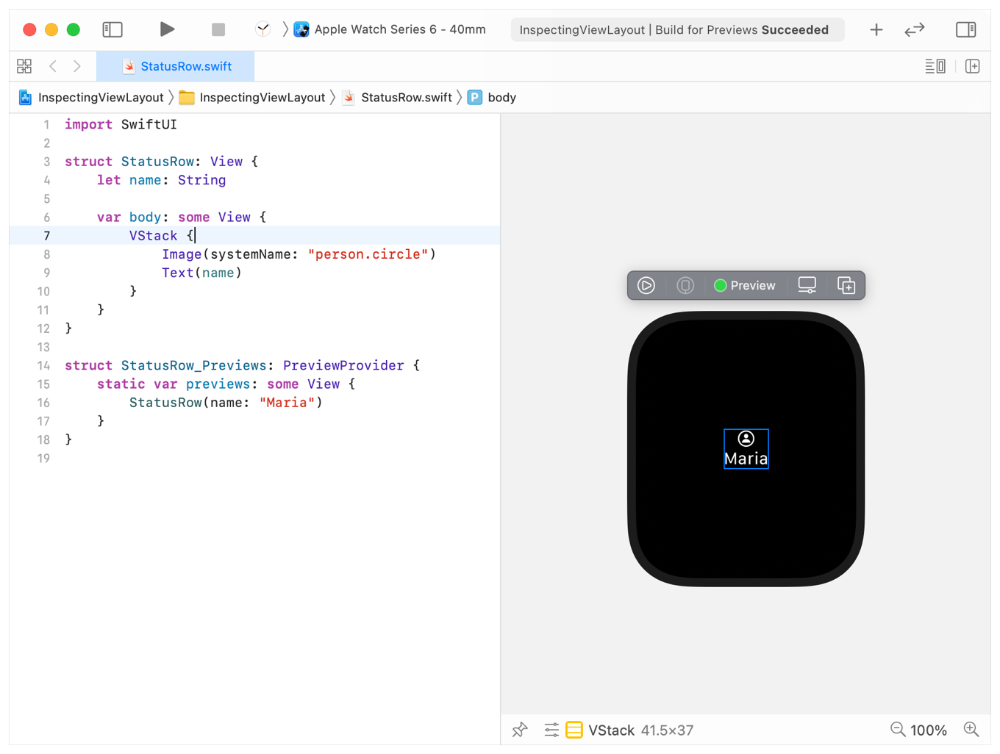
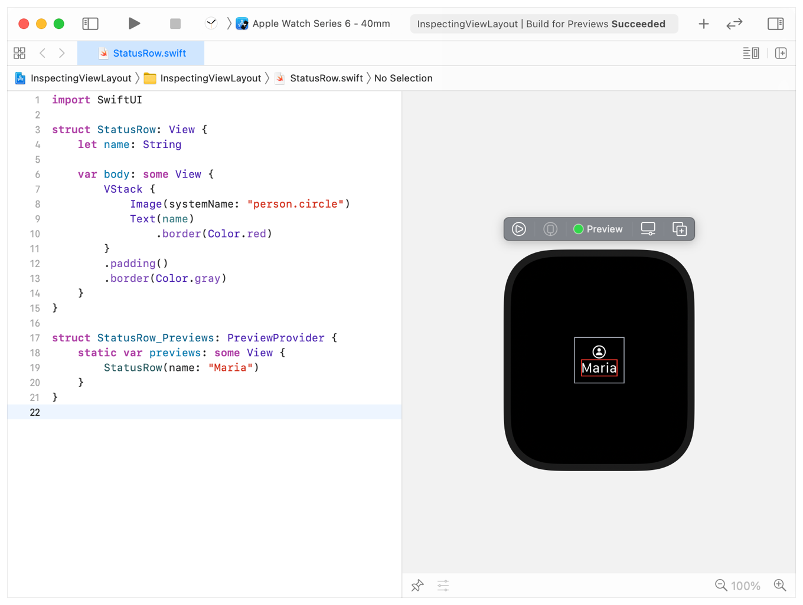

> Navigation: [Technologies](../technologies.md) · [SwiftUI](../swiftui.md) · [Layout adjustments](layout-adjustments.md)

# Inspecting view layout

<sub>Article</sub>

Determine the position and extent of a view using Xcode previews or by adding temporary borders.

## Overview

To learn how SwiftUI sizes and positions views, take advantage of Xcode previews to inspect a single view’s boundaries. You can also add temporary borders to see how SwiftUI positions and sizes multiple views together.

### Highlight views with Xcode previews

Using Xcode previews, you can quickly see the size of a specific view element by selecting the view or child view in the editor. To illustrate this, the following example uses a [VStack](vstack.md) to vertically group an image, provided by [SF Symbols](../design/human-interface-guidelines/sf-symbols.md), above a name:

```swift
struct StatusRow: View {
    let name: String

    var body: some View {
        VStack {
            Image(systemName: "person.circle")
            Text(name)
        }            
    }
}

struct StatusRow_Previews: PreviewProvider {
    static var previews: some View {
        StatusRow(name: "Maria")
    }
}
```

With the [VStack](vstack.md) selected, you’ll see a blue border around the view in the Xcode preview:



<sub>Xcode displaying a split view, with a code editor on the left and a corresponding Xcode preview showing a watchOS simulator face on the right. Within the code editor is the example code, with the editing cursor on the line with VStack, selecting it. Within the face of the watchOS simulator is a rectangle illustrating the bounds of the VStack, inside which is a person symbol inside a circle from SF Symbols above the text Maria, both centered horizontally.</sub>

### Use temporary borders to explore complex layouts

To see the border of more than one view, or to see a border when the view isn’t selected, temporarily add a border with the view modifier [border(_:width:)](<view/border(__width_).md>). Set the border’s color to something other than [blue](shapestyle/blue.md) to easily distinguish it from a border added by Xcode:

```swift
struct StatusRow: View {
    let name: String

    var body: some View {
        VStack {
            Image(systemName: "person.circle")
            Text(name)
                .border(Color.red)
        }
        .padding()
        .border(Color.gray)
    }
}
```



<sub>Xcode displaying a split view, with a code editor on the left and a corresponding Xcode preview showing a watchOS simulator face on the right. Within the code editor is the example code with multiple, different colored borders applied to views. The cursor within the editor is at the bottom of the code, with no code selected. Within the face of the watchOS simulator is a rectangle illustrating the bounds of the VStack. Enclosed within the VStack is a person symbol inside a circle from SF Symbols above the text Christina, with a different colored border illustrating that view’s bounds within the VStack. The image and text in the view are centered horizontally.</sub>

## See Also

### Fine-tuning a layout

- [Laying out a simple view](laying-out-a-simple-view.md) — Create a view layout by adjusting the size of views.
